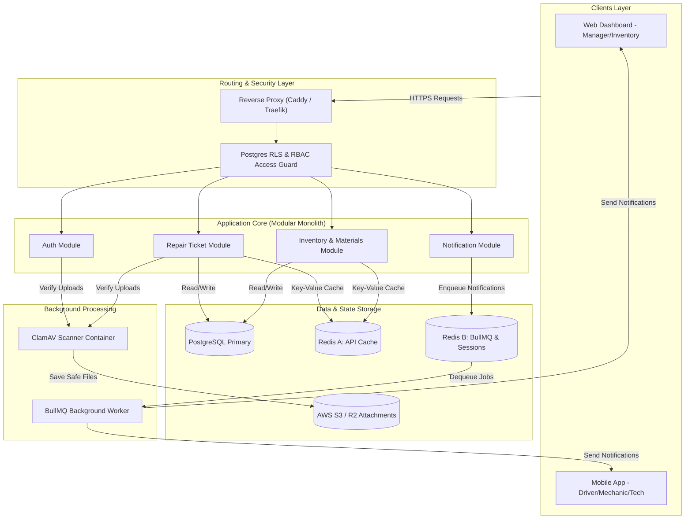

# FixTrack (VRMS) — System Specification Dossier

**Trạng thái: Hoàn thành (Finalized - Version 1.0)**  
**Phiên bản: v1.0**  
**Chủ sở hữu: AI-EOS**  
**Ngày cập nhật: 2026-06-30**  

---

## Purpose

Tài liệu này tổng hợp toàn bộ 8 phần (Part A đến Part H) gồm 38 chương thuộc **Tài liệu Đặc tả Hệ thống (System Specification Sheet - SSS)** của hệ thống Quản lý Sửa chữa Xe (Vehicle Repair Management System - VRMS / FixTrack). Dossier đóng vai trò là "Sách cẩm nang kiến trúc" (Executive Canonical Master Book) giúp các bên liên quan nhanh chóng nắm bắt bức tranh toàn cảnh về thiết kế nghiệp vụ, kiến trúc phần mềm, cơ sở dữ liệu, quy trình DevOps, và cẩm nang vận hành sự cố của dự án.

---

# Section 0 — Executive Summary (Tóm tắt Dự án)

## 0.1 Đối tượng Độc giả (Intended Audience)

Tài liệu này được biên soạn để phục vụ cho các nhóm đối tượng chính sau:
*   **Executives / Ban giám đốc**: Xem xét tổng quan tiến độ phát triển, lộ trình chi phí (Cost Scaling) và tính khả thi về mặt kinh tế của hệ thống.
*   **Product Managers / Business Analysts (PM/BA)**: Đối soát các quy tắc nghiệp vụ (Business Rules), luồng công việc (Workflows) và hành trình người dùng.
*   **Tech Leads / Architects**: Giám sát tính toàn vẹn của kiến trúc giải pháp, cấu trúc dữ liệu, và chốt chặn an toàn bảo mật.
*   **Software & DevOps Engineers**: Sử dụng làm tài liệu hướng dẫn phát triển mã nguồn, cấu trúc API, và quy trình CI/CD.
*   **QA / QC Engineers**: Thiết kế kịch bản kiểm thử (Test Cases) dựa trên đặc tả màn hình và các điểm chốt chặn nghiệm thu.

## 0.2 Hệ thống Sơ lược (System Snapshot)

| Thành phần thiết kế | Đặc tả công nghệ áp dụng |
| :--- | :--- |
| **Dự án (Project Name)** | FixTrack / Vehicle Repair Management System (VRMS) |
| **Lĩnh vực Nghiệp vụ (Domain)** | Quản lý bảo dưỡng và sửa chữa đội xe doanh nghiệp |
| **Mô hình Kiến trúc (Architecture)** | Modular Monolith (Phase 1) → Distributed Microservices (Phase 3) |
| **Công nghệ Backend Stack** | NestJS (TypeScript / Canonical Spec) & Python FastAPI (Runtime Implementation) |
| **Hệ Quản trị CSDL (Database)** | PostgreSQL (Database chính) & SQLite (Database cho chạy test nội bộ) |
| **Hàng chờ & Bộ nhớ đệm** | Redis Cache (Redis A - Caching) & Redis Queue (Redis B - BullMQ / Session) |
| **Triển khai Hạ tầng (Deployment)** | Single VPS với Docker Compose (Phase 1) → AWS EKS Kubernetes Cluster (Phase 3) |

## 0.3 Các Chỉ số Cốt lõi (Core KPIs)

*   **5 Vai trò người dùng (User Roles)**: `DRIVER`, `MECHANIC`, `TECH`, `INVENTORY`, `MANAGER` (phân chia và điều phối chặt chẽ theo chi nhánh địa lý MTY1, MT2, TV, NT).
*   **38 Chương đặc tả (SSS Chapters)**: Trải rộng từ nền tảng nghiệp vụ đến vận hành chi tiết.
*   **10 Trường hợp sử dụng chính (Use Cases)**: Thêm mới nghiệp vụ Nhập kho thủ công (UC-09) và Trả phụ tùng dư thừa (UC-10).
*   **18+ Bảng cơ sở dữ liệu (Database Tables)**: Thiết kế chuẩn hóa 3NF kết hợp RLS (Row-Level Security) và lưu trữ lịch sử giao dịch xuất nhập kho.
*   **8 Miền Kiến trúc (Architecture Domains)**: Định nghĩa rõ ràng phạm vi trách nhiệm của từng Module.

## 0.4 Hướng dẫn Sử dụng Tài liệu (How to Use this Document)

Để khai thác tối đa giá trị của bộ tài liệu đặc tả FixTrack, độc giả cần hiểu rõ phương thức liên kết giữa các phần:
*   **Bản đồ Tổng quan (Dossier - World Map)**: Đọc chính xác file Dossier này để có cái nhìn toàn cảnh nhanh nhất về nghiệp vụ, sơ đồ thực thể ERD, các module NestJS, cấu trúc hạ tầng và các kịch bản phát hành hay vận hành.
*   **Chỉ đường Chi tiết (38 Chapters - GPS Navigation)**: Khi cần triển khai viết mã nguồn, thiết kế kiểm thử, cấu hình mạng hoặc khắc phục sự cố, độc giả sử dụng các liên kết (Hyperlinks) trong Dossier để nhảy trực tiếp vào chương chuyên sâu mong muốn.

---

# Section 1 — Architectural Principles (Nguyên tắc Kiến trúc)

Kiến trúc của FixTrack được định hình dựa trên 5 triết lý phát triển cốt lõi:

1.  **Nghiệp vụ là Trọng tâm (Business Rules First)**: Hệ thống được xây dựng xung quanh các quy tắc nghiệp vụ thực tế (e.g., cấm thay đổi trạng thái phiếu khi chưa duyệt vật tư). Lớp kiểm soát nghiệp vụ (Domain Logic) phải được cô lập tuyệt đối khỏi các chi tiết hạ tầng mạng hay UI.
2.  **Tài liệu là Nguồn Sự thật Duy nhất (Documentation as Single Source of Truth)**: Mọi sự thay đổi về cấu trúc API, sơ đồ cơ sở dữ liệu, hay kịch bản vận hành đều phải được cập nhật vào tài liệu SSS trước khi triển khai viết mã nguồn (Design-First Development).
3.  **An ninh Đa lớp ngay từ đầu (Security by Design)**: Áp dụng cơ chế an toàn đa tầng bảo vệ: Phân quyền vai trò chi tiết (RBAC), kiểm soát truy cập mức dòng CSDL (Postgres RLS), băm SHA256 mã hóa tệp tin đính kèm và kiểm duyệt mã độc tự động qua Trivy.
4.  **Mở rộng theo Phân kỳ (Scalability by Evolution)**: Tránh tối đa hiện tượng Over-engineering. Thiết lập hệ thống đơn giản ở Phase 1 (Single VPS, Recreate Deployment) và vạch rõ lộ trình kỹ thuật tự động chuyển dịch lên Phase 2 & 3 (HA Master-Replica DB, Zero-Downtime Blue-Green, Kubernetes & Kafka) khi chạm các ngưỡng kích hoạt thực tế.
5.  **Chú trọng khâu Vận hành (Operability Matters)**: Hệ thống được thiết kế để dễ dàng giám sát, khôi phục và truy vết lỗi. Trực quan hóa tiến trình qua hệ thống log có trace_id, cơ chế chuỗi băm Hash Chaining ngăn chặn giả mạo audit logs, và cẩm nang xử lý sự cố on-call chi tiết đến từng câu lệnh shell.

---

# Section 2 — High-Level System Architecture (Sơ đồ Kiến trúc)

Dưới đây là mô hình phân tầng kiến trúc tổng thể của FixTrack trong Phase 1 (MVP VPS):

---

# Section 3 — Synthesis of System Specification Chapters

## Part A — Business Foundation (Chương 01 - 05)
*   **Mục tiêu**: Định nghĩa tầm nhìn dự án, bài toán kinh doanh quản lý bảo dưỡng xe, phạm vi dự án và vai trò của các tác nhân.
*   **Đặc tả vai trò người dùng (User Roles)**:
    *   `DRIVER` (Tài xế): Báo cáo hỏng hóc xe, nhận phụ tùng từ kho bàn giao cho KTV.
    *   `MECHANIC` (Đội Cơ giới): Phân công phương tiện, tiếp nhận phiếu báo hỏng xe, kiểm tra phân loại sơ bộ, và nghiệm thu đóng phiếu sửa chữa sau chạy thử đạt (được ràng buộc và điều phối theo chi nhánh địa lý MTY1, MT2, TV, NT).
    *   `TECH` (Đội Kỹ thuật / KTV): Khám xe chuyên sâu tại xưởng, đề xuất danh sách phụ tùng vật tư, trực tiếp thực hiện sửa chữa, và tạo phiếu trả vật tư thừa.
    *   `INVENTORY` (Thủ kho vật tư): Quản lý xuất kho phụ tùng xe phục vụ sửa chữa, duyệt trả hàng thừa, và trực tiếp thực hiện nghiệp vụ Nhập kho thủ công để cộng thêm số lượng tồn kho khả dụng.
    *   `MANAGER` (Quản lý / Admin): Giám sát KPI & Dashboard thời gian thực, phê duyệt phiếu chi phí cao ngoài hạn mức, điều phối thay đổi thứ tự ưu tiên trong hàng chờ xưởng.

## Part B — Requirement Analysis (Chương 06 - 10)
*   **Mục tiêu**: Phân tích luồng nghiệp vụ liên tầng (Tài xế báo hỏng -> Cơ giới tiếp nhận/triage -> KTV khám -> Thủ kho xuất -> KTV sửa/trả hàng thừa -> Cơ giới nghiệm thu/đóng phiếu), thiết lập 10 Use Cases và yêu cầu phi chức năng (NFR) như API Latency < 2s, thời gian khôi phục sự cố RTO < 2 giờ.
*   **Quy tắc nghiệp vụ cốt lõi**: Ràng buộc phân quyền điều phối và xử lý ticket theo chi nhánh hoạt động (MTY1, MT2, TV, NT), cơ chế tự động giải phóng slot xưởng và đẩy lùi hàng chờ khi thiếu hụt vật tư, quy trình kiểm soát trả lại vật tư dư thừa, và cảnh báo an toàn tồn kho thấp.

## Part C — Data Design (Chương 11 - 15)
*   **Mục tiêu**: Thiết lập Domain Model, sơ đồ quan hệ thực thể ERD, cấu trúc từ điển dữ liệu chi tiết và phân quyền thao tác dữ liệu (CRUD Matrix).
*   **Cơ sở Dữ liệu**: Định nghĩa rõ ràng sơ đồ bảng (Schemas) của các bảng lõi: `users`, `repair_tickets`, `materials`, `inventory_transactions`, và `audit_logs` với các ràng buộc khóa ngoại chặt chẽ.

## Part D — Application Design (Chương 16 - 20)
*   **Mục tiêu**: Định nghĩa hệ thống lưới UI/UX (Layout Grid), luồng chuyển dịch màn hình (Screen Flows), thiết kế cơ chế máy trạng thái của Phiếu sửa chữa (State Machine: Draft -> Open -> Assigned -> Pending Materials -> In Progress -> Under Test -> Completed).
*   **Kiến trúc phụ trợ**:
    *   **Notification Flow**: Luồng gửi thông báo đa kênh (Web, Mobile Push, Email) qua nền tảng Firebase Cloud Messaging (FCM).
    *   **Attachment Design**: Cơ chế lưu trữ và quét mã độc (ClamAV) đối với ảnh chụp hiện trạng hỏng hóc của tài xế.

## Part E — Backend Design (Chương 21 - 25)
*   **Mục tiêu**: Đặc tả cấu trúc API RESTful chuẩn hóa, phân tách Module của NestJS Backend, các hợp đồng dịch vụ giao tiếp (Service Contracts), thiết kế hàng chờ chạy ngầm BullMQ, và chiến lược bộ nhớ đệm hai cụm Redis.
*   **Tách biệt Redis**: Redis A dùng cho bộ nhớ đệm ứng dụng (cải thiện hiệu năng truy vấn danh mục vật tư); Redis B dùng cho lưu trữ phiên đăng nhập và quản lý jobs hàng chờ của BullMQ.

## Part F — Solution Architecture (Chương 26 - 29)
*   **Mục tiêu**: Định nghĩa sơ đồ triển khai vật lý, cấu trúc liên kết phân mảnh cấu phần (Component Decoupling), cơ chế bảo mật xác thực ứng dụng bằng JWT Token, chính sách lưu vết hoạt động (Audit Trails), và kiến trúc tích hợp hệ thống bên thứ ba (FCM Push Service, AWS S3 Storage).

## Part G — DevOps (Chương 30 - 33)
*   **Mục tiêu**: Đặc tả cấu hình hạ tầng VPS chạy Docker Compose, chính sách xây dựng Dockerfile multi-stage rút gọn tối đa dung lượng, thiết kế quy trình tự động hóa tích hợp và triển khai liên tục qua GitHub Actions, và thiết lập công cụ giám sát Prometheus/Grafana để cấu hình cảnh báo tài nguyên máy chủ.

## Part H — Operations (Chương 34 - 38)
*   **Mục tiêu**: Thiết lập chiến lược kiểm thử tự động toàn diện (Unit, Integration, E2E Tests), cơ chế mã hóa bảo vệ chống giả mạo nhật ký hệ thống (Cryptographic Audit Hash Chaining: $hash_n = \text{SHA256}(payload_n + hash_{n-1})$), cẩm nang ứng phó sự cố on-call (Runbook), chiến lược phát hành an toàn tương thích ngược (Expand-Contract Database Migrations), và lộ trình mở rộng quy mô hệ thống trong tương lai.

---

# Section 4 — Final System Assessment (Đánh giá Hệ thống)

Dưới đây là bảng đối soát trạng thái hoàn thành và mức độ sẵn sàng vận hành của các cấu phần thiết kế thuộc hệ thống FixTrack:

| Phân khu Thiết kế (Aspect) | Trạng thái Hiện tại (Status) | Đánh giá & Định hướng phát triển |
| :--- | :---: | :--- |
| **Nền tảng Nghiệp vụ (Part A & B)** | **Hoàn thành (Complete)** | Định nghĩa rõ ràng 5 vai trò, 10 Use Cases và luồng nghiệp vụ lõi theo chi nhánh (MTY1, MT2...), sẵn sàng chuyển giao. |
| **Thiết kế Dữ liệu & UI (Part C & D)** | **Hoàn thành (Complete)** | Schema CSDL chuẩn hóa 3NF tích hợp RLS; State Machine của phiếu sửa chữa thiết kế chặt chẽ. |
| **Thiết kế Logic Backend (Part E & F)** | **Hoàn thành (Complete)** | Đặc tả API RESTful chuẩn hóa; kiến trúc module phân mảnh rõ ràng kết hợp hàng chờ BullMQ bảo vệ hiệu năng. |
| **Sẵn sàng DevOps (Part G)** | **Sẵn sàng Chạy (Prod-Ready)** | Cấu hình Docker Compose và GitHub Actions Pipeline đã sẵn sàng tự động hóa deploy lên Staging và Production. |
| **Vận hành & An toàn (Part H)** | **Sẵn sàng Chạy (Prod-Ready)** | Tích hợp hệ thống kiểm thử tự động bảo đảm chất lượng code; cơ chế chống giả mạo log an toàn tuyệt đối; quy trình Runbook và Release Strategy chuẩn hóa SRE. |
| **Tầm nhìn Tương lai** | **Đã Lập Kế hoạch (Planned)** | Đã cấu trúc rõ ràng lộ trình phân kỳ nâng cấp lên cụm HA Postgres Master-Replica, Kubernetes, và Apache Kafka. |

## Kết luận Chung (Conclusion)

> [!IMPORTANT]
> **Tuyên bố Sẵn sàng Phát hành (Production Readiness Statement):**
> Hệ thống FixTrack (VRMS) đã hoàn tất toàn bộ tiến trình đặc tả thiết kế hệ thống chi tiết (SSS v1.0). Cấu trúc kiến trúc đáp ứng đầy đủ các tiêu chuẩn vận hành thực tế ở môi trường doanh nghiệp. Hệ thống được phê duyệt **Sẵn sàng để Triển khai Giai đoạn 1 (Production-Ready for Phase 1 Single VPS Deployment)**.
