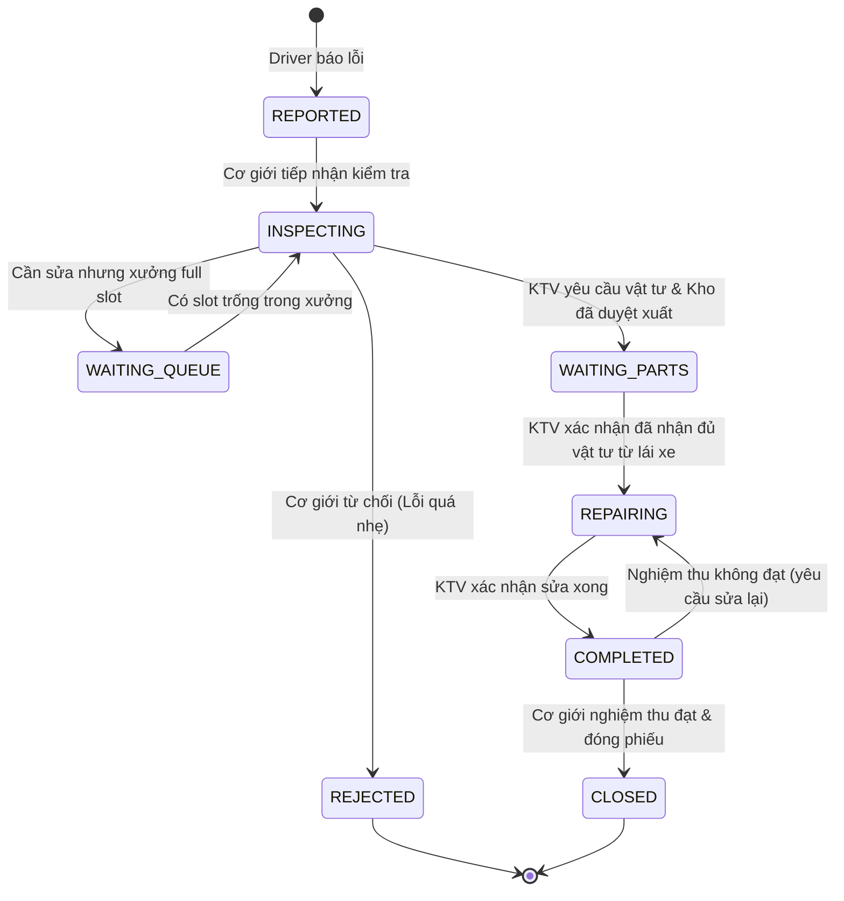
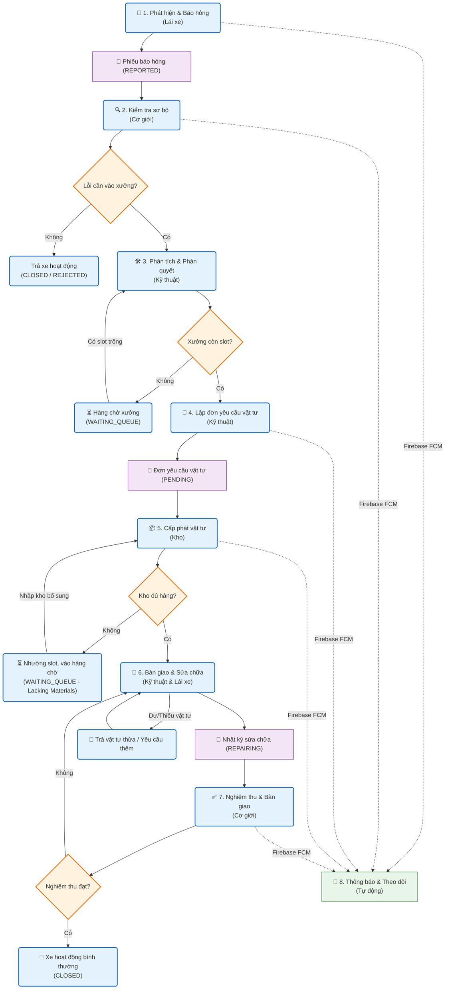
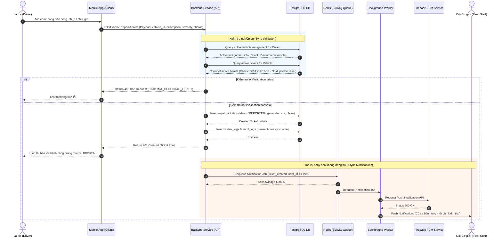

# 06 Workflow Analysis

## Purpose
Chương này phân tích chi tiết quy trình nghiệp vụ (Business Workflow) số hóa từ lúc phát hiện sự cố phương tiện cho tới khi phương tiện được nghiệm thu và hoạt động bình thường trở lại. Tài liệu làm rõ sự phối hợp tác nghiệp giữa 4 bộ phận chính: Lái xe, Đội cơ giới, Đội kỹ thuật và Kho vật tư trên ứng dụng di động (Mobile App).

## Questions Answered
- Quy trình sửa chữa phương tiện trải qua các bước cụ thể nào?
- Sự phối hợp và trách nhiệm bàn giao vật tư giữa Kho, Lái xe và Kỹ thuật viên (KTV) được kiểm soát như thế nào để tránh thất thoát?
- Hệ thống xử lý các tình huống đặc biệt như xưởng hết chỗ (full slot) hoặc thiếu vật tư như thế nào?

## Inputs
- Sơ đồ quy trình nghiệp vụ gốc từ tệp `quy_trinh_sua_chua_phuong_tien_v2.pdf`.
- Quy tắc nghiệp vụ cốt lõi: `BR-01` (Quyền tạo phiếu của tài xế được phân công), `BR-02` (Luồng bàn giao vật tư khép kín), `BR-03` (Báo nhiều lỗi trong một phiếu).
- Sơ đồ Business Flow và Sequence Diagram đã được kết xuất tại thư mục `docs/images/`.

---

## Content

### Level 1 — Summary
Quy trình sửa chữa phương tiện được số hóa hoàn toàn nhằm thay thế các phương thức trao đổi thủ công (giấy tờ, chat, gọi điện) bằng luồng xử lý thời gian thực trên Mobile App. Quy trình bắt đầu khi Lái xe phát hiện sự cố và tạo phiếu báo lỗi. Đội cơ giới tiếp nhận và kiểm tra sơ bộ nhằm lọc nhanh các lỗi nhỏ có thể tự xử lý để trả xe chạy tiếp. Nếu cần can thiệp chuyên sâu, xe được chuyển sang Đội kỹ thuật. 

Tại xưởng, KTV chẩn đoán chi tiết và lập đơn yêu cầu vật tư gửi cho Kho. Kho duyệt và xuất vật tư cho Lái xe. Lái xe nhận vật tư vật lý mang về xưởng bàn giao cho KTV thực hiện sửa chữa. Sau khi sửa xong, Đội cơ giới tiến hành nghiệm thu thực tế và xác nhận đóng phiếu trên hệ thống để đưa xe trở lại trạng thái hoạt động bình thường.

### Level 2 — Breakdown
Quy trình nghiệp vụ chi tiết bao gồm 7 bước chính sau:

#### Bước 1: Lái xe báo hư hỏng (Driver)
- **Hành động**: Lái xe phát hiện sự cố (trong quá trình chạy hoặc lúc kiểm tra đầu ca). Lái xe đăng nhập app, chọn phương tiện đang được phân công cho mình (bắt buộc theo `BR-01`).
- **Nội dung khai báo**: Nhập mô tả lỗi (hỗ trợ khai báo nhiều hạng mục lỗi đồng thời theo `BR-03`), đính kèm hình ảnh/video thực tế tại hiện trường, chọn mức độ nghiêm trọng và gửi yêu cầu.
- **Hệ thống**: Tạo phiếu sửa chữa với trạng thái ban đầu là `REPORTED` (Đã báo lỗi) và gửi thông báo (Push Notification) tới Đội cơ giới.

#### Bước 2: Đội cơ giới kiểm tra sơ bộ (Mechanic)
- **Hành động**: Nhân viên Cơ giới tiếp nhận xe tại bãi, tiến hành kiểm tra nhanh ban đầu.
- **Quyết định**:
  - *Nếu là lỗi rất nhẹ hoặc báo sai*: Cơ giới từ chối phiếu (Status: `REJECTED`), cập nhật lý do và trả xe tiếp tục hoạt động.
  - *Nếu cần sửa chữa chuyên sâu*: Cơ giới xác nhận chuyển xưởng (Status: `INSPECTING`).

#### Bước 3: Đội kỹ thuật khám xe & Đưa ra phán quyết (Technical)
- **Hành động**: Xe được di chuyển vào khu vực xưởng. KTV chẩn đoán chuyên sâu để xác định chính xác các lỗi cần sửa.
- **Xử lý hàng chờ (Queue)**: Nếu toàn bộ slot sửa chữa trong xưởng đang bị đầy (Full), hệ thống tự động đưa xe vào hàng chờ (Status: `WAITING_QUEUE`). Khi có slot trống (KTV bấm hoàn tất xe trước), hệ thống thông báo điều phối xe tiếp theo vào vị trí để KTV bắt đầu xử lý.
- **Phán quyết**: KTV xác định phương án sửa chữa và danh sách linh kiện, phụ tùng cần thay thế.

#### Bước 4: Lên danh sách vật tư yêu cầu cấp phát (Technical)
- **Hành động**: KTV tạo Đơn yêu cầu vật tư (Material Request) trực tiếp trên app bám theo mã phiếu sửa chữa, chỉ định rõ tên phụ tùng, mã SKU và số lượng cần thiết. Gửi yêu cầu phê duyệt tới Kho.

#### Bước 5: Kho phê duyệt và bàn giao vật tư khép kín (Inventory & Driver & Technical)
Để kiểm soát chặt chẽ vật tư, hệ thống áp dụng luồng bàn giao 3 bên theo quy tắc `BR-02`:
1. **Thủ kho xuất kho**: Thủ kho tiếp nhận yêu cầu trên app, kiểm tra số lượng tồn kho. Nếu đủ, thủ kho bấm duyệt, chuẩn bị vật tư vật lý và xác nhận "Đã xuất kho" (Status: `WAITING_PARTS`).
2. **Lái xe nhận vật tư**: Lái xe di chuyển đến kho để nhận phụ tùng vật lý. Thủ kho giao hàng, Lái xe bấm xác nhận "Đã nhận vật tư từ kho" trên app.
3. **Bàn giao cho KTV**: Lái xe mang vật tư về xưởng bàn giao cho KTV. KTV kiểm tra đúng chủng loại/số lượng và bấm xác nhận "Kỹ thuật đã nhận đủ vật tư từ lái xe". Hệ thống tự động chuyển trạng thái phiếu sang sẵn sàng sửa chữa.

#### Bước 6: Tiến hành sửa chữa (Technical)
- **Hành động**: KTV bấm "Bắt đầu sửa chữa" trên app (Status: `REPAIRING`). Hệ thống bắt đầu ghi nhận thời gian sửa chữa thực tế. KTV tiến hành thay thế phụ tùng, khắc phục lỗi.
- **Sửa xong**: KTV bấm xác nhận "Đã sửa xong" trên ứng dụng (Status: `COMPLETED`).

#### Bước 7: Nghiệm thu và bàn giao phương tiện (Mechanic & Technical)
- **Hành động**: Nhân viên Cơ giới tiến hành chạy thử và nghiệm thu kỹ thuật thực tế của phương tiện.
- **Quyết định**:
  - *Nghiệm thu đạt*: Cơ giới bấm "Xác nhận nghiệm thu thành công" trên app. Phiếu sửa chữa chuyển sang trạng thái cuối cùng là đóng (`CLOSED`). Phương tiện chuyển về trạng thái hoạt động bình thường (`ACTIVE`).
  - *Nghiệm thu không đạt*: Cơ giới cập nhật lý do chưa đạt, yêu cầu xưởng khắc phục lại. Phiếu quay ngược về trạng thái sửa chữa (`REPAIRING`).

---

### Level 3 — Technical Detail

#### 1. Sơ đồ trạng thái của Phiếu sửa chữa (Ticket State Transitions)
Luồng chuyển đổi trạng thái của `Repair Ticket` được kiểm soát chặt chẽ thông qua các API tương tác của người dùng:

#### 2. Biểu đồ nghiệp vụ tổng thể (Business Flow Diagram)
Sơ đồ dưới đây biểu diễn luồng hoạt động nghiệp vụ tổng quát được số hóa:

#### 3. Luồng tuần tự tạo phiếu sửa chữa (Sequence Flow)
Tương tác API giữa Mobile App (Client), Backend và Database khi khởi tạo luồng báo lỗi:

---

## Outputs
- Tệp đặc tả hoàn chỉnh: [06_workflow_analysis.md](file:///c:/Users/Legion/Desktop/IT/SNP/.agents/skills/system_engineering_copilot/deliverables/current/sss/part_b_requirement_analysis/06_workflow_analysis.md)
