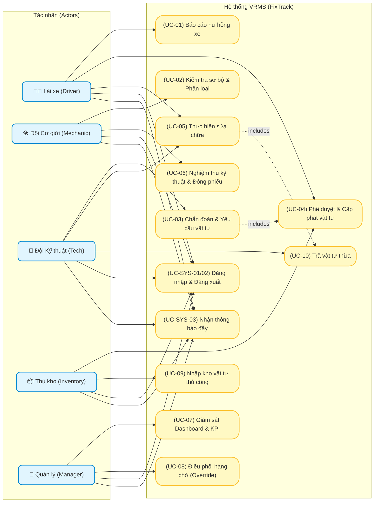

# 10 Use Cases

**Trạng thái: Hoàn thành (Finalized)**

---

## Purpose
Chương này đặc tả chi tiết các trường hợp sử dụng (Use Cases - UC) cốt lõi của hệ thống VRMS. Tài liệu này đóng vai trò là cầu nối giữa yêu cầu nghiệp vụ (Business Rules), thiết kế giao diện (UI Screen) và thiết kế kỹ thuật (API/Database), giúp đội ngũ phát triển và kiểm thử (QA/QC) nắm rõ từng bước tương tác giữa người dùng và hệ thống, bao gồm các kịch bản chuẩn (Main Flow) và kịch bản lỗi (Exception Flow).

---

## Questions Answered
- Các tác nhân tương tác với hệ thống qua những bước tuần tự nào để hoàn thành nhiệm vụ?
- Điều kiện tiên quyết (Preconditions) và kết quả đầu ra (Postconditions) của từng Use Case là gì?
- Hệ thống xử lý các tình huống rẽ nhánh hoặc lỗi (như nhập sai dữ liệu, xưởng hết slot, kho hết hàng) như thế nào?
- Những quy tắc nghiệp vụ (Business Rules) nào được áp dụng trực tiếp trong từng Use Case?

---

## Inputs
- [05 User Roles](file:///c:/Users/Legion/Desktop/IT/SNP/.agents/skills/system_engineering_copilot/deliverables/current/sss/part_a_business_foundation/05_user_roles.md) (Danh sách Actors).
- [06 Workflow Analysis](file:///c:/Users/Legion/Desktop/IT/SNP/.agents/skills/system_engineering_copilot/deliverables/current/sss/part_b_requirement_analysis/06_workflow_analysis.md) (Luồng phối hợp nghiệp vụ).
- [07 Functional Requirements](file:///c:/Users/Legion/Desktop/IT/SNP/.agents/skills/system_engineering_copilot/deliverables/current/sss/part_b_requirement_analysis/07_functional_requirements.md) (Yêu cầu chức năng).
- [09 Business Rules](file:///c:/Users/Legion/Desktop/IT/SNP/.agents/skills/system_engineering_copilot/deliverables/current/sss/part_b_requirement_analysis/09_business_rules.md) (Quy tắc nghiệp vụ ràng buộc).

---

## Content

### Level 1 — Summary

Chương này mô tả chi tiết các Use Cases nghiệp vụ quan trọng nhất điều hành toàn bộ quy trình sửa chữa phương tiện của VRMS. Sơ đồ Use Case được thiết kế theo phong cách trực quan địa lý (mỗi tác nhân nằm ở một phân khu riêng biệt với các chức năng tương ứng, tránh chồng chéo các mối liên kết), đảm bảo tính rõ ràng giống như tài liệu thiết kế mẫu:

#### **Sơ đồ Use Case tổng thể hệ thống VRMS (UML Use Case Diagram)**

#### **Danh sách các Use Cases chính:**
1.  **`UC-01` - Báo cáo hư hỏng xe:** Tài xế tạo phiếu sự cố trên Mobile App.
2.  **`UC-02` - Kiểm tra sơ bộ & Phân loại lỗi:** Cơ giới lọc lỗi nhẹ tại bãi hoặc định tuyến chuyển xưởng (ràng buộc chi nhánh).
3.  **`UC-03` - Chẩn đoán kỹ thuật & Yêu cầu vật tư:** KTV kiểm tra chi tiết tại xưởng và đề xuất linh kiện thay thế (ràng buộc chi nhánh).
4.  **`UC-04` - Phê duyệt & Cấp phát vật tư:** Thủ kho kiểm duyệt và bàn giao phụ tùng vật lý cho tài xế (nhường slot xưởng nếu thiếu hàng).
5.  **`UC-05` - Thực hiện sửa chữa (Repair Execution):** KTV nhận bàn giao phụ tùng và sửa chữa xe (trả lại vật tư thừa nếu dư).
6.  **`UC-06` - Nghiệm thu kỹ thuật & Đóng phiếu:** Cơ giới chạy thử xe đạt để đóng phiếu và đưa xe trở lại hoạt động.
7.  **`UC-07` - Giám sát Dashboard & KPI:** Quản lý theo dõi hiệu suất sửa chữa, downtime xe thời gian thực.
8.  **`UC-08` - Điều phối hàng chờ (Queue Override):** Quản lý điều chỉnh mức độ ưu tiên hàng chờ sửa chữa tại xưởng.
9.  **`UC-09` - Nhập kho vật tư thủ công:** Thủ kho nhập thêm số lượng tồn kho khả dụng cho phụ tùng.
10. **`UC-10` - Trả vật tư thừa:** KTV gửi trả lại phụ tùng dư thừa không sử dụng hết về kho.
11. **Các Use Cases bổ trợ hệ thống (Supporting Use Cases):**
    *   **`UC-SYS-01` - Đăng nhập (Login):** Xác thực tài khoản của người dùng.
    *   **`UC-SYS-02` - Đăng xuất (Logout):** Đóng phiên làm việc an toàn.
    *   **`UC-SYS-03` - Nhận thông báo đẩy (Push Notifications):** Gửi cảnh báo thời gian thực về thiết bị khi có thay đổi trạng thái.

---

### Level 2 — Breakdown

#### **UC-01: Báo cáo hư hỏng phương tiện**
*   **Tác nhân chính (Actor):** Tài xế (Driver).
*   **Điều kiện tiên quyết (Preconditions):**
    *   Tài xế đã đăng nhập thành công vào Mobile App (`UC-SYS-01`).
    *   Tài xế đang được phân công vận hành phương tiện ở trạng thái hoạt động (`BR-ASSIGN-02`, `BR-ASSIGN-03`).
*   **Kết quả đầu ra (Postconditions):**
    *   Phiếu sửa chữa được tạo mới trên hệ thống với trạng thái `REPORTED`.
    *   Trạng thái phương tiện chuyển sang `BROKEN` (Chờ kiểm tra).
    *   Thông báo đẩy (Push Notification) được gửi tới Đội cơ giới (`UC-SYS-03`).
*   **Luồng xử lý chính (Main Flow):**
    1.  Tài xế truy cập chức năng "Báo hỏng xe" trên Mobile App.
    2.  Hệ thống tự động hiển thị thông tin phương tiện đang gán cho tài xế (Biển số xe, chủng loại).
    3.  Tài xế chọn danh mục lỗi, nhập mô tả hư hỏng chi tiết và chọn mức độ nghiêm trọng cảm nhận.
    4.  Tài xế chụp ảnh/quay video hiện trường sự cố và đính kèm vào phiếu (`FR-TICKET-03`).
    5.  Tài xế bấm nút "Gửi báo cáo".
    6.  Hệ thống thực hiện kiểm tra các quy tắc nghiệp vụ (`BR-TICKET-03`).
    7.  Hệ thống ghi nhận thông tin, cấp mã số phiếu sửa chữa (`repair_tickets`) và phản hồi "Gửi báo cáo thành công".
*   **Luồng rẽ nhánh / Ngoại lệ (Exception Flow):**
    *   *Ngoại lệ 1a (Chưa được gán xe):* Hệ thống phát hiện tài xế chưa được phân công vận hành bất kỳ xe nào. Hệ thống hiển thị cảnh báo "Bạn không giữ phương tiện nào để báo lỗi" và chặn không cho truy cập màn hình tạo phiếu.
    *   *Ngoại lệ 2a (Xe đã có phiếu mở trùng lặp):* Hệ thống phát hiện xe này đang có một phiếu sửa chữa chưa đóng (`BR-TICKET-03`). Hệ thống hiển thị thông báo lỗi và chặn lưu phiếu mới.
    *   *Ngoại lệ 3a (Lỗi đính kèm file):* Dung lượng ảnh đính kèm vượt quá 10MB hoặc quá 5 file. Hệ thống thông báo lỗi và yêu cầu tài xế giảm kích thước hoặc số lượng ảnh.

---

#### **UC-02: Kiểm tra sơ bộ & Phân loại lỗi**
*   **Tác nhân chính (Actor):** Đội cơ giới (Mechanic).
*   **Preconditions:**
    *   Phiếu sửa chữa đang ở trạng thái `REPORTED`.
    *   Tài khoản nhân viên Cơ giới và phương tiện phải đăng ký hoạt động tại cùng một chi nhánh (MTY1, MT2, TV, NT) (`BR-ASSIGN-04`).
*   **Postconditions:**
    *   Trạng thái phiếu chuyển sang `TECHNICAL_DIAGNOSIS` (nếu xưởng còn slot trống).
    *   Hoặc trạng thái phiếu chuyển sang `WAITING_QUEUE` (nếu xưởng hết slot trống).
    *   Hoặc trạng thái phiếu chuyển sang `CLOSED` / `REJECTED` (nếu từ chối/tự sửa, lỗi nhẹ).
*   **Main Flow:**
    1.  Cơ giới tiếp nhận thông báo, mở chi tiết phiếu sự cố trên App.
    2.  Cơ giới kiểm tra xe thực tế tại bãi xe (`BR-INSP-01`).
    3.  Cơ giới cập nhật kết quả kiểm tra sơ bộ và phân loại lỗi.
    4.  Cơ giới chọn quyết định: "Chuyển xưởng kỹ thuật".
    5.  Hệ thống kiểm tra số lượng slot trống trong xưởng. Nếu trống, chuyển trạng thái ticket sang `TECHNICAL_DIAGNOSIS`.
*   **Exception Flow:**
    *   *Rẽ nhánh 4a (Lỗi nhẹ, tự xử lý tại chỗ hoặc báo sai):* Cơ giới đánh giá lỗi nhẹ có thể xử lý tại chỗ hoặc báo sai. Cơ giới chọn "Từ chối", bắt buộc nhập lý do cụ thể (`BR-INSP-03`). Hệ thống chuyển trạng thái ticket sang `REJECTED` (hoặc `CLOSED`), cập nhật trạng thái xe thành `ACTIVE` (Hoạt động) và đóng phiếu.
    *   *Rẽ nhánh 5a (Xưởng sửa chữa hết slot trống):* Hệ thống phát hiện toàn bộ slot trong xưởng đang đầy. Hệ thống tự động chuyển trạng thái xe sang hàng chờ `WAITING_QUEUE` và xếp vị trí FIFO (`BR-QUEUE-01`, `BR-QUEUE-03`).

---

#### **UC-03: Chẩn đoán kỹ thuật & Yêu cầu vật tư**
*   **Tác nhân chính (Actor):** Kỹ thuật viên (Tech).
*   **Preconditions:**
    *   Phiếu sửa chữa đang ở trạng thái `TECHNICAL_DIAGNOSIS` hoặc được điều phối từ `WAITING_QUEUE` vào slot sửa chữa.
    *   Tài khoản KTV và phương tiện phải đăng ký hoạt động tại cùng một chi nhánh (MTY1, MT2, TV, NT) (`BR-ASSIGN-04`).
*   **Postconditions:**
    *   Tạo mới yêu cầu vật tư (`material_requests`) ở trạng thái `PENDING` (chờ duyệt).
    *   Phiếu sửa chữa chuyển sang trạng thái chờ cấp phát vật tư (`WAITING_PARTS`).
*   **Main Flow:**
    1.  KTV nhận xe tại slot sửa chữa, tiến hành đo đạc, chẩn đoán chi tiết lỗi của xe.
    2.  KTV chọn chức năng "Yêu cầu vật tư thay thế" trên ứng dụng.
    3.  KTV tìm kiếm phụ tùng cần thiết theo SKU hoặc tên phụ tùng, nhập số lượng yêu cầu (`FR-MAT-02`).
    4.  Hệ thống thực hiện kiểm tra tồn kho ảo và hiển thị **Cảnh báo tồn kho thấp** nếu số lượng yêu cầu vượt quá tồn kho hệ thống (nhưng không chặn thao tác gửi yêu cầu).
    5.  KTV bấm nút "Gửi yêu cầu vật tư".
    6.  Hệ thống ghi nhận và tạo đơn yêu cầu vật tư ở trạng thái `PENDING` (chờ thủ kho phê duyệt vật lý theo quy trình Model B), đồng thời gửi thông báo tới Thủ kho.
*   **Exception Flow:**
    *   *Rẽ nhánh 4a (Không cần thay phụ tùng):* KTV chẩn đoán xe chỉ cần căn chỉnh không cần phụ tùng. KTV bỏ qua bước yêu cầu vật tư, bấm nút "Bắt đầu sửa chữa" và bỏ qua trạng thái chờ vật tư để vào thẳng trạng thái đang sửa `REPAIRING`.

---

#### **UC-04: Phê duyệt & Cấp phát vật tư**
*   **Tác nhân chính (Actor):** Thủ kho (Inventory Staff).
*   **Tác nhân phụ (Secondary Actor):** Tài xế (Driver).
*   **Preconditions:**
    *   Đơn yêu cầu vật tư đang ở trạng thái `PENDING` đi kèm phiếu sửa chữa hợp lệ.
*   **Postconditions:**
    *   Trạng thái đơn vật tư chuyển sang `ISSUED` (Đã cấp phát hoàn toàn hoặc một phần).
    *   Số lượng tồn kho thực tế của phụ tùng được cập nhật (trừ đi) trong CSDL.
*   **Main Flow:**
    1.  Thủ kho tiếp nhận yêu cầu cấp phát trên App.
    2.  Thủ kho trực tiếp kiểm tra vật tư vật lý tại các kệ kho.
    3.  Thủ kho chuẩn bị phụ tùng và bấm nút "Xác nhận xuất kho" trên App.
    4.  Tài xế di chuyển tới kho, Thủ kho bàn giao phụ tùng vật lý cho tài xế.
    5.  Tài xế bấm nút "Xác nhận đã nhận vật tư từ kho" trên App (`BR-MAT-03`).
    6.  Hệ thống chuyển trạng thái đơn vật tư sang `ISSUED` và gửi thông báo sẵn sàng bàn giao cho KTV tại xưởng.
*   **Exception Flow:**
    *   *Rẽ nhánh 2a (Thiếu hụt thực tế hoàn toàn trong kho):* Thủ kho phát hiện không còn phụ tùng vật lý nào khớp yêu cầu. Thủ kho bấm "Từ chối yêu cầu - Thiếu hàng". Hệ thống tự động chuyển trạng thái phiếu sửa chữa sang hàng chờ `WAITING_QUEUE` với nhãn `LACKING_MATERIALS` và giải phóng slot sửa chữa hiện tại trong xưởng để nhường slot xưởng cho phương tiện tiếp theo đã có đủ vật tư sẵn sàng (`BR-REP-02`). Hệ thống gửi thông báo cho KTV và phòng mua hàng để đặt phụ tùng bổ sung.
    *   *Rẽ nhánh 2b (Phê duyệt một phần - Partial Approval - Split Request Model):* Thủ kho phát hiện số lượng vật lý trong kho chỉ đáp ứng được một phần yêu cầu của KTV (ví dụ: KTV yêu cầu 4 má phanh nhưng trong kho chỉ còn 2 chiếc).
        1. Thủ kho chọn tùy chọn "Duyệt cấp phát một phần (Partial Approve)".
        2. Nhập số lượng thực tế cấp phát là `2`.
        3. Hệ thống tự động **Tách đơn yêu cầu vật tư (Split Request)** thành hai đơn độc lập trong CSDL:
           - **Đơn phụ A (Đơn bàn giao hiện hành):** Chứa 2 chiếc má phanh, tự động chuyển sang trạng thái `ISSUED` để bàn giao cho Tài xế.
           - **Đơn phụ B (Đơn tồn đọng):** Chứa 2 chiếc má phanh còn thiếu, tự động lưu lại ở trạng thái `PENDING` để hệ thống theo dõi chờ nhập hàng bổ sung.

---

#### **UC-05: Thực hiện sửa chữa (Repair Execution)**
*   **Tác nhân chính (Actor):** Kỹ thuật viên (Tech).
*   **Tác nhân phụ (Secondary Actor):** Tài xế (Driver).
*   **Preconditions:**
    *   Đơn vật tư liên quan đang ở trạng thái `ISSUED` (Đã cấp phát cho tài xế).
*   **Postconditions:**
    *   Trạng thái đơn vật tư chuyển sang `RECEIVED` (KTV đã nhận bàn giao).
    *   Phiếu sửa chữa chuyển sang trạng thái đang sửa `REPAIRING`.
*   **Main Flow:**
    1.  Tài xế vận chuyển phụ tùng từ kho về xưởng kỹ thuật và bàn giao phụ tùng vật lý cho KTV.
    2.  KTV kiểm tra đúng chủng loại, số lượng so với yêu cầu trên app.
    3.  KTV bấm nút "Xác nhận nhận đủ vật tư từ lái xe" trên App (`BR-MAT-03`). Hệ thống ghi nhận trạng thái đơn vật tư sang `RECEIVED`.
    4.  KTV bấm nút "Bắt đầu sửa chữa" trên ứng dụng (`BR-REP-01`). Hệ thống ghi nhận thời gian bắt đầu thực tế.
    5.  KTV tiến hành thay thế, sửa chữa thực tế xe.
    6.  Sau khi sửa xong, KTV bấm nút "Xác nhận sửa xong" (`FR-REP-03`).
    7.  Hệ thống chuyển trạng thái ticket sang `COMPLETED` và gửi thông báo nghiệm thu cho Đội cơ giới.
*   **Exception Flow:**
    *   *Ngoại lệ 2a (KTV kiểm tra phát hiện sai phụ tùng/lỗi vật lý):* Phụ tùng tài xế mang đến không khớp với đơn yêu cầu hoặc bị nứt vỡ vật lý. KTV bấm "Từ chối nhận bàn giao", nhập lý do. Tài xế mang trả kho, kích hoạt lại luồng yêu cầu vật tư bổ sung của KTV.
    *   *Ngoại lệ 2b (Xử lý đơn tách khi phê duyệt một phần):* Trong trường hợp đơn yêu cầu bị tách (Split Request ở `UC-04`), KTV chỉ nhận bàn giao số lượng phụ tùng thực tế hiện có (2 chiếc má phanh) và xác nhận. KTV bắt đầu tiến hành sửa xe bằng vật tư hiện tại. Khi đơn phụ tồn đọng (2 chiếc còn lại) được kho nhập về và duyệt cấp phát tiếp, tài xế sẽ nhận và thực hiện bàn giao bổ sung sau cho KTV theo quy trình lặp lại.
    *   *Ngoại lệ 4a (Chặn sửa khống):* KTV cố tình bấm bắt đầu sửa trước khi nhận bàn giao vật tư từ tài xế. Hệ thống chặn thao tác và hiển thị cảnh báo đỏ (`BR-MAT-04`).

---

#### **UC-06: Nghiệm thu kỹ thuật & Đóng phiếu**
*   **Tác nhân chính (Actor):** Đội cơ giới (Mechanic).
*   **Preconditions:**
    *   Phiếu sửa chữa đang ở trạng thái `COMPLETED` (KTV đã xác nhận sửa xong).
*   **Postconditions:**
    *   Phiếu sửa chữa chuyển sang trạng thái đóng `CLOSED` và lưu vào lịch sử.
    *   Phương tiện chuyển trạng thái kỹ thuật về hoạt động bình thường `ACTIVE`.
*   **Main Flow:**
    1.  Nhân viên Cơ giới nhận thông báo xe đã sửa xong, di chuyển đến xưởng để chạy thử thực tế.
    2.  Cơ giới kiểm tra kỹ thuật và chạy thử phương tiện.
    3.  Cơ giới xác nhận chất lượng đạt yêu cầu và truy cập App.
    4.  Cơ giới bấm chọn nút "Nghiệm thu đạt" trên ứng dụng (`BR-CLOSE-01`).
    5.  Hệ thống cập nhật trạng thái ticket thành `CLOSED`, chuyển trạng thái xe thành `ACTIVE`.
    6.  Tài xế nhận lại xe bàn giao từ Cơ giới.
*   **Exception Flow:**
    *   *Rẽ nhánh 4a (Nghiệm thu không đạt):* Cơ giới phát hiện xe vẫn còn lỗi hoặc phát sinh lỗi mới khi chạy thử. Cơ giới bấm "Nghiệm thu không đạt" và nhập mô tả lý do kỹ thuật bắt buộc (`BR-CLOSE-02`). Hệ thống chuyển ngược trạng thái ticket về `REPAIRING`, gửi thông báo yêu cầu xưởng kỹ thuật sửa lại.

---

#### **UC-07: Giám sát Dashboard & Báo cáo**
*   **Tác nhân chính (Actor):** Quản lý (Manager).
*   **Preconditions:**
    *   Quản lý đã đăng nhập thành công vào Web Portal với quyền quản trị (`UC-SYS-01`).
*   **Postconditions:**
    *   Hiển thị thông số vận hành (Downtime, KPI KTV, Tiêu hao vật tư) dạng biểu đồ trực quan.
*   **Main Flow:**
    1.  Quản lý truy cập mục "Dashboard & Báo cáo" trên Web Portal.
    2.  Quản lý lựa chọn bộ lọc thời gian (ngày/tuần/tháng) và loại phương tiện cần giám sát.
    3.  Hệ thống tính toán và hiển thị các số liệu thống kê thời gian thực:
        *   Tổng thời gian dừng hoạt động của xe (Vehicle Downtime).
        *   Thời gian xử lý trung bình của KTV (Mean Time to Repair - MTTR).
        *   Chi phí tiêu hao vật tư thay thế.
    4.  Quản lý bấm chọn nút "Xuất báo cáo PDF/Excel" nếu cần lưu trữ.
    5.  Hệ thống kết xuất và tải tệp về thiết bị.

---

#### **UC-08: Điều phối hàng chờ (Queue Override)**
*   **Tác nhân chính (Actor):** Quản lý (Manager).
*   **Preconditions:**
    *   Có ít nhất 1 phương tiện đang nằm trong danh sách hàng chờ sửa chữa (`WAITING_QUEUE`).
*   **Postconditions:**
    *   Thứ tự ưu tiên của xe trong hàng chờ được cập nhật thành công trong CSDL.
    *   Gửi thông báo thay đổi điều phối tới Đội cơ giới và KTV tại xưởng.
*   **Main Flow:**
    1.  Quản lý mở màn hình "Quản lý hàng chờ" trên Web Portal.
    2.  Hệ thống hiển thị danh sách xe đang đợi theo thứ tự FIFO kèm lý do sự cố.
    3.  Quản lý chọn phương tiện cần ưu tiên gấp (ví dụ: xe chở hàng lạnh cần chạy ca tối).
    4.  Quản lý kéo thả thay đổi vị trí hoặc nhấn nút "Đẩy lên đầu hàng chờ (High Priority Override)".
    5.  Hệ thống yêu cầu nhập lý do điều phối bất thường (`BR-QUEUE-02`).
    6.  Quản lý nhập lý do và bấm "Xác nhận".
    7.  Hệ thống cập nhật lại chỉ mục hàng chờ, ghi log kiểm toán (audit log) và gửi thông báo tới KTV đầu xưởng.

---

### Level 3 — Technical Detail

#### **1. Phụ lục: Các trường hợp sử dụng bổ trợ hệ thống (Supporting Use Cases)**

##### **UC-SYS-01: Đăng nhập (Login)**
*   **Tác nhân:** Tất cả các vai trò (Driver, Mechanic, Tech, Inventory, Manager).
*   **Flow chính:**
    1. Người dùng mở ứng dụng (Mobile App hoặc Web Portal).
    2. Nhập thông tin tài khoản bao gồm `Username` và `Password`.
    3. Hệ thống xác thực thông tin đăng nhập với Database:
        *   Nếu khớp, cấp token JWT lưu phiên làm việc, chuyển hướng người dùng vào giao diện tương ứng với vai trò đã được thiết lập (RBAC).
        *   Nếu không khớp, hiển thị thông báo lỗi "Tài khoản hoặc mật khẩu không chính xác".

##### **UC-SYS-02: Đăng xuất (Logout)**
*   **Tác nhân:** Tất cả các vai trò.
*   **Flow chính:**
    1. Người dùng bấm nút "Đăng xuất" tại màn hình cấu hình tài khoản.
    2. Hệ thống thu hồi token JWT đang hoạt động, xóa sạch phiên đăng nhập ở local storage và chuyển hướng người dùng về màn hình đăng nhập mặc định.

##### **UC-SYS-03: Nhận thông báo đẩy (Push Notifications)**
*   **Tác nhân:** Driver, Mechanic, Tech, Inventory.
*   **Flow chính:**
    1. Hệ thống phát sinh một sự kiện chuyển dịch trạng thái nghiệp vụ (ví dụ: Ticket chuyển sang `WAITING_PARTS`).
    2. Backend kích hoạt dịch vụ thông báo đẩy (FCM / APNs) gửi thông tin sự kiện tới thiết bị của người dùng mục tiêu.
    3. Thiết bị của người dùng hiển thị thông báo dạng pop-up kể cả khi ứng dụng đang chạy nền. Người dùng chạm vào thông báo để mở nhanh chi tiết công việc.

##### **UC-09: Nhập kho vật tư thủ công**
*   **Tác nhân chính (Actor):** Kho vật tư (Inventory).
*   **Preconditions:**
    *   Thủ kho đã đăng nhập thành công vào Web Portal với quyền quản trị kho (`UC-SYS-01`).
*   **Postconditions:**
    *   Số lượng phụ tùng khả dụng trong bảng `inventory_stock` được cộng thêm tương ứng.
    *   Một bản ghi giao dịch `INFLOW` được ghi nhận trong lịch sử giao dịch kho.
*   **Main Flow:**
    1. Thủ kho truy cập chức năng "Nhập kho vật tư" trên Web Portal.
    2. Thủ kho tìm kiếm và chọn mã phụ tùng cần nhập thêm (ví dụ: Má phanh đĩa trước).
    3. Thủ kho nhập số lượng thực tế cần nhập kho và số chứng từ nhập kho đi kèm.
    4. Thủ kho nhấn "Xác nhận nhập kho".
    5. Hệ thống cập nhật số lượng `on_hand = on_hand + so_luong_nhap` trong CSDL (`BR-MAT-06`).
    6. Hệ thống tạo bản ghi giao dịch nhập kho trong bảng `inventory_transactions`.
*   **Exception Flow:**
    *   *Ngoại lệ 3a (Nhập sai số lượng âm hoặc bằng 0):* Hệ thống chặn và báo lỗi "Số lượng nhập kho phải lớn hơn 0".

##### **UC-10: Trả vật tư thừa**
*   **Tác nhân chính (Actor):** Kỹ thuật viên (Tech - Chính), Kho vật tư (Inventory - Phụ).
*   **Preconditions:**
    *   KTV đã được nhận bàn giao vật tư và phiếu đang ở trạng thái `REPAIRING` hoặc `COMPLETED`.
*   **Postconditions:**
    *   Vật tư dư thừa được hoàn kho vật lý và cộng lại vào số lượng khả dụng trên hệ thống.
    *   Một bản ghi giao dịch `RETURN` được lưu trữ.
*   **Main Flow:**
    1. KTV phát hiện phụ tùng dư thừa không sử dụng, truy cập chức năng "Yêu cầu trả vật tư thừa" trên App.
    2. KTV chọn phụ tùng, nhập số lượng trả lại và nhấn "Tạo yêu cầu trả".
    3. Tài xế mang trả vật lý phụ tùng về kho vật tư.
    4. Thủ kho nhận lại hàng, kiểm tra tính nguyên vẹn và mở Web Portal để duyệt yêu cầu.
    5. Thủ kho bấm "Xác nhận nhận trả hàng" (`BR-MAT-07`).
    6. Hệ thống cộng lại số lượng vào `inventory_stock.on_hand` và tạo giao dịch loại `RETURN` trong bảng `inventory_transactions`.
*   **Exception Flow:**
    *   *Ngoại lệ 4a (Phụ tùng bị hỏng hóc vật lý):* Thủ kho phát hiện phụ tùng đã bị nứt vỡ hoặc không đạt tiêu chuẩn tái sử dụng. Thủ kho bấm "Từ chối nhận trả", nhập lý do. Hệ thống hủy yêu cầu trả, vật tư không được cộng lại vào kho.

---

#### **2. Ma trận Ánh xạ chéo Use Case (Use Case to Screens, APIs, FR & BR Mapping Matrix)**
Dưới đây là ma trận thiết kế chi tiết dùng để bàn giao cho đội ngũ Phát triển (Dev) và Kiểm thử (QA/QC) ánh xạ chéo giữa các Use Cases, giao diện màn hình, endpoint API, yêu cầu chức năng (FR) và quy tắc nghiệp vụ kiểm soát (BR) tương ứng:

| Mã UC | Tên Use Case | Tác nhân chính / phụ | Màn hình liên quan | APIs liên quan | Yêu cầu FR liên quan | Quy tắc nghiệp vụ BR kiểm soát |
| :---: | :--- | :--- | :--- | :--- | :--- | :--- |
| **UC-SYS-01** | Đăng nhập (Login) | Tất cả | `SCR-LOGIN` | `POST /auth/login` | `FR-USER-LOGIN` | `BR-AUTH-01` |
| **UC-SYS-02** | Đăng xuất (Logout) | Tất cả | `SCR-PROFILE` | `POST /auth/logout` | `FR-USER-LOGOUT` | - |
| **UC-SYS-03** | Nhận thông báo | Tất cả trừ Manager | Giao diện nền thiết bị | Kênh WebSockets / Push | `FR-SYS-NOTIF` | `BR-NOTIF-01` |
| **UC-01** | Báo cáo hư hỏng | Driver | `SCR-TICKET-CREATE` | `POST /tickets` | `FR-TICKET-01`, `FR-TICKET-02`, `FR-TICKET-03` | `BR-ASSIGN-02`, `BR-ASSIGN-03`, `BR-TICKET-03`, `BR-TICKET-04` |
| **UC-02** | Kiểm tra sơ bộ | Mechanic | `SCR-INSPECT` | `POST /tickets/{id}/inspect` | `FR-INSP-01`, `FR-INSP-02`, `FR-INSP-03` | `BR-INSP-01`, `BR-INSP-02`, `BR-INSP-03`, `BR-QUEUE-01`, `BR-ASSIGN-04` |
| **UC-03** | Chẩn đoán & Đề xuất vật tư | Tech | `SCR-DIAGNOSE`, `SCR-MAT-REQ` | `POST /tickets/{id}/diagnose`, `POST /material-requests` | `FR-MAT-01`, `FR-MAT-02` | `BR-MAT-01`, `BR-MAT-02`, `BR-ASSIGN-04` |
| **UC-04** | Phê duyệt & Cấp phát vật tư | Inventory (Chính), Driver (Phụ) | `SCR-INV-REVIEW` | `POST /material-requests/{id}/approve`, `POST /material-requests/{id}/issue` | `FR-MAT-03`, `FR-MAT-04` | `BR-MAT-02`, `BR-MAT-03`, `BR-AUDIT-02`, `BR-REP-02` |
| **UC-05** | Thực hiện sửa chữa (Repair) | Tech (Chính), Driver (Phụ) | `SCR-REPAIR-EXEC` | `POST /tickets/{id}/start-repair`, `POST /tickets/{id}/complete-repair`, `POST /material-requests/{id}/receive` | `FR-REP-01`, `FR-REP-02`, `FR-REP-03` | `BR-MAT-03`, `BR-MAT-04`, `BR-MAT-05`, `BR-REP-01`, `BR-REP-02` |
| **UC-06** | Nghiệm thu & Đóng phiếu | Mechanic | `SCR-CLOSE-TICKET` | `POST /tickets/{id}/accept-repair`, `POST /tickets/{id}/close` | `FR-REP-04` | `BR-CLOSE-01`, `BR-CLOSE-02`, `BR-CLOSE-03`, `BR-AUDIT-01` |
| **UC-07** | Giám sát Dashboard & KPI | Manager | `SCR-DASHBOARD` | `GET /reports/kpis`, `GET /reports/downtime` | `FR-MGR-DASH` | - |
| **UC-08** | Điều phối hàng chờ | Manager | `SCR-QUEUE-MGMT` | `POST /queue/reorder` | `FR-MGR-QUEUE` | `BR-QUEUE-02` |
| **UC-09** | Nhập kho vật tư thủ công | Inventory | `SCR-INV-RECEIPT` | `POST /inventory/receipt` | `FR-INV-INFLOW` | `BR-MAT-06` |
| **UC-10** | Trả vật tư thừa | Tech (Chính), Inventory (Phụ) | `SCR-INV-RETURN` | `POST /material-requests/{id}/return` | `FR-INV-RETURN` | `BR-MAT-07` |

---

## Outputs
- File đặc tả trường hợp sử dụng hoàn chỉnh: [10_use_cases.md](file:///c:/Users/Legion/Desktop/IT/FixTrack/Tai_Lieu/SSS/part_b_requirement_analysis/10_use_cases.md)
