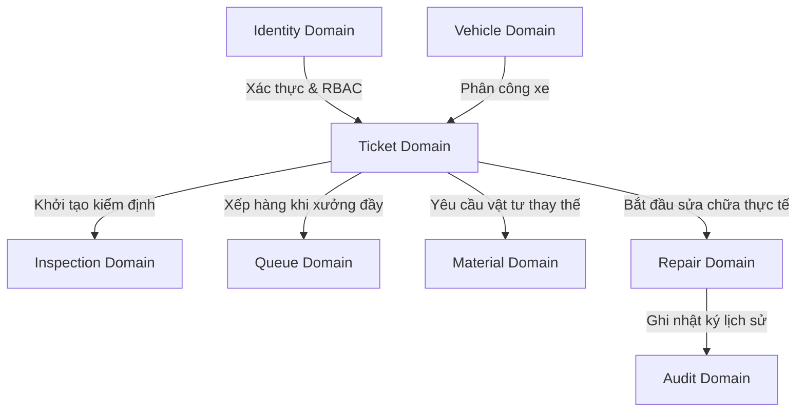
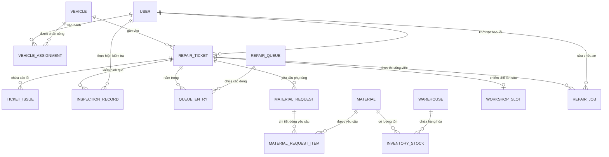

# 11 Domain Model

**Trạng thái: Hoàn thành (Finalized)**

---

## Purpose
Chương này mô hình hóa các thực thể nghiệp vụ cốt lõi (Core Business Entities) của hệ thống VRMS và mô tả mối quan hệ giữa chúng. Domain Model đóng vai trò là cầu nối giữa yêu cầu nghiệp vụ (Business Requirements) và thiết kế hệ thống chi tiết (Database & API design). Mục tiêu là xây dựng ngôn ngữ chung (Ubiquitous Language) giúp toàn bộ đội ngũ (BA, Dev, QA, Manager) hiểu thống nhất về các khái niệm nghiệp vụ trong hệ thống.

---

## Questions Answered
- Hệ thống bao gồm những thực thể nghiệp vụ nào và thuộc phân miền (Bounded Context) nào?
- Các thực thể liên kết với nhau theo mối quan hệ nào và các ràng buộc nghiệp vụ chính là gì?
- Cấu trúc thuộc tính nghiệp vụ và các ràng buộc nghiệp vụ của từng thực thể được quy định ra sao?

---

## Inputs
- [05 User Roles](file:///c:/Users/Legion/Desktop/IT/SNP/.agents/skills/system_engineering_copilot/deliverables/current/sss/part_a_business_foundation/05_user_roles.md) (Quyền hạn và Actor).
- [06 Workflow Analysis](file:///c:/Users/Legion/Desktop/IT/SNP/.agents/skills/system_engineering_copilot/deliverables/current/sss/part_b_requirement_analysis/06_workflow_analysis.md) (Luồng quy trình sửa chữa).
- [07 Functional Requirements](file:///c:/Users/Legion/Desktop/IT/SNP/.agents/skills/system_engineering_copilot/deliverables/current/sss/part_b_requirement_analysis/07_functional_requirements.md) (Yêu cầu chức năng).
- [09 Business Rules](file:///c:/Users/Legion/Desktop/IT/SNP/.agents/skills/system_engineering_copilot/deliverables/current/sss/part_b_requirement_analysis/09_business_rules.md) (Quy tắc nghiệp vụ kiểm soát).
- [10 Use Cases](file:///c:/Users/Legion/Desktop/IT/SNP/.agents/skills/system_engineering_copilot/deliverables/current/sss/part_b_requirement_analysis/10_use_cases.md) (Mô tả tương tác chi tiết).

---

## Content

### Level 1 — Summary

Hệ thống quản lý sửa chữa VRMS được chia thành **8 Bounded Contexts (Phân miền nghiệp vụ)** độc lập để giảm thiểu sự phụ thuộc chéo và dễ quản lý:

#### **Sơ đồ liên kết Bounded Contexts (Context Map Diagram)**
Mermaid dưới đây thể hiện sự tương tác và luân chuyển thông tin giữa các miền nghiệp vụ của VRMS:

1.  **Identity Domain (Người dùng & Phân quyền):** Đảm nhận vai trò xác thực tài khoản và phân quyền sử dụng dựa trên RBAC.
2.  **Vehicle Domain (Phương tiện):** Quản lý hồ sơ xe (nội bộ, bên ngoài) và lịch sử bàn giao xe cho tài xế.
3.  **Ticket Domain (Phiếu sự cố):** Trung tâm điều hành luồng sửa chữa, tiếp nhận mô tả sự cố đa lỗi kèm hình ảnh đính kèm.
4.  **Inspection Domain (Kiểm định):** Lưu vết toàn bộ các đợt kiểm tra sơ bộ bãi, chẩn đoán xưởng, và nghiệm thu chạy thử xe.
5.  **Queue Domain (Hàng chờ):** Quản lý điều hành xếp hàng tự động theo FIFO khi xưởng kỹ thuật hết chỗ trống.
6.  **Material Domain (Vật tư & Kho):** Quản lý danh mục linh kiện, tồn kho đa kho, và quy trình phê duyệt cấp phát vật tư.
7.  **Repair Domain (Sửa chữa):** Theo dõi tiến độ sửa chữa của KTV tại xưởng kỹ thuật.
8.  **Audit Domain (Kiểm toán & Lịch sử):** Lưu vết toàn bộ thao tác hệ thống phục vụ hậu kiểm.

---

### Level 2 — Entity Breakdown

Dưới đây là chi tiết các thực thể nghiệp vụ nghiệp vụ (Business Entities) cấu thành hệ thống VRMS:

#### **1. Identity Domain**
##### **User (Người dùng)**
*   **Ý nghĩa:** Đại diện cho một nhân sự nội bộ tham gia vận hành hệ thống.
*   **Các thuộc tính cốt lõi:** `id`, `employee_code` (mã nhân viên), `full_name`, `phone`, `role`, `status` (ACTIVE/INACTIVE).
*   **Mối quan hệ:**
    *   `User 1 —- N VehicleAssignment` (Tài xế nhận xe theo ca).
    *   `User 1 —- N RepairTicket` (Người tạo phiếu sự cố).
    *   `User 1 —- N InspectionRecord` (Cơ giới/KTV thực hiện kiểm tra).
*   **Ràng buộc:** Mã nhân viên (`employee_code`) và Số điện thoại (`phone`) phải là duy nhất.

##### **Role (Vai trò)**
*   **Ý nghĩa:** Nhóm phân quyền của người dùng để xác định giao diện hiển thị và quyền gọi API (RBAC).
*   **Thuộc tính cốt lõi:** `id`, `role_name` (DRIVER, MECHANIC, TECH, INVENTORY, MANAGER), `permissions` (danh sách quyền).

---

#### **2. Vehicle Domain**
##### **Vehicle (Phương tiện)**
*   **Ý nghĩa:** Đại diện xe tải, xe khách nội bộ hoặc xe khách vãng lai bên ngoài cần quản lý.
*   **Thuộc tính cốt lõi:** `id`, `vehicle_code` (mã quản lý xe), `plate_number` (biển số xe), `type` (loại xe), `status` (ACTIVE/BROKEN/REPAIRING), `is_external` (boolean xác định xe ngoài).
*   **Mối quan hệ:**
    *   `Vehicle 1 —- N VehicleAssignment` (Xe được phân công cho nhiều tài xế theo thời gian).
    *   `Vehicle 1 —- N RepairTicket` (Xe liên kết với các phiếu báo hỏng).
*   **Ràng buộc:** Biển số xe (`plate_number`) và mã quản lý (`vehicle_code`) là duy nhất trên hệ thống.

##### **VehicleAssignment (Phân công xe)**
*   **Ý nghĩa:** Bản ghi trung gian giải quyết bài toán phân công động: 1 xe chạy nhiều tài xế và 1 tài xế có thể đổi xe qua các ca chạy khác nhau.
*   **Thuộc tính cốt lõi:** `id`, `vehicle_id`, `driver_id` (User ID), `assigned_at`, `released_at`, `is_active` (boolean).
*   **Ràng buộc:**
    *   Một xe tại một thời điểm chỉ được phép có tối đa 1 bản ghi phân công ở trạng thái `is_active = true`.
    *   Một tài xế tại một thời điểm chỉ được phép có tối đa 1 bản ghi phân công ở trạng thái `is_active = true` (`BR-ASSIGN-02`).

---

#### **3. Ticket Domain**
##### **RepairTicket (Phiếu sửa chữa)**
*   **Ý nghĩa:** Thực thể trung tâm điều hành toàn bộ vòng đời sửa chữa xe.
*   **Thuộc tính cốt lõi:** `id`, `ticket_no` (mã số phiếu tự sinh), `vehicle_id`, `driver_id` (nullable - dùng cho xe nội bộ), `guest_owner_name` (dùng cho xe ngoài), `guest_owner_phone` (dùng cho xe ngoài), `status` (REPORTED/INSPECTING/REPAIRING/COMPLETED/CLOSED/REJECTED), `priority` (LOW/MEDIUM/HIGH), `created_at`.
*   **Mối quan hệ:**
    *   `RepairTicket 1 —- N TicketIssue` (Phiếu chứa nhiều lỗi).
    *   `RepairTicket 1 —- N MaterialRequest` (Phiếu liên kết các đơn yêu cầu phụ tùng).
    *   `RepairTicket 1 —- N InspectionRecord` (Các biên bản kiểm định sơ bộ, chẩn đoán, nghiệm thu).
*   **Ràng buộc:** Nếu xe là nội bộ (`is_external = false`), thuộc tính `driver_id` bắt buộc phải có giá trị và tài xế đó phải có phân công xe đang kích hoạt (`BR-ASSIGN-02`). Nếu xe ngoài (`is_external = true`), cho phép `driver_id` là NULL nhưng bắt buộc phải có `guest_owner_name` và `guest_owner_phone` (`BR-TICKET-02`).

##### **TicketIssue (Hạng mục lỗi chi tiết)**
*   **Ý nghĩa:** Đặc tả một lỗi cụ thể nằm trong phiếu sửa chữa đa lỗi.
*   **Thuộc tính cốt lõi:** `id`, `ticket_id`, `issue_type` (phân loại lỗi: Điện, Lốp, Máy...), `description` (mô tả lỗi thực tế), `severity` (mức độ nghiêm trọng do người báo đánh giá).

##### **Attachment (Tệp đính kèm đa hình)**
*   **Ý nghĩa:** Thực thể đa hình lưu trữ file ảnh/video hiện trường hỏng hóc hoặc chứng từ liên quan.
*   **Thuộc tính cốt lõi:** `id`, `file_url`, `entity_type` (TICKET, INSPECTION, REPAIR_JOB), `entity_id` (ID của thực thể tương ứng), `uploaded_by` (User ID), `uploaded_at`.
*   **Ràng buộc:** Dung lượng tệp đính kèm tối đa 10MB và tối đa 5 tệp cho một thực thể (`BR-TICKET-04`).

---

#### **4. Inspection Domain**
##### **InspectionRecord (Biên bản kiểm định)**
*   **Ý nghĩa:** Lưu lại kết quả kiểm tra từng giai đoạn để làm căn cứ đóng phiếu hoặc phạt/kỷ luật (nếu có phá hoại).
*   **Thuộc tính cốt lõi:** `id`, `ticket_id`, `inspection_type` (INITIAL_INSPECTION - Cơ giới kiểm bãi / TECHNICAL_DIAGNOSIS - KTV chẩn đoán / FINAL_ACCEPTANCE - Cơ giới nghiệm thu), `inspected_by` (User ID), `findings` (kết quả kiểm tra chuyên môn), `decision` (APPROVE - Duyệt / REJECT - Từ chối / QUEUE - Đưa vào hàng chờ / REPAIR_AGAIN - Nghiệm thu fail sửa lại), `inspected_at`.

---

#### **5. Queue Domain**
##### **RepairQueue (Hàng chờ sửa chữa)**
*   **Ý nghĩa:** Quản lý hàng xe đợi sửa chữa tại xưởng.
*   **Thuộc tính cốt lõi:** `id`, `queue_name` (ví dụ: Hàng chờ Xưởng Chính), `max_capacity` (dung lượng tối đa), `created_at`.

##### **QueueEntry (Dòng xếp hàng)**
*   **Ý nghĩa:** Từng xe cụ thể đang nằm trong hàng chờ.
*   **Thuộc tính cốt lõi:** `id`, `queue_id`, `ticket_id`, `position` (số thứ tự xếp hàng), `entered_at`, `status` (WAITING/PROMOTED - Đã được gọi vào slot / CANCELLED).
*   **Ràng buộc:** Số thứ tự `position` tự động tăng dần theo cơ chế FIFO (`BR-QUEUE-01`). Khi Quản lý override thứ tự, hệ thống cập nhật lại vị trí các bản ghi liên quan và lưu vết vào Audit Log.

---

#### **6. Material Domain**
##### **Warehouse (Kho vật tư)**
*   **Ý nghĩa:** Đại diện một địa điểm lưu kho vật lý (ví dụ: Kho trung tâm, Cửa hàng xưởng).
*   **Thuộc tính cốt lõi:** `id`, `warehouse_name`, `location`, `status` (ACTIVE/INACTIVE).

##### **Material (Vật tư phụ tùng)**
*   **Ý nghĩa:** Định nghĩa danh mục linh kiện, phụ tùng chuẩn của doanh nghiệp.
*   **Thuộc tính cốt lõi:** `id`, `sku` (mã quản lý hàng hóa), `name`, `category`, `unit` (đơn vị tính: chiếc, bộ, lít), `reorder_level` (ngưỡng báo động tồn kho tối thiểu).

##### **InventoryStock (Chi tiết số lượng tồn kho)**
*   **Ý nghĩa:** Bảng trung gian quản lý số lượng thực tế của từng phụ tùng trong từng kho cụ thể.
*   **Thuộc tính cốt lõi:** `material_id`, `warehouse_id`, `quantity_available` (số lượng khả dụng thực tế), `quantity_reserved` (số lượng đã được duyệt duyệt cấp phát nhưng xe chưa đến nhận).
*   **Ràng buộc:** Tồn kho ảo để hệ thống so khớp cảnh báo khi KTV yêu cầu vật tư = `quantity_available - quantity_reserved` (`BR-MAT-02`).

##### **MaterialRequest (Đơn yêu cầu vật tư)**
*   **Ý nghĩa:** Phiếu yêu cầu xuất kho phụ tùng do KTV đề xuất cho xe đang sửa.
*   **Thuộc tính cốt lõi:** `id`, `ticket_id`, `requester_id` (KTV ID), `status` (PENDING - Chờ duyệt / APPROVED - Đã duyệt / PARTIAL - Duyệt một phần / ISSUED - Đã xuất / RECEIVED - KTV đã nhận bàn giao), `created_at`.

##### **MaterialRequestItem (Chi tiết linh kiện yêu cầu)**
*   **Ý nghĩa:** Chi tiết số lượng của từng loại vật tư trong đơn yêu cầu.
*   **Thuộc tính cốt lõi:** `id`, `request_id`, `material_id`, `quantity_requested` (số lượng KTV xin), `quantity_approved` (số lượng thủ kho duyệt cấp), `quantity_issued` (số lượng thực tế lái xe đã nhận).
*   **Ràng buộc:** Khi thực hiện phê duyệt một phần (Partial Approved): dòng hàng (line item) nào đủ hàng sẽ được gán số lượng `quantity_approved` bằng yêu cầu và chuyển sang đơn con `ISSUED` sau khi xuất kho; dòng hàng nào thiếu sẽ được hệ thống tách (Split Request) thành một bản ghi đơn con `MaterialRequest` mới ở trạng thái `PENDING` để tiếp tục chờ cấp phát bổ sung khi kho nhập hàng mới.

---

#### **7. Repair Domain**
##### **WorkshopSlot (Slot sửa chữa)**
*   **Ý nghĩa:** Các làn/cầu sửa chữa vật lý hoạt động đồng thời trong xưởng kỹ thuật.
*   **Thuộc tính cốt lõi:** `id`, `slot_name` (Cầu 1, Cầu 2...), `current_ticket_id` (nullable - ID phiếu sửa chữa đang đậu), `status` (VACANT - trống / OCCUPIED - đang sửa xe).

##### **RepairJob (Thực thi sửa chữa)**
*   **Ý nghĩa:** Nhật ký thực hiện sửa chữa xe thực tế của KTV nhằm đo lường hiệu suất (MTTR).
*   **Thuộc tính cốt lõi:** `id`, `ticket_id`, `technician_id` (User ID), `started_at`, `completed_at`, `notes`, `status` (REPAIRING/COMPLETED).

---

#### **8. Audit Domain**
##### **AuditLog (Nhật ký hệ thống)**
*   **Ý nghĩa:** Ghi vết tự động mọi hành động nhạy cảm (duyệt vật tư, xếp hàng ưu tiên, đổi trạng thái phiếu).
*   **Thuộc tính cốt lõi:** `id`, `actor_id` (User ID thực hiện), `action` (hành động thực hiện), `entity_type` (TICKET, STOCK, QUEUE...), `entity_id` (ID của thực thể bị tác động), `old_values` (JSON chứa giá trị cũ), `new_values` (JSON chứa giá trị mới), `timestamp`.

---

### Level 3 — Technical Detail

#### **Sơ đồ quan hệ thực thể nghiệp vụ (Domain Relationship Diagram)**
Sơ đồ Mermaid ERD dưới đây mô hình hóa mối quan hệ và tính tuần số (cardinality) giữa 18 thực thể nghiệp vụ cốt lõi của hệ thống VRMS:

---

## Outputs
- File tài liệu đặc tả mô hình miền hoàn chỉnh: [11_domain_model.md](file:///c:/Users/Legion/Desktop/IT/SNP/.agents/skills/system_engineering_copilot/deliverables/current/sss/part_c_data_design/11_domain_model.md)
