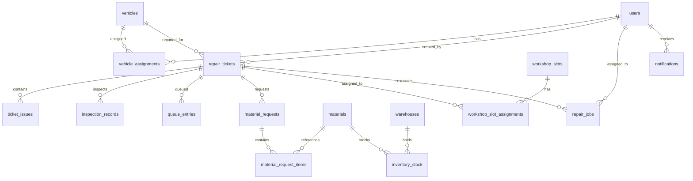

# 12 Logical Database Design & ERD

**Trạng thái: Hoàn thành (Finalized - Version 3.0)**

---

## Purpose
Chương này trình bày thiết kế cơ sở dữ liệu logic (Logical Database Design) của hệ thống VRMS dưới dạng Sơ đồ quan hệ thực thể (ERD) và đặc tả chi tiết cấu trúc các bảng dữ liệu trong hệ quản trị CSDL PostgreSQL. Tài liệu này cung cấp thông tin kỹ thuật chính xác cho đội ngũ lập trình Backend thiết kế Database Schema, Migration Scripts và phân quyền hệ thống.

---

## Questions Answered
- Dữ liệu của hệ thống được tổ chức thành các bảng vật lý nào trong CSDL quan hệ?
- Khóa chính (PK), khóa ngoại (FK) và các mối quan hệ ràng buộc giữa các bảng được thiết lập như thế nào để đảm bảo tính toàn vẹn?
- Kiểu dữ liệu, chỉ mục (indexes), các loại ENUM và chiến lược phân vùng (partitioning) của từng trường dữ liệu được đặc tả chi tiết ra sao?
- Các ràng buộc kiểm tra (CHECK constraints) và chiến lược soft delete/archival được thiết lập thế nào để bảo vệ tính toàn vẹn nghiệp vụ?

---

## Inputs
- [05 User Roles](file:///c:/Users/Legion/Desktop/IT/SNP/.agents/skills/system_engineering_copilot/deliverables/current/sss/part_a_business_foundation/05_user_roles.md) (Danh sách quyền & tác nhân).
- [09 Business Rules](file:///c:/Users/Legion/Desktop/IT/SNP/.agents/skills/system_engineering_copilot/deliverables/current/sss/part_b_requirement_analysis/09_business_rules.md) (Các quy tắc ràng buộc).
- [11 Domain Model](file:///c:/Users/Legion/Desktop/IT/SNP/.agents/skills/system_engineering_copilot/deliverables/current/sss/part_c_data_design/11_domain_model.md) (Mô hình miền nghiệp vụ & thực thể).

---

## Content

### Level 1 — Summary

Cơ sở dữ liệu của VRMS được xây dựng trên mô hình cơ sở dữ liệu quan hệ chuẩn hóa. Để tránh tình trạng sơ đồ bị rối (spaghetti) khi có nhiều thực thể, sơ đồ ERD dưới đây chỉ hiển thị tên bảng và các liên kết khóa ngoại cốt lõi giữa chúng:

#### **Sơ đồ quan hệ bảng hệ thống VRMS (High-Level Database ERD)**



---

### Level 2 — Table Definitions

VRMS bao gồm **18 bảng quan hệ vật lý cốt lõi** dưới đây được định nghĩa theo quy chuẩn đặt tên viết thường dạng số nhiều (snake_case) và chiến lược chọn khóa chính (UUID cho thực thể ngoài và SERIAL/BIGSERIAL cho hệ thống nội bộ):

#### **1. Bảng `users` (Tài khoản người dùng)**
*   **Chiến lược khóa chính:** Sử dụng `UUID` vì là thực thể chính tham gia tương tác API/đăng nhập.
*   **Trạng thái enums:** Sử dụng `user_role` ENUM và `user_status` ENUM.

| Tên trường | Kiểu dữ liệu | Khóa | Nullable | Mô tả & Ràng buộc |
| :--- | :--- | :---: | :---: | :--- |
| `id` | UUID | PK | No | Khóa chính dạng UUID (DEFAULT gen_random_uuid()) |
| `employee_code` | VARCHAR(20) | | No | Mã số nhân viên (UNIQUE) |
| `full_name` | VARCHAR(100) | | No | Họ và tên đầy đủ |
| `phone` | VARCHAR(20) | | No | Số điện thoại di động (UNIQUE, CHECK định dạng số điện thoại) |
| `role` | ENUM | | No | Vai trò (`user_role` ENUM: DRIVER, MECHANIC, TECH, INVENTORY, MANAGER) |
| `status` | ENUM | | No | Trạng thái hoạt động (`user_status` ENUM: ACTIVE, INACTIVE) |
| `created_at` | TIMESTAMP | | No | Thời điểm tạo (DEFAULT CURRENT_TIMESTAMP) |

#### **2. Bảng `vehicles` (Danh mục phương tiện)**
*   **Chiến lược khóa chính:** Sử dụng `UUID` (Exposed Entity).

| Tên trường | Kiểu dữ liệu | Khóa | Nullable | Mô tả & Ràng buộc |
| :--- | :--- | :---: | :---: | :--- |
| `id` | UUID | PK | No | Khóa chính dạng UUID (DEFAULT gen_random_uuid()) |
| `vehicle_code` | VARCHAR(50) | | No | Số quản lý nội bộ xe (UNIQUE) |
| `plate_number` | VARCHAR(20) | | No | Biển số xe (UNIQUE, CHECK định dạng biển số) |
| `type` | ENUM | | No | Chủng loại (`vehicle_type` ENUM: INTERNAL_TRUCK, INTERNAL_VAN, EXTERNAL_CLIENT) |
| `status` | ENUM | | No | Trạng thái kỹ thuật (`vehicle_status` ENUM: ACTIVE, BROKEN, REPAIRING) |
| `is_external` | BOOLEAN | | No | Xác định xe ngoài (DEFAULT FALSE) |
| `created_at` | TIMESTAMP | | No | Thời điểm đăng ký xe vào hệ thống |

#### **3. Bảng `vehicle_assignments` (Phân công xe cho tài xế)**
*   **Chiến lược khóa chính:** Sử dụng `SERIAL` (Bảng phụ hệ thống nội bộ).

| Tên trường | Kiểu dữ liệu | Khóa | Nullable | Mô tả & Ràng buộc |
| :--- | :--- | :---: | :---: | :--- |
| `id` | SERIAL | PK | No | Khóa chính tự tăng |
| `vehicle_id` | UUID | FK | No | Liên kết `vehicles.id` (ON DELETE CASCADE) |
| `driver_id` | UUID | FK | No | Liên kết `users.id` (ON DELETE CASCADE) |
| `assigned_at` | TIMESTAMP | | No | Thời gian gán xe (DEFAULT CURRENT_TIMESTAMP) |
| `released_at` | TIMESTAMP | | Yes | Thời gian thu hồi xe (NULL khi xe đang được gán) |
| `is_active` | BOOLEAN | | No | Trạng thái hiệu lực phân công (DEFAULT TRUE) |

#### **4. Bảng `repair_tickets` (Phiếu báo sửa chữa)**
*   **Chiến lược khóa chính:** Sử dụng `UUID` (Exposed Entity phục vụ Mobile API).

| Tên trường | Kiểu dữ liệu | Khóa | Nullable | Mô tả & Ràng buộc |
| :--- | :--- | :---: | :---: | :--- |
| `id` | UUID | PK | No | Khóa chính dạng UUID (DEFAULT gen_random_uuid()) |
| `ticket_no` | VARCHAR(50) | | No | Số phiếu tự tăng định dạng chuẩn (UNIQUE) |
| `vehicle_id` | UUID | FK | No | Liên kết `vehicles.id` (ON DELETE RESTRICT) |
| `driver_id` | UUID | FK | Yes | Liên kết `users.id` (Lái xe nội bộ báo - ON DELETE SET NULL) |
| `guest_owner_name`| VARCHAR(100) | | Yes | Tên chủ xe vãng lai |
| `guest_owner_phone`| VARCHAR(20) | | Yes | SĐT chủ xe vãng lai |
| `status` | ENUM | | No | Trạng thái phiếu (`ticket_status` ENUM: REPORTED, INSPECTING, WAITING_QUEUE, WAITING_PARTS, REPAIRING, COMPLETED, CLOSED, REJECTED) |
| `priority` | ENUM | | No | Độ ưu tiên sửa (`ticket_priority` ENUM: LOW, MEDIUM, HIGH) |
| `created_at` | TIMESTAMP | | No | Ngày khởi tạo phiếu |

> **Ràng buộc kiểm tra nghiệp vụ (CHECK constraint):**
> ```sql
> CHECK (
>     (driver_id IS NOT NULL AND guest_owner_name IS NULL AND guest_owner_phone IS NULL)
>     OR
>     (driver_id IS NULL AND guest_owner_name IS NOT NULL AND guest_owner_phone IS NOT NULL)
> )
> ```
> Đảm bảo phiếu báo hỏng luôn gắn với một chủ thể chịu trách nhiệm rõ ràng. Ràng buộc kiểm tra chéo (nếu xe nội bộ thì `driver_id` không được trống) được thực hiện ở tầng Application Service Layer.

#### **5. Bảng `ticket_issues` (Danh mục lỗi chi tiết)**
*   **Chiến lược khóa chính:** Sử dụng `UUID` (Exposed Entity).

| Tên trường | Kiểu dữ liệu | Khóa | Nullable | Mô tả & Ràng buộc |
| :--- | :--- | :---: | :---: | :--- |
| `id` | UUID | PK | No | Khóa chính dạng UUID |
| `ticket_id` | UUID | FK | No | Liên kết `repair_tickets.id` (ON DELETE CASCADE) |
| `issue_type` | VARCHAR(50) | | No | Danh mục lỗi (Lốp, Phanh, Động cơ...) |
| `description` | TEXT | | No | Mô tả chi tiết hỏng hóc thực tế |
| `severity` | ENUM | | No | Mức độ lỗi (`ticket_priority` ENUM) |

#### **6. Bảng `attachments` (Metadata tệp đính kèm đa hình)**
*   **Chiến lược khóa chính:** Sử dụng `UUID` (Exposed Entity).
*   **Cơ chế liên kết:** Sử dụng quan hệ đa hình (`entity_type`, `entity_id`). Tính toàn vẹn tham chiếu (Referential Integrity) được kiểm soát ở tầng Application Service Layer.

| Tên trường | Kiểu dữ liệu | Khóa | Nullable | Mô tả & Ràng buộc |
| :--- | :--- | :---: | :---: | :--- |
| `id` | UUID | PK | No | Khóa chính dạng UUID |
| `file_name` | VARCHAR(255) | | No | Tên tệp gốc |
| `mime_type` | VARCHAR(100) | | No | Định dạng tệp (image/jpeg, video/mp4...) |
| `size_bytes` | BIGINT | | No | Kích thước tệp (CHECK size_bytes > 0) |
| `storage_key` | VARCHAR(255) | | No | Khóa định danh vật lý trên S3/MinIO |
| `file_url` | VARCHAR(512) | | No | Đường dẫn CDN truy cập tệp trực tiếp |
| `entity_type` | VARCHAR(50) | | No | Phân loại liên kết ('TICKET', 'INSPECTION', 'REPAIR') |
| `entity_id` | UUID | | No | ID của bản ghi liên quan (quan hệ đa hình) |
| `uploaded_by` | UUID | FK | Yes | Người tải lên (Liên kết `users.id` - ON DELETE SET NULL) |
| `uploaded_at` | TIMESTAMP | | No | Thời điểm tải lên (DEFAULT CURRENT_TIMESTAMP) |

#### **7. Bảng `inspection_records` (Biên bản kiểm định)**
*   **Chiến lược khóa chính:** Sử dụng `UUID` (Exposed Entity).

| Tên trường | Kiểu dữ liệu | Khóa | Nullable | Mô tả & Ràng buộc |
| :--- | :--- | :---: | :---: | :--- |
| `id` | UUID | PK | No | Khóa chính dạng UUID |
| `ticket_id` | UUID | FK | No | Liên kết `repair_tickets.id` (ON DELETE CASCADE) |
| `inspection_type` | ENUM | | No | Loại kiểm định (`inspection_type` ENUM: INITIAL_INSPECTION, TECHNICAL_DIAGNOSIS, FINAL_ACCEPTANCE) |
| `inspected_by` | UUID | FK | No | Người kiểm tra (Liên kết `users.id` - ON DELETE RESTRICT) |
| `findings` | TEXT | | No | Ghi nhận/Đánh giá chi tiết kỹ thuật |
| `decision` | ENUM | | No | Kết quả xử lý (`inspection_decision` ENUM: APPROVE, REJECT, QUEUE, REPAIR_AGAIN) |
| `inspected_at` | TIMESTAMP | | No | Thời gian thực hiện kiểm định |

#### **8. Bảng `queue_entries` (Dòng xếp hàng chờ chi tiết)**
*   **Chiến lược khóa chính:** Sử dụng `BIGSERIAL` (Bảng phụ nội bộ phình nhanh).

| Tên trường | Kiểu dữ liệu | Khóa | Nullable | Mô tả & Ràng buộc |
| :--- | :--- | :---: | :---: | :--- |
| `id` | BIGSERIAL | PK | No | Khóa chính tự tăng 8-byte |
| `ticket_id` | UUID | FK | No | Liên kết `repair_tickets.id` (ON DELETE CASCADE) |
| `position` | INT | | No | Số thứ tự xếp hàng (Tự tăng theo FIFO) |
| `priority` | SMALLINT | | No | Độ ưu tiên xếp hàng (0: Normal, 10: Urgent, 100: Emergency, DEFAULT 0, CHECK priority >= 0) |
| `entered_at` | TIMESTAMP | | No | Thời điểm vào hàng chờ (DEFAULT CURRENT_TIMESTAMP) |
| `status` | ENUM | | No | Trạng thái xếp hàng (`queue_entry_status` ENUM: WAITING, PROMOTED, CANCELLED) |

#### **9. Bảng `warehouses` (Danh mục kho hàng)**
*   **Chiến lược khóa chính:** Sử dụng `UUID`.

| Tên trường | Kiểu dữ liệu | Khóa | Nullable | Mô tả & Ràng buộc |
| :--- | :--- | :---: | :---: | :--- |
| `id` | UUID | PK | No | Khóa chính dạng UUID |
| `warehouse_name` | VARCHAR(100) | | No | Tên kho hàng |
| `location` | VARCHAR(255) | | No | Địa chỉ vật lý của kho |
| `status` | ENUM | | No | Trạng thái hoạt động (`warehouse_status` ENUM: ACTIVE, INACTIVE) |
| `is_active` | BOOLEAN | | No | Cột hỗ trợ lưu trữ Soft Delete (DEFAULT TRUE) |

#### **10. Bảng `materials` (Danh mục vật tư phụ tùng)**
*   **Chiến lược khóa chính:** Sử dụng `UUID`.

| Tên trường | Kiểu dữ liệu | Khóa | Nullable | Mô tả & Ràng buộc |
| :--- | :--- | :---: | :---: | :--- |
| `id` | UUID | PK | No | Khóa chính dạng UUID |
| `sku` | VARCHAR(50) | | No | Mã quản lý vật tư độc nhất (UNIQUE) |
| `name` | VARCHAR(100) | | No | Tên gọi của vật tư phụ tùng |
| `category` | VARCHAR(50) | | No | Phân nhóm vật tư (Lốp, Dầu, Lọc...) |
| `unit` | VARCHAR(20) | | No | Đơn vị tính (Cái, Lít, Bộ..., kiểm định theo danh sách chuẩn ứng dụng) |
| `reorder_level` | INT | | No | Ngưỡng báo động cần nhập thêm hàng (CHECK reorder_level >= 0) |
| `is_active` | BOOLEAN | | No | Cột hỗ trợ lưu trữ Soft Delete (DEFAULT TRUE) |

#### **11. Bảng `inventory_stock` (Quản lý tồn kho liên kết)**
*   **Chiến lược khóa chính:** Sử dụng Composite PK (`material_id`, `warehouse_id`).

| Tên trường | Kiểu dữ liệu | Khóa | Nullable | Mô tả & Ràng buộc |
| :--- | :--- | :---: | :---: | :--- |
| `material_id` | UUID | PK, FK | No | Liên kết `materials.id` (ON DELETE CASCADE) |
| `warehouse_id` | UUID | PK, FK | No | Liên kết `warehouses.id` (ON DELETE CASCADE) |
| `quantity_on_hand` | INT | | No | Số lượng thực tế có trong kho (CHECK quantity_on_hand >= 0) |
| `quantity_reserved` | INT | | No | Số lượng đặt trước cho xe (CHECK quantity_reserved >= 0) |

> **Ràng buộc kiểm tra tồn kho (CHECK constraint):**
> ```sql
> CHECK (quantity_on_hand >= quantity_reserved)
> ```
> Bảo đảm số lượng phụ tùng đặt trước (reserved) không bao giờ vượt quá tổng lượng tồn kho thực tế đang có sẵn trong kho (on hand). Lượng hàng khả dụng thực xuất (available) được tính bằng: `quantity_on_hand - quantity_reserved`.

#### **12. Bảng `material_requests` (Yêu cầu phụ tùng)**
*   **Chiến lược khóa chính:** Sử dụng `UUID` (Exposed Entity).

| Tên trường | Kiểu dữ liệu | Khóa | Nullable | Mô tả & Ràng buộc |
| :--- | :--- | :---: | :---: | :--- |
| `id` | UUID | PK | No | Khóa chính dạng UUID |
| `ticket_id` | UUID | FK | No | Liên kết `repair_tickets.id` (ON DELETE RESTRICT) |
| `requester_id` | UUID | FK | No | KTV tạo đơn (Liên kết `users.id` - ON DELETE RESTRICT) |
| `status` | ENUM | | No | Trạng thái đơn (`material_request_status` ENUM: PENDING, APPROVED, PARTIAL, ISSUED, RECEIVED, REJECTED) |
| `created_at` | TIMESTAMP | | No | Thời điểm tạo yêu cầu |

#### **13. Bảng `material_request_items` (Chi tiết linh kiện đơn yêu cầu)**
*   **Chiến lược khóa chính:** Sử dụng `BIGSERIAL` (Bảng phụ nội bộ).

| Tên trường | Kiểu dữ liệu | Khóa | Nullable | Mô tả & Ràng buộc |
| :--- | :--- | :---: | :---: | :--- |
| `id` | BIGSERIAL | PK | No | Khóa chính tự tăng 8-byte |
| `request_id` | UUID | FK | No | Liên kết `material_requests.id` (ON DELETE CASCADE) |
| `material_id` | UUID | FK | No | Liên kết `materials.id` (ON DELETE RESTRICT) |
| `quantity_requested`| INT | | No | Số lượng KTV đăng ký yêu cầu (CHECK quantity_requested > 0) |
| `quantity_approved` | INT | | No | Số lượng thực tế thủ kho đã duyệt cấp (CHECK quantity_approved >= 0) |
| `quantity_issued` | INT | | No | Số lượng thực tế lái xe đã nhận vật lý (CHECK quantity_issued >= 0) |

> **Ràng buộc kiểm tra cấp phát (CHECK constraint):**
> ```sql
> CHECK (quantity_issued <= quantity_approved)
> ```

#### **14. Bảng `workshop_slots` (Cầu sửa chữa vật lý)**
*   **Chiến lược khóa chính:** Sử dụng `UUID`.

| Tên trường | Kiểu dữ liệu | Khóa | Nullable | Mô tả & Ràng buộc |
| :--- | :--- | :---: | :---: | :--- |
| `id` | UUID | PK | No | Khóa chính dạng UUID |
| `slot_name` | VARCHAR(50) | | No | Tên/Mã cầu sửa chữa (UNIQUE) |
| `status` | ENUM | | No | Trạng thái cầu (`slot_status` ENUM: VACANT, OCCUPIED, MAINTENANCE) |

#### **15. Bảng `workshop_slot_assignments` (Lịch sử và vị trí đỗ cầu sửa xe)**
*   **Chiến lược khóa chính:** Sử dụng `SERIAL` (Bảng phụ nội bộ).

| Tên trường | Kiểu dữ liệu | Khóa | Nullable | Mô tả & Ràng buộc |
| :--- | :--- | :---: | :---: | :--- |
| `id` | SERIAL | PK | No | Khóa chính tự tăng |
| `slot_id` | UUID | FK | No | Liên kết `workshop_slots.id` (ON DELETE CASCADE) |
| `ticket_id` | UUID | FK | No | Liên kết `repair_tickets.id` (ON DELETE CASCADE) |
| `assigned_at` | TIMESTAMP | | No | Thời điểm đỗ vào cầu (DEFAULT CURRENT_TIMESTAMP) |
| `released_at` | TIMESTAMP | | Yes | Thời điểm rời cầu (NULL khi xe đang được sửa tại cầu) |

#### **16. Bảng `repair_jobs` (Thực thi sửa chữa)**
*   **Chiến lược khóa chính:** Sử dụng `UUID` (Exposed Entity).
*   **Quan hệ:** Một `repair_tickets` có nhiều `repair_jobs`, mỗi job gán cho một KTV khác nhau, đáp ứng nghiệp vụ sửa song song nhiều lỗi (N-N giữa Ticket và KTV).

| Tên trường | Kiểu dữ liệu | Khóa | Nullable | Mô tả & Ràng buộc |
| :--- | :--- | :---: | :---: | :--- |
| `id` | UUID | PK | No | Khóa chính dạng UUID |
| `ticket_id` | UUID | FK | No | Liên kết `repair_tickets.id` (ON DELETE CASCADE) |
| `technician_id` | UUID | FK | No | KTV phụ trách tác vụ (Liên kết `users.id` - ON DELETE RESTRICT) |
| `started_at` | TIMESTAMP | | No | Bắt đầu bấm sửa chữa |
| `completed_at` | TIMESTAMP | | Yes | Hoàn tất sửa chữa (NULL khi đang sửa) |
| `notes` | TEXT | | Yes | Ghi chú của KTV về quá trình sửa |
| `status` | ENUM | | No | Trạng thái công việc (`repair_job_status` ENUM: REPAIRING, COMPLETED) |

#### **17. Bảng `notifications` (Hộp thư thông báo trong ứng dụng)**
*   **Chiến lược khóa chính:** Sử dụng `UUID` (Exposed Entity).

| Tên trường | Kiểu dữ liệu | Khóa | Nullable | Mô tả & Ràng buộc |
| :--- | :--- | :---: | :---: | :--- |
| `id` | UUID | PK | No | Khóa chính dạng UUID |
| `user_id` | UUID | FK | No | Người nhận (Liên kết `users.id` - ON DELETE CASCADE) |
| `notification_type`| ENUM | | No | Phân loại thông báo (`notification_type` ENUM: TICKET_UPDATED, QUEUE_PROMOTED, PARTS_READY, SYSTEM_ALERT) |
| `title` | VARCHAR(150) | | No | Tiêu đề thông báo ngắn |
| `body` | TEXT | | No | Nội dung chi tiết thông báo |
| `is_read` | BOOLEAN | | No | Trạng thái đã đọc (DEFAULT FALSE) |
| `delivery_status` | ENUM | | No | Trạng thái gửi thông báo (`delivery_status` ENUM: PENDING, SENT, FAILED, DEFAULT 'PENDING') |
| `sent_at` | TIMESTAMP | | Yes | Thời điểm gửi thành công (NULL khi chưa gửi hoặc gửi lỗi) |
| `created_at` | TIMESTAMP | | No | Thời điểm tạo thông báo |

#### **18. Bảng `audit_logs` (Nhật ký kiểm toán - Bảng phân vùng vật lý)**
*   **Chiến lược khóa chính:** Sử dụng cặp khóa kết hợp (Composite PK) gồm `id` (`BIGSERIAL`) và `created_at` (`TIMESTAMP`) để đáp ứng quy tắc phân vùng của PostgreSQL.

| Tên trường | Kiểu dữ liệu | Khóa | Nullable | Mô tả & Ràng buộc |
| :--- | :--- | :---: | :---: | :--- |
| `id` | BIGSERIAL | PK | No | Khóa chính tự tăng 8-byte |
| `actor_id` | UUID | FK | Yes | Người thực hiện (Liên kết `users.id` - ON DELETE SET NULL) |
| `action` | VARCHAR(100) | | No | Mô tả hành động (ví dụ: 'QUEUE_OVERRIDE') |
| `entity_type` | VARCHAR(50) | | No | Bảng bị thay đổi dữ liệu (ví dụ: 'repair_tickets') |
| `entity_id` | UUID | | No | ID dạng UUID của bản ghi bị tác động |
| `old_values` | JSONB | | Yes | Dữ liệu cũ định dạng JSON |
| `new_values` | JSONB | | Yes | Dữ liệu mới định dạng JSON |
| `created_at` | TIMESTAMP | PK | No | Thời điểm ghi log (DEFAULT NOW - Khóa phân vùng) |

---

## Level 3 — Technical Detail

### 1. Naming Conventions & PK/FK Strategy
Hệ thống tuân thủ nghiêm ngặt các quy chuẩn Backend & DBA:
- **Tên bảng:** Luôn ở dạng viết thường số nhiều, ngăn cách bằng dấu gạch dưới (`snake_case`). Ví dụ: `repair_tickets`.
- **Khóa chính:** Các thực thể lộ ra API ngoài (Exposed Entities) luôn sử dụng `UUID` để bảo mật thông tin mã số tăng dần. Bảng hệ thống nội bộ sử dụng `SERIAL` hoặc `BIGSERIAL` để tối ưu hóa hiệu năng ghi.
- **Khóa ngoại:** Phải khớp với tên bảng số ít kết hợp hậu tố `_id`. Ví dụ: `vehicle_id` (trỏ đến `vehicles.id`).

### 2. Ràng buộc toàn vẹn dữ liệu (Referential Integrity strategy)
*   **Cascade strategy (`ON DELETE CASCADE`):** Áp dụng cho các bảng phụ thuộc yếu nhằm dọn rác tự động khi bảng cha bị xóa. Các quan hệ áp dụng gồm: `ticket_issues.ticket_id`, `vehicle_assignments.vehicle_id`, `material_request_items.request_id`, `notifications.user_id`, `repair_jobs.ticket_id`, `workshop_slot_assignments.slot_id`, `workshop_slot_assignments.ticket_id`.
*   **Restrict strategy (`ON DELETE RESTRICT`):** Sử dụng bảo vệ dữ liệu lịch sử/kế toán doanh nghiệp. Chặn hành động xóa thực thể cha nếu đã phát sinh dữ liệu liên kết. Áp dụng cho: `repair_tickets.vehicle_id` (không cho phép xóa xe đã có lịch sử sửa chữa), `material_requests.requester_id` (chặn xóa KTV đã tạo yêu cầu).

### 3. Thiết lập Chỉ mục dữ liệu (Indexing Strategy)
Các chỉ mục trong hệ thống được cấu hình chi tiết nhằm tăng tốc độ truy vấn:
*   **B-Tree Indexes:**
    *   `vehicles(plate_number)`: UNIQUE Index phục vụ tìm kiếm xe nhanh theo biển số.
    *   `users(employee_code)`: UNIQUE Index phục vụ xác thực người dùng.
    *   `repair_tickets(ticket_no)`: UNIQUE Index tra cứu phiếu nhanh.
*   **Composite Index (Chỉ mục phức hợp):**
    *   `inventory_stock(material_id, warehouse_id)`: Phục vụ so khớp số lượng tồn kho khả dụng nhanh chóng khi thực hiện kiểm tra chéo đa kho.
*   **Partial Unique Indexes (Chỉ mục độc nhất một phần):**
    *   `unique_active_slot_assignment` trên `workshop_slot_assignments (slot_id) WHERE (released_at IS NULL)`: Đảm bảo một cầu sửa chữa tại một thời điểm chỉ chứa tối đa 1 xe đang sửa.
    *   `unique_active_ticket_assignment` trên `workshop_slot_assignments (ticket_id) WHERE (released_at IS NULL)`: Đảm bảo một xe đang sửa tại một thời điểm chỉ được đỗ ở duy nhất 1 cầu sửa chữa.
*   **GIN Index (Generalized Inverted Index):**
    *   `audit_logs USING gin (old_values, new_values)`: Hỗ trợ tìm kiếm thông tin thay đổi theo các khóa động bên trong định dạng JSONB của nhật ký kiểm toán.

### 4. Phân vùng vật lý cho Audit Logs (PostgreSQL Table Partitioning)
Do bảng `audit_logs` sẽ tích lũy dữ liệu rất nhanh theo thời gian làm giảm hiệu năng truy vấn của cả hệ thống, hệ thống áp dụng chiến lược **Range Partitioning** theo tháng đối với cột `created_at`:

```sql
-- Khởi tạo bảng Audit Logs cha với thuộc tính phân vùng
CREATE TABLE audit_logs (
    id BIGSERIAL,
    actor_id UUID,
    action VARCHAR(100),
    entity_type VARCHAR(50),
    entity_id UUID,
    old_values JSONB,
    new_values JSONB,
    created_at TIMESTAMP NOT NULL,
    PRIMARY KEY (id, created_at) -- Cột phân vùng phải nằm trong khóa chính
) PARTITION BY RANGE (created_at);
```
> **Chú ý về mặt cú pháp trong PostgreSQL:** 
> Khi sử dụng tính năng phân vùng bảng (Table Partitioning), PostgreSQL bắt buộc cột phân vùng (`created_at`) phải nằm trong tập hợp các cột tạo nên Primary Key của bảng. Do đó, `PRIMARY KEY (id, created_at)` là cú pháp bắt buộc để PostgreSQL chấp nhận phân vùng theo `created_at`, mặc dù trường `id` (`BIGSERIAL`) về mặt logic đã đủ điều kiện đảm bảo tính duy nhất trên toàn bảng.

### 5. Chiến lược Soft Delete / Lưu trữ dữ liệu lịch sử (Archival & Soft Delete Strategy)
Đối với một hệ thống ERP doanh nghiệp, việc xóa cứng (Hard Delete) các danh mục cốt lõi là cực kỳ nguy hiểm, gây đứt gãy referential integrity của dữ liệu lịch sử. VRMS áp dụng các quy chuẩn sau để quản lý lưu trữ:
- **Tài khoản người dùng (`users`):** Không xóa bản ghi, chuyển trạng thái `status` sang `INACTIVE`. Hệ thống xác thực sẽ chặn đăng nhập, và các bộ lọc API sẽ tự động ẩn nhân sự này khỏi danh sách phân công mới.
- **Phương tiện (`vehicles`):** Thay vì xóa xe, chuyển `status` sang một cờ trạng thái hỏng hóc hoặc ngừng hoạt động thích hợp. Lịch sử sửa chữa của xe vẫn được bảo toàn nguyên vẹn phục vụ kế toán.
- **Vật tư phụ tùng (`materials`) & Kho hàng (`warehouses`):** Áp dụng cột `is_active` (boolean, mặc định TRUE). Khi quản lý thực hiện xóa vật tư hoặc đóng kho, `is_active` chuyển sang `FALSE`. Các API tra cứu vật tư/kho hàng mới sẽ lọc điều kiện `is_active = TRUE`, nhưng các đơn yêu cầu phụ tùng (`material_requests`) cũ trỏ tới các ID này vẫn hiển thị đúng thông tin lịch sử.

---

## Outputs
- Tệp đặc tả thiết kế cơ sở dữ liệu hoàn chỉnh: [12_erd.md](file:///c:/Users/Legion/Desktop/IT/SNP/.agents/skills/system_engineering_copilot/deliverables/current/sss/part_c_data_design/12_erd.md)
