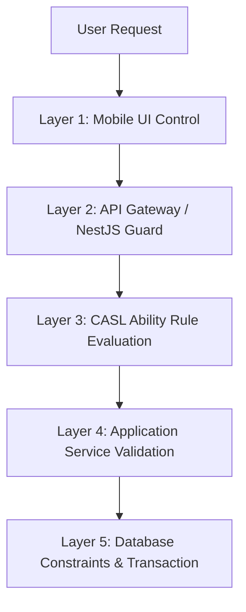

# Chapter 14 — CRUD & Access Control Matrix

**Trạng thái: Hoàn thành (Finalized - Version 2.0)**

---

## Purpose
Chương này định nghĩa **Ma trận Phân quyền & Kiểm soát Truy cập Dữ liệu (Permission & Access Control Matrix)** của 5 vai trò người dùng (`user_role` ENUM) kết hợp với tác nhân hệ thống (`SYSTEM` actor) đối với 18 bảng vật lý trong cơ sở dữ liệu hệ thống VRMS. Tài liệu này đóng vai trò đặc tả chi tiết về cả quyền hạn vai trò (RBAC) lẫn kiểm soát dựa trên sở hữu bản ghi (ABAC/Row-Level Security), làm căn cứ kỹ thuật để Backend thiết kế lớp bảo mật (CASL Abilities, Auth Guards) và QA thiết kế bộ test cases bảo mật truy cập.

---

## Questions Answered
- Vai trò nào có quyền thực hiện các thao tác Tạo (Create), Đọc (Read), Cập nhật (Update) trên các thực thể CSDL?
- Hành động xóa được kiểm soát như thế nào qua sự phân biệt giữa Xóa mềm (Soft Delete) và Xóa vật lý (Physical Delete)?
- Tác nhân hệ thống (`SYSTEM` actor) tự động tương tác và ghi nhận thông tin đối với các bảng audit, notification và slot assignment ra sao?
- Các quy tắc Row-Level Security (RLS) được định nghĩa kỹ thuật như thế nào để xác định quyền sở hữu bản ghi (`Own`)?
- Các hành động nghiệp vụ đặc thù (Domain Actions) thay vì cập nhật thô (Raw CRUD) được phân quyền cụ thể thế nào?
- Kiến trúc áp dụng và thực thi phân quyền (Enforcement Architecture) được triển khai ở các tầng nào trong hệ thống?

---

## Inputs
- [05 User Roles](file:///c:/Users/Legion/Desktop/IT/SNP/.agents/skills/system_engineering_copilot/deliverables/current/sss/part_a_business_foundation/05_user_roles.md)
- [12 Logical Database Design & ERD](file:///c:/Users/Legion/Desktop/IT/SNP/.agents/skills/system_engineering_copilot/deliverables/current/sss/part_c_data_design/12_erd.md)
- [13 Data Dictionary](file:///c:/Users/Legion/Desktop/IT/SNP/.agents/skills/system_engineering_copilot/deliverables/current/sss/part_c_data_design/13_data_dictionary.md)

---

## Content

### Level 1 — Summary
Hệ thống VRMS sử dụng mô hình kiểm soát truy cập hỗn hợp: **RBAC** (Role-Based Access Control) để phân quyền chức năng và **ABAC** (Attribute-Based Access Control) để phân quyền dữ liệu mức dòng dựa trên quan hệ sở hữu. 

Nhằm đảm bảo an toàn thông tin và tính toàn vẹn dữ liệu:
1. **Xóa mềm (Soft Delete - SD)**: Bản ghi không bị xóa thực tế khỏi đĩa cứng mà được cập nhật trường trạng thái (`status = INACTIVE` hoặc `is_active = FALSE`). Áp dụng đối với tất cả các bảng Danh mục (Master Data).
2. **Xóa vật lý (Physical Delete - PD)**: Chạy câu lệnh SQL `DELETE` để xóa thực tế dòng dữ liệu khỏi bảng. Chỉ được áp dụng đối với các bảng giao dịch phụ trợ hoặc bảng junction (bảng trung gian) khi dữ liệu đang ở trạng thái nháp.
3. **SYSTEM Actor**: Được đưa vào hệ thống như một tác nhân tự động (backend worker, event interceptor, scheduler) để thực hiện các tác vụ tự động mà người dùng thông thường không được phép đụng vào (như ghi đè Audit Logs hoặc tạo Notifications).

---

### Level 2 — Permission Conventions & Actors

#### 1. Các Ký hiệu Phân quyền
- **`C` (Create)**: Cho phép thêm mới bản ghi.
- **`R (Global)`**: Cho phép đọc toàn bộ dữ liệu trong bảng.
- **`R (Global - Ltd)`**: Chỉ cho phép đọc các trường thông tin cơ bản công khai (Ví dụ: `full_name`, `phone`, `role`, `status` trong bảng `users`), ẩn các trường nhạy cảm khác.
- **`R (Own)`**: Chỉ cho phép đọc bản ghi liên quan trực tiếp đến người dùng đang đăng nhập (xem chi tiết tại phần Row-Level Policies).
- **`U (Global)`**: Cho phép cập nhật tất cả bản ghi.
- **`U (Own)`**: Chỉ cho phép cập nhật bản ghi do mình sở hữu.
- **`U (Cond)`**: Chỉ cho phép cập nhật khi thỏa mãn các điều kiện trạng thái nghiệp vụ cụ thể.
- **`SD` (Soft Delete)**: Cho phép chuyển trạng thái hoạt động của bản ghi thành ngưng hoạt động (không chạy lệnh `DELETE`).
- **`PD` (Physical Delete)**: Cho phép xóa cứng bản ghi khỏi CSDL bằng lệnh `DELETE`.
- **`-` (No Access)**: Không có quyền truy cập dưới bất kỳ hình thức nào.

#### 2. Các Vai trò & Tác nhân (6 Actors)
- **`DRIVER` (Tài xế)**: Lái xe nội bộ hoặc xe vãng lai.
- **`MECHANIC` (Đội cơ giới)**: Người kiểm tra sơ bộ, điều phối hàng chờ đỗ xưởng, phân cầu sửa chữa và bàn giao xe.
- **`TECH` (Kỹ thuật viên)**: Người chẩn đoán chuyên sâu, thực hiện sửa chữa, lập yêu cầu linh kiện và nghiệm thu chất lượng kỹ thuật.
- **`INVENTORY` (Thủ kho)**: Người quản lý danh mục phụ tùng, kiểm kê tồn kho và thực xuất linh kiện.
- **`MANAGER` (Quản lý)**: Quản lý người dùng, thiết lập cấu hình hệ thống, giám sát hiệu suất và tra cứu audit log.
- **`SYSTEM` (Hệ thống tự động)**: Các backend interceptors, trigger, scheduler thực thi tự động.

---

### Level 3 — Technical Detail

#### 14.1 Ma trận Phân quyền Dữ liệu (Data Access Control Matrix)

Dưới đây là bảng ma trận chi tiết quyền CRUD, SD và PD đối với 18 bảng vật lý trong hệ thống VRMS:

| # | Bảng dữ liệu (Table Name) | DRIVER | MECHANIC | TECH | INVENTORY | MANAGER | SYSTEM | Ghi chú & Ràng buộc Nghiệp vụ đặc thù |
|---|---|:---:|:---:|:---:|:---:|:---:|:---:|---|
| 1 | `users` | R (Own) | R (Global - Ltd) | R (Global - Ltd) | R (Global - Ltd) | C R (Global) U (Global) SD | - | Nhân sự thông thường chỉ được xem hồ sơ cá nhân (`R (Own)`) và danh sách liên lạc cơ bản để làm việc. Chỉ Manager có quyền tạo, sửa đổi và vô hiệu hóa (`SD`) tài khoản nhân viên. |
| 2 | `vehicles` | R (Own) | C R (Global) U (Cond) | R (Global) | R (Global) | C R (Global) U (Global) SD | - | Mechanic chỉ được phép Tạo/Sửa thông tin đối với xe ngoài vãng lai (`is_external = TRUE`). Các phương tiện nội bộ chỉ do Manager quản trị. |
| 3 | `vehicle_assignments` | R (Own) | C R (Global) U (Cond) SD | R (Global) | - | C R (Global) U (Global) SD | U (Cond) | Mechanic gán xe chạy. SYSTEM tự động giải phóng gán xe (`U`) khi hết giờ ca chạy nếu Driver quên trả. |
| 4 | `repair_tickets` | C R (Own) U (Cond) | R (Global) U (Cond) | R (Global) U (Cond) | R (Global) | C R (Global) U (Global) SD | U (Cond) | - **Driver**: Chỉ được sửa thông tin ticket của mình khi `status = REPORTED`. Bị khóa cứng khi đã chuyển sang kiểm định. - **Mech/Tech**: Chỉ cập nhật các trạng thái thuộc phạm vi trách nhiệm. Không ai được phép xóa vật lý (`PD`) ticket. |
| 5 | `ticket_issues` | C R (Own) U (Cond) PD (Cond) | C R (Global) U (Cond) PD (Cond) | C R (Global) U (Cond) PD (Cond) | R (Global) | C R (Global) U (Global) PD | - | Driver/Mech/Tech chỉ được thêm/sửa/xóa lỗi khi ticket liên quan chưa được hoàn thành (`status` trước `COMPLETED`). |
| 6 | `attachments` | C R (Own) PD (Cond) | C R (Global) PD (Cond) | C R (Global) PD (Cond) | R (Global) | C R (Global) PD | - | Chỉ được phép xóa tệp đính kèm (`PD`) do chính mình tải lên và khi ticket chưa đóng (`CLOSED`). Cấm cập nhật trực tiếp nội dung file đính kèm. |
| 7 | `warehouses` | R (Global) | R (Global) | R (Global) | R (Global) | C R (Global) U (Global) SD | - | Thủ kho chỉ xem danh sách kho (`R`), không có quyền sửa thông tin cấu hình kho vật lý (chuyển đổi hoàn toàn sang Manager). |
| 8 | `materials` | R (Global) | R (Global) | R (Global) | C R (Global) U (Global) SD | C R (Global) U (Global) SD | - | Thủ kho quản trị danh mục vật tư phụ tùng nhưng không được xóa vật lý (`PD`), chỉ được khóa hoạt động (`SD`). |
| 9 | `inventory_stock` | - | R (Global) | R (Global) | C R (Global) U (Global) | C R (Global) U (Global) SD | U (Cond) | Thủ kho cập nhật tồn kho vật lý khi kiểm kho. SYSTEM tự động trừ/cộng/giữ chỗ tồn khả dụng (`on_hand`, `reserved`) dựa trên xuất nhập kho thực tế. |
| 10 | `material_requests` | R (Own) | R (Global) | C R (Own) U (Cond) | R (Global) U (Cond) | C R (Global) U (Global) SD | U (Cond) | Tech tạo yêu cầu vật tư cho xe đang sửa. Thủ kho duyệt cấp phát (`U (Cond)`). SYSTEM cập nhật trạng thái tự động. |
| 11 | `material_request_items`| R (Own) | R (Global) | C R (Own) U (Cond) PD (Cond) | R (Global) U (Cond) | C R (Global) U (Global) PD | U (Cond) | Tech chỉ thêm/sửa/xóa dòng vật tư khi yêu cầu đang `PENDING`. Thủ kho cập nhật số lượng duyệt và thực xuất. |
| 12 | `queue_entries` | R (Own) | C R (Global) U (Cond) SD | R (Global) | - | C R (Global) U (Global) SD | C U SD | Mechanic quản lý hàng chờ. Manager có quyền override thứ tự. SYSTEM tự động thêm/xóa xe khỏi hàng chờ khi xe lên cầu sửa chữa. |
| 13 | `inspection_records` | R (Own) | C R (Global) U (Own) | C R (Global) U (Own) | - | C R (Global) U (Global) SD | - | Chỉ người thực hiện kiểm định mới được phép cập nhật biên bản kiểm tra do mình ghi nhận. |
| 14 | `workshop_slots` | R (Global) | U (Cond) | U (Cond) | - | C R (Global) U (Global) SD | U (Cond) | Mech/Tech chỉ cập nhật trạng thái vận hành của cầu (`status` chuyển giữa `VACANT`, `OCCUPIED`). Cấu hình tên/cầu do Manager. |
| 15 | `workshop_slot_assignments`| R (Global) | C R (Global) U (Cond) | C R (Global) U (Cond) | - | C R (Global) U (Global) SD | C R (Global) U (Cond) | Lịch sử đỗ cầu được SYSTEM ghi nhận tự động khi đổi trạng thái xưởng. Mech/Tech cập nhật thủ công nếu cảm biến lỗi. |
| 16 | `repair_jobs` | R (Own) | C R (Global) U (Global) SD | R (Global) U (Own) | - | C R (Global) U (Global) SD | U (Cond) | Mechanic phân công việc cho Tech. Tech nhận việc, cập nhật trạng thái thi công và báo cáo hoàn thành trên đầu việc của mình. |
| 17 | `notifications` | R (Own) | R (Own) | R (Own) | R (Own) | R (Own) | C R (Global) U (Global) | Mọi người dùng chỉ được xem và cập nhật trạng thái đã đọc thông báo của chính mình. SYSTEM tạo và đẩy thông báo tự động. |
| 18 | `audit_logs` | - | - | - | - | R (Global) | C R (Global) | **Nghiêm cấm tuyệt đối CUD từ mọi con người**. SYSTEM là đối tượng duy nhất tự động chèn dữ liệu nhật ký kiểm toán hệ thống. |

---

#### 14.2 Quy tắc Bảo mật mức Dòng (Row-Level Security Policies)

Để hiện thực hóa quyền `Own` trong ma trận, hệ thống áp dụng các quy tắc kiểm tra quyền sở hữu dữ liệu dưới đây tại tầng dịch vụ ứng dụng:

| Bảng dữ liệu (Table Name) | Định nghĩa kỹ thuật về Quyền sở hữu (Own Security Policy) |
|---|---|
| `users` | `users.id = current_user.id` (Chỉ xem/sửa hồ sơ của bản thân). |
| `vehicles` | `EXISTS (SELECT 1 FROM vehicle_assignments WHERE vehicle_id = vehicles.id AND driver_id = current_user.id AND is_active = TRUE)` (Xe đang được gán trực tiếp cho tài xế trong ca chạy). |
| `vehicle_assignments` | `vehicle_assignments.driver_id = current_user.id` (Lịch sử phân công của riêng tài xế). |
| `repair_tickets` | `repair_tickets.driver_id = current_user.id` (Phiếu sửa chữa do tài xế tạo) **HOẶC** `repair_tickets.guest_owner_phone = current_user.phone` (Nếu là chủ xe vãng lai đăng nhập số điện thoại). |
| `ticket_issues` | `EXISTS (SELECT 1 FROM repair_tickets WHERE repair_tickets.id = ticket_issues.ticket_id AND repair_tickets.driver_id = current_user.id)` (Các hạng mục lỗi nằm trong ticket do tài xế sở hữu). |
| `attachments` | `attachments.uploaded_by = current_user.id` (Tệp tin do chính người dùng đó tải lên). |
| `material_requests` | `material_requests.requester_id = current_user.id` (Đơn đề xuất vật tư do chính KTV lập). |
| `material_request_items`| `EXISTS (SELECT 1 FROM material_requests WHERE material_requests.id = material_request_items.request_id AND material_requests.requester_id = current_user.id)` (Dòng linh kiện thuộc đơn yêu cầu do KTV lập). |
| `queue_entries` | `EXISTS (SELECT 1 FROM repair_tickets WHERE repair_tickets.id = queue_entries.ticket_id AND repair_tickets.driver_id = current_user.id)` (Vị trí xếp hàng của xe do tài xế sở hữu). |
| `inspection_records` | `inspection_records.inspected_by = current_user.id` (Biên bản kiểm tra do chính người dùng ghi nhận). |
| `repair_jobs` | `repair_jobs.technician_id = current_user.id` (Đầu việc sửa chữa được phân công cụ thể cho KTV đó). |
| `notifications` | `notifications.user_id = current_user.id` (Thông báo gửi riêng cho tài khoản đăng nhập). |

---

#### 14.3 Ma trận Phân quyền Hành động Nghiệp vụ (Action Authorization Matrix)

Các hành động nghiệp vụ làm thay đổi trạng thái của đối tượng trong vòng đời sửa chữa (State Machine Transitions) không map hoàn toàn 1-1 vào các thao tác CRUD cơ bản. Dưới đây là ma trận phân quyền thực thi các hành động đó:

##### A. Vòng đời Phiếu sửa chữa & Hàng chờ (Repair Ticket & Queue Actions)
| Hành động nghiệp vụ (Action) | DRIVER | MECHANIC | TECH | INVENTORY | MANAGER | SYSTEM | Ràng buộc nghiệp vụ chuyển trạng thái |
|---|:---:|:---:|:---:|:---:|:---:|:---:|---|
| `create_ticket` | **Yes** | - | - | - | **Yes** | - | Khởi tạo phiếu khi xe hỏng. Trạng thái khởi đầu: `REPORTED`. |
| `assign_driver` | - | **Yes** | - | - | **Yes** | - | Phân công xe cho tài xế. Tạo bản ghi trong `vehicle_assignments`. |
| `perform_inspection` | - | **Yes** | **Yes** | - | **Yes** | - | Ghi biên bản kiểm định sơ bộ (Mech) hoặc chẩn đoán/nghiệm thu (Tech). |
| `reject_ticket` | - | **Yes** | - | - | **Yes** | - | Từ chối tiếp nhận sửa chữa. Chuyển ticket sang `REJECTED`. |
| `assign_queue` | - | **Yes** | - | - | **Yes** | - | Đưa xe vào hàng chờ. Tạo bản ghi `queue_entries` với trạng thái `WAITING`. |
| `promote_queue` | - | **Yes** | - | - | **Yes** | - | Ưu tiên đẩy xe lên trước trong hàng chờ. Sửa `priority` trong queue. |
| `assign_slot` | - | **Yes** | **Yes** | - | **Yes** | **Yes** | Cho xe vào cầu nâng. Trạng thái ticket chuyển sang `REPAIRING`, cầu sang `OCCUPIED`. |
| `release_slot` | - | **Yes** | **Yes** | - | **Yes** | **Yes** | Rút xe khỏi cầu nâng. Cầu trở lại trạng thái `VACANT`. |
| `close_ticket` | - | - | **Yes** | - | **Yes** | - | Đóng hồ sơ sửa chữa sau nghiệm thu thành công. Trạng thái sang `CLOSED`. |

##### B. Quy trình Yêu cầu & Cấp phát Vật tư (Material Request Actions)
| Hành động nghiệp vụ (Action) | DRIVER | MECHANIC | TECH | INVENTORY | MANAGER | SYSTEM | Ràng buộc nghiệp vụ chuyển trạng thái |
|---|:---:|:---:|:---:|:---:|:---:|:---:|---|
| `create_request` | - | - | **Yes** | - | **Yes** | - | Tech lập yêu cầu cấp linh kiện. Trạng thái: `PENDING`. |
| `approve_request` | - | - | - | **Yes** | **Yes** | - | Thủ kho duyệt yêu cầu vật tư. Trạng thái chuyển sang `APPROVED` hoặc `REJECTED`. |
| `partial_approve` | - | - | - | **Yes** | **Yes** | - | Thủ kho duyệt một phần số lượng (nếu thiếu hàng). Trạng thái: `PARTIAL`. |
| `issue_materials` | - | - | - | **Yes** | **Yes** | - | Xuất kho phụ tùng bàn giao cho Driver. Trạng thái: `ISSUED`. Trừ tồn kho vật lý. |
| `receive_materials` | **Yes** | - | **Yes** | - | **Yes** | - | - **Driver**: Xác nhận nhận phụ tùng tại kho (`status = RECEIVED`). - **Tech**: Xác nhận nhận phụ tùng từ Driver tại xưởng để thi công. |
| `override_request` | - | - | - | - | **Yes** | - | Quản lý phê duyệt vượt cấp/bỏ qua các ràng buộc tồn kho cảnh báo. |

---

### Level 4 — Authorization Enforcement Architecture

Để đảm bảo các quy tắc phân quyền trên được thực thi triệt để và không thể bị vượt qua, hệ thống VRMS áp dụng kiến trúc bảo mật đa lớp (Defense in Depth) trải dài qua 5 tầng:

1. **Layer 1: Mobile/Web UI Control (Client Layer)**:
   - Các nút bấm hành động (Ví dụ: "Duyệt yêu cầu vật tư", "Báo hoàn thành sửa") sẽ tự động ẩn/hiện hoặc disable trên giao diện người dùng dựa trên vai trò (`role`) và trạng thái đối tượng được trả về từ API.
   - Tránh việc người dùng bấm nhầm hành động không được phép.

2. **Layer 2: API Gateway & Guards (Routing Layer - NestJS)**:
   - Kiểm tra Token JWT để xác định danh tính và vai trò người dùng (`DRIVER`, `TECH`, v.v.).
   - Áp dụng các Decorator phân quyền như `@Roles(UserRole.TECH)` tại Controller để chặn đứng các truy cập sai vai trò ở mức endpoint.

3. **Layer 3: CASL Ability Rule Evaluation (Resource Policy Layer)**:
   - Sử dụng thư viện CASL để định nghĩa động các bộ quy tắc (Abilities).
   - CASL đánh giá khả năng thực thi hành động trên đối tượng cụ thể (Ví dụ: `ability.can('update', ticket)` bằng cách kiểm tra thuộc tính `ticket.driver_id === user.id` đối với Driver).

4. **Layer 4: Application Service Validation (Business Rule Layer)**:
   - Thực hiện kiểm tra các ràng buộc trạng thái nghiệp vụ trước khi ghi dữ liệu. 
   - Ví dụ: Trước khi cập nhật mô tả lỗi, Service kiểm tra `if (ticket.status !== TicketStatus.REPORTED) throw new BadRequestException('Không thể chỉnh sửa phiếu sau khi đã kiểm định');`.

5. **Layer 5: Database Constraints & Transactions (Persistence Layer - PostgreSQL)**:
   - Áp dụng các ràng buộc khóa ngoại `ON DELETE RESTRICT` để chống xóa vật lý các bản ghi có liên kết lịch sử.
   - Sử dụng các CHECK Constraints cấp CSDL để chặn các dữ liệu phi logic (như số lượng xuất lớn hơn số lượng duyệt).
   - Thực thi các thao tác cập nhật số lượng tồn kho trong Database Transactions (`ACID`) kèm cơ chế khóa dòng (`SELECT FOR UPDATE`) để tránh tình trạng tranh chấp dữ liệu (Race Condition).

---

## Outputs
- File tài liệu đặc tả [14_crud_matrix.md](file:///c:/Users/Legion/Desktop/IT/SNP/.agents/skills/system_engineering_copilot/deliverables/current/sss/part_c_data_design/14_crud_matrix.md) đã được cập nhật hoàn chỉnh ma trận phân quyền, quy tắc RLS mức dòng, action matrix nghiệp vụ và kiến trúc thực thi bảo mật.
