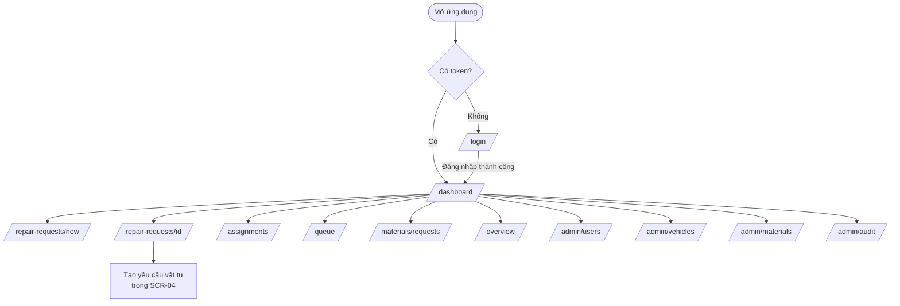

# 16 UI/UX Design

## Purpose
Chương này định nghĩa **Design System** và **UX Principles** của hệ thống FixTrack. Tài liệu xác lập nền tảng thiết kế thống nhất bao gồm: nguyên tắc UX, design tokens, hệ thống màu, typography, spacing, quy tắc responsive và interaction rules — là chuẩn tham chiếu cho toàn bộ màn hình trong [Chapter 17 — Screen Specifications](./17_screen_specs.md).

## Questions Answered
- Nền tảng kỹ thuật và nền tảng UI nào được dùng trong FixTrack?
- Nguyên tắc thiết kế trải nghiệm người dùng (UX Principles) là gì?
- Hệ thống màu, typography, spacing và radius được định nghĩa ra sao?
- Luồng điều hướng (Navigation Flow) tổng thể giữa các màn hình như thế nào?
- Hệ thống xử lý các trạng thái UI đặc biệt (loading, empty, error) theo chuẩn nào?

## Inputs
- [05 User Roles](../part_a_business_foundation/05_user_roles.md) — Vai trò và ma trận phân quyền.
- [06 Workflow Analysis](../part_b_requirement_analysis/06_workflow_analysis.md) — Quy trình 7 bước nghiệp vụ.
- [07 Functional Requirements](../part_b_requirement_analysis/07_functional_requirements.md) — Danh sách FR theo module.

---

## Content

### Level 1 — Nền tảng & Quyết định thiết kế

#### 1.1 Nền tảng kỹ thuật (Technology Foundation)

| Hạng mục | Lựa chọn | Lý do |
|---|---|---|
| Framework | Next.js 14 (App Router) + TypeScript | SSR/CSR hybrid, type safety |
| Styling | Tailwind CSS | Utility-first, consistent tokens |
| Nền tảng mục tiêu | **Web App (desktop-first, responsive)** | Người dùng thao tác chủ yếu trên máy tính trạm/tablet tại văn phòng và xưởng |
| Icon | **Không sử dụng icon library** | Nhãn văn bản đủ rõ ràng cho môi trường nghiệp vụ nội bộ |
| Font | System font (sans-serif) | Tải nhanh, không phụ thuộc CDN |

> **Quyết định: Web-first → Mobile sau.**
> Giai đoạn hiện tại xây dựng **Web App responsive** — chạy tốt trên desktop (văn phòng) và tablet (xưởng). Khi web đã ổn định và nghiệm thu thực tế, sẽ chuyển tiếp sang mobile app (PWA hoặc native) ở giai đoạn sau. Bottom nav, camera integration, offline sync là scope của giai đoạn mobile — **không thuộc phạm vi thiết kế hiện tại**.

---

#### 1.2 UX Principles

**P1 — Clarity over decoration**
Ưu tiên sự rõ ràng của thông tin hơn thẩm mỹ phức tạp. Người dùng trong môi trường công nghiệp đọc nhanh, thao tác nhanh, không cần hiệu ứng.

**P2 — Role-aware interface**
Giao diện tự điều chỉnh theo vai trò. Mỗi role chỉ thấy đúng những gì họ có quyền thao tác — không ẩn bằng disabled, ẩn hoàn toàn bằng conditional render.

**P3 — Progressive disclosure**
Màn hình danh sách hiển thị thông tin tóm tắt. Chi tiết chỉ mở ra khi người dùng chủ động vào. Không nhồi nhét tất cả vào một màn hình.

**P4 — Inline feedback**
Lỗi và xác nhận hiện ngay tại chỗ thao tác. Không dùng popup toàn màn hình trừ các hành động không thể hoàn tác (confirm dialog).

**P5 — Status as primary signal**
Status badge là yếu tố trực quan quan trọng nhất trên mọi danh sách. Màu sắc trạng thái phải nhất quán 100% xuyên suốt toàn hệ thống.

**P6 — Warning, not blocking**
Hệ thống cảnh báo người dùng khi dữ liệu có vấn đề (ví dụ: yêu cầu vật tư vượt tồn kho), nhưng không block thao tác trừ khi vi phạm business rule cứng (ví dụ: không có xe được gán → không thể tạo phiếu).

---

### Level 2 — Design Tokens

#### 2.1 Color System

**Brand Colors**
| Token | Hex | Dùng cho |
|---|---|---|
| `slate-900` | `#0f172a` | Primary CTA, header brand, active nav |
| `slate-700` | `#334155` | Body text, secondary actions |
| `slate-500` | `#64748b` | Muted text, labels |
| `slate-200` | `#e2e8f0` | Borders, dividers |
| `slate-100` | `#f1f5f9` | Table header background |
| `slate-50` | `#f8fafc` | Page background, hover states |
| `white` | `#ffffff` | Card/panel background |

**Status Badge Colors — Repair Ticket**
| Status | Label | Background | Text |
|---|---|---|---|
| `reported` | Đã báo lỗi | `blue-50` | `blue-700` |
| `inspecting` | Đang kiểm tra | `yellow-50` | `yellow-700` |
| `waiting_queue` | Chờ vào xưởng | `orange-50` | `orange-700` |
| `waiting_parts` | Chờ vật tư | `purple-50` | `purple-700` |
| `repairing` | Đang sửa | `indigo-50` | `indigo-700` |
| `completed` | Chờ nghiệm thu | `teal-50` | `teal-700` |
| `closed` | Đã đóng | `green-50` | `green-700` |
| `rejected` | Bị từ chối | `red-50` | `red-700` |

**Status Badge Colors — Severity (Mức độ hư hỏng)**
| Value | Label | Background | Text |
|---|---|---|---|
| `nho` | Nhỏ | `slate-100` | `slate-600` |
| `trung_binh` | Trung bình | `yellow-50` | `yellow-700` |
| `nghiem_trong` | Nghiêm trọng | `red-50` | `red-700` |

**Status Badge Colors — Vehicle**
| Value | Label | Background | Text |
|---|---|---|---|
| `hoat_dong` | Hoạt động | `green-50` | `green-700` |
| `hong` | Hỏng | `red-50` | `red-700` |
| `dang_sua` | Đang sửa | `indigo-50` | `indigo-700` |
| `ngung` | Ngừng | `slate-100` | `slate-500` |

**Status Badge Colors — Material Request**
| Value | Label | Background | Text |
|---|---|---|---|
| `cho_duyet` | Chờ duyệt | `yellow-50` | `yellow-700` |
| `da_xuat` | Đã xuất kho | `blue-50` | `blue-700` |
| `da_nhan_tai_xe` | Tài xế đã nhận | `purple-50` | `purple-700` |
| `da_ban_giao` | Đã bàn giao KTV | `teal-50` | `teal-700` |
| `tu_choi` | Từ chối | `red-50` | `red-700` |

**Feedback Colors**
| Loại | Background | Text | Border |
|---|---|---|---|
| Error | `red-50` | `red-700` | `red-200` |
| Warning | `yellow-50` | `yellow-800` | `yellow-200` |
| Success | `green-50` | `green-700` | `green-200` |
| Info | `blue-50` | `blue-700` | `blue-200` |

---

#### 2.2 Typography

| Token Tailwind | Size | Weight | Dùng cho |
|---|---|---|---|
| `text-2xl font-bold` | 24px / 700 | — | Page title (H1) — login page |
| `text-xl font-bold` | 20px / 700 | — | Section heading (H1 trong content) |
| `text-sm font-semibold uppercase tracking-wide` | 14px / 600 | — | Sub-section label, table header |
| `text-sm font-medium` | 14px / 500 | — | Button text, nav link active |
| `text-sm` | 14px / 400 | — | Body text, table cell, form input |
| `text-xs` | 12px / 400 | — | Badge label, helper text, metadata |
| `font-mono` | Monospace | — | Mã phiếu, mã xe (nhận dạng nhanh) |

---

#### 2.3 Spacing Scale

Hệ thống dùng Tailwind spacing scale chuẩn (1 unit = 4px):

| Token | Value | Dùng cho |
|---|---|---|
| `p-2 / gap-2` | 8px | Compact elements, badge padding |
| `p-3 / gap-3` | 12px | Table cell, filter bar |
| `p-4 / gap-4` | 16px | Card/panel inner padding |
| `p-5 / gap-5` | 20px | Section padding (desktop) |
| `p-6 / gap-6` | 24px | Page main padding |
| `p-8` | 32px | Login card padding |
| `space-y-3` | 12px gap | Form field spacing |
| `space-y-5` | 20px gap | Page section spacing |
| `space-y-6` | 24px gap | Overview dashboard sections |

---

#### 2.4 Border Radius

| Token | Value | Dùng cho |
|---|---|---|
| `rounded-md` | 6px | Buttons, inputs, badges, table |
| `rounded-lg` | 8px | Filter bar, table container |
| `rounded-xl` | 12px | Cards, KPI widgets, login box |
| `rounded-full` | 9999px | Circular badges (nếu cần) |

---

#### 2.5 Shadow

| Token | Dùng cho |
|---|---|
| `shadow-sm` | Login card, modal |
| Không có shadow | Table, filter bar, section panel (dùng border thay) |

---

#### 2.6 Border

Hầu hết elements dùng `border border-slate-200` (1px, màu `#e2e8f0`) thay vì shadow để giữ giao diện phẳng (flat).

---

### Level 3 — Navigation & Layout

#### 3.1 Layout Shell

```
┌──────────────────────────────────────────────────────────┐
│ HEADER (sticky)                                          │
│  FixTrack  [Nav links — desktop]     [UserChip] [Logout] │
│            [Hamburger — mobile only]                     │
├──────────────────────────────────────────────────────────┤
│                                                          │
│  MAIN CONTENT                                            │
│  max-w-6xl, mx-auto, px-4, py-6                         │
│                                                          │
└──────────────────────────────────────────────────────────┘
```

- Header: `bg-white border-b border-slate-200`, height ~52px.
- Không có sidebar. Không có footer.
- Mobile: Nav links collapse thành dropdown menu dọc dưới header.

---

#### 3.2 Navigation Flow (Mermaid)



> **Ghi chú visibility theo role** — xem [Chapter 17 — Screen Specifications, Section Navigation Matrix](./17_screen_specs.md).

---

#### 3.3 Menu items theo vai trò

| Route | lai_xe | co_gioi | ky_thuat | kho_vat_tu | admin |
|---|:---:|:---:|:---:|:---:|:---:|
| `/dashboard` — Phiếu báo hỏng | ✓ | ✓ | ✓ | ✓ | ✓ |
| `/repair-requests/new` — Tạo phiếu | ✓ | — | — | — | ✓ |
| `/assignments` — Phân công xe | — | ✓ | — | — | ✓ |
| `/queue` — Hàng chờ | — | ✓ | ✓ | — | ✓ |
| `/materials/requests` — Yêu cầu vật tư | — | — | ✓ | ✓ | ✓ |
| `/overview` — Tổng quan | — | — | — | — | ✓ |
| `/admin/*` — Quản trị | — | — | — | — | ✓ |

---

### Level 4 — UI States & Interaction Rules

#### 4.1 Loading State
- Hiển thị text "Đang tải…" căn giữa trong container, màu `text-slate-400`.
- Không dùng spinner animation trong version hiện tại.
- Table: hiện 1 row colspan toàn bộ cột với nội dung "Đang tải…".

#### 4.2 Empty State
- Text mô tả ngắn gọn: "Chưa có phiếu nào.", "Hàng chờ trống.", "Chưa có phân công nào đang hiệu lực."
- Căn giữa trong container, màu `text-slate-400`.
- Không dùng illustration.

#### 4.3 Error State
- Banner `bg-red-50 px-3 py-2 rounded-md text-sm text-red-700`.
- Đặt ngay trên hoặc dưới phần tử gây lỗi, không phải floating.
- Nội dung: message từ API hoặc message mặc định "Đã có lỗi xảy ra. Vui lòng thử lại."

#### 4.4 Warning State (cho stock conflict)
- Banner `bg-yellow-50 px-3 py-2 rounded-md text-sm text-yellow-800 border border-yellow-200`.
- Dùng khi số lượng yêu cầu vật tư > tồn kho hiện tại.
- **Không block submit** — thủ kho sẽ là người quyết định approve/partial/reject (theo UC-04 Model B).

#### 4.5 Confirm Dialog
- Dùng `window.confirm()` hoặc custom Modal cho hành động không thể hoàn tác.
- Bắt buộc dùng khi: Thu hồi phân công, Từ chối phiếu, Nghiệm thu không đạt.
- Các hành động này yêu cầu nhập lý do (controlled textarea, bắt buộc điền).

#### 4.6 Button States
| State | Style |
|---|---|
| Default | `bg-slate-900 text-white hover:bg-slate-800` |
| Destructive | `text-red-600 hover:text-red-800` |
| Secondary | `border border-slate-300 text-slate-700 hover:bg-slate-100` |
| Disabled | `opacity-60 cursor-not-allowed` |
| Loading | Text đổi thành "Đang xử lý…", `disabled` |

#### 4.7 Form Input
- Default: `border border-slate-300 rounded-md px-3 py-2 text-sm outline-none`
- Focus: `focus:border-slate-500` (không dùng ring/shadow)
- Error: `border-red-400` + message lỗi bên dưới

---

## Outputs
- Design System hoàn chỉnh: [16_ui_ux_design.md](./16_ui_ux_design.md)
- Đặc tả màn hình chi tiết: [17_screen_specs.md](./17_screen_specs.md)
- State machine diagram: [18_state_machine.md](./18_state_machine.md)
