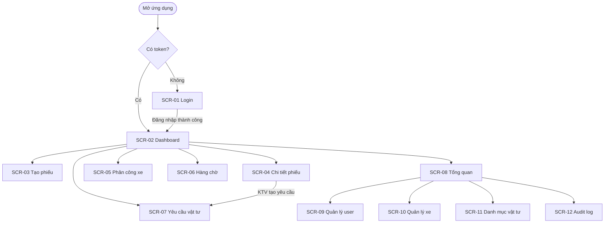

# 17 Screen Specifications

## Purpose
Chương này đặc tả chi tiết toàn bộ các màn hình (screens/pages) của hệ thống FixTrack, bao gồm bố cục giao diện, thành phần UI, quyền truy cập theo vai trò, hành vi tương tác và trạng thái đặc biệt của từng màn hình.

Tài liệu này là cầu nối giữa:
- **UI/UX Design** (Chapter 16) — Design System, tokens, principles
- **API Design** (Chapter 21) — Endpoints phục vụ từng màn hình
- **Frontend Implementation** — Dev code theo spec này

Mục tiêu: BA hiểu luồng, UI Designer mock đúng, Frontend Dev code đúng, QA test đúng.

## Questions Answered
- Hệ thống gồm bao nhiêu màn hình và mỗi màn hình có vai trò gì?
- Vai trò nào truy cập được màn hình nào?
- Mỗi màn hình gồm những component gì?
- User interaction diễn ra như thế nào (action → result)?
- API nào phục vụ từng màn hình?
- Loading / Empty / Error states xử lý ra sao?

## Inputs
- [05 User Roles](../part_a_business_foundation/05_user_roles.md)
- [06 Workflow Analysis](../part_b_requirement_analysis/06_workflow_analysis.md)
- [07 Functional Requirements](../part_b_requirement_analysis/07_functional_requirements.md)
- [09 Business Rules](../part_b_requirement_analysis/09_business_rules.md)
- [10 Use Cases](../part_b_requirement_analysis/10_use_cases.md)
- [16 UI/UX Design](./16_ui_ux_design.md) — Design tokens, color system, interaction rules

---

## Content

---

### Level 0 — Naming Convention

Để đảm bảo tính nhất quán xuyên suốt tài liệu kỹ thuật, FixTrack áp dụng quy tắc đặt tên theo tầng:

| Tầng | Convention | Ví dụ |
|---|---|---|
| **Code / API / DB** | snake_case English | `repair_requests`, `DRIVER`, `ISSUED` |
| **UI display** | Tiếng Việt tự nhiên | "Đã báo lỗi", "Lái xe", "Đã xuất kho" |
| **Route** | kebab-case English | `/repair-requests`, `/materials/requests` |
| **Role code** | snake_case lowercase | `lai_xe`, `co_gioi`, `ky_thuat`, `kho_vat_tu`, `admin` |
| **Status code** | snake_case lowercase | `reported`, `inspecting`, `waiting_parts`, `cho_duyet`, `da_xuat` |

> **Lý do giữ role và status theo tiếng Việt slug**: Codebase hiện tại đã implement theo naming này và đã đồng bộ với DB. Sẽ được chuẩn hóa sang full English trong lần refactor major tiếp theo nếu team quyết định.

---

### Level 0.5 — Shared Component Catalog

Các component tái sử dụng xuyên suốt toàn bộ màn hình:

| Component | File | Mục đích | Props chính |
|---|---|---|---|
| `RepairStatusBadge` | `components/StatusBadge.tsx` | Badge trạng thái phiếu sửa chữa | `value: string` |
| `MucDoBadge` | `components/StatusBadge.tsx` | Badge mức độ hư hỏng | `value: string` |
| `VehicleStatusBadge` | `components/StatusBadge.tsx` | Badge tình trạng phương tiện | `value: string` |
| `MaterialRequestBadge` | `components/StatusBadge.tsx` | Badge trạng thái yêu cầu vật tư | `value: string` |
| `AppLayout` | `components/AppLayout.tsx` | Shell layout (header + nav + auth guard) | `adminOnly?: bool`, `allow?: string[]` |
| `ErrorBanner` | inline | Banner thông báo lỗi từ API | `message: string` |
| `WarningBanner` | inline | Banner cảnh báo (không block) | `message: string` |
| `ConfirmDialog` | `components/Modal.tsx` | Dialog xác nhận hành động không hoàn tác | `message`, `onConfirm` |
| `ReasonModal` | `components/Modal.tsx` | Modal yêu cầu nhập lý do bắt buộc | `title`, `onSubmit` |
| `DataTable` | inline | Bảng dữ liệu dạng scrollable | `columns`, `rows`, `loading`, `empty` |
| `StatusBadge (generic)` | `components/StatusBadge.tsx` | Generic badge (map + color) | `value`, `labelMap`, `colorMap` |

**Quy tắc dùng ConfirmDialog vs ReasonModal**:
- `ConfirmDialog`: Dùng khi hành động đơn giản không cần lý do (Thu hồi phân công, Ưu tiên hàng chờ)
- `ReasonModal`: Dùng khi hành động yêu cầu nhập lý do bắt buộc (Từ chối phiếu, Nghiệm thu không đạt, Từ chối vật tư)

---

### Level 0.8 — Table Data Strategy (Global)

Áp dụng cho tất cả màn hình có bảng dữ liệu:

| Thuộc tính | Giá trị | Ghi chú |
|---|---|---|
| Page size mặc định | 20 rows | |
| Pagination | Server-side | Không load all |
| Sort | Server-side | Truyền `?sort_by=field&order=asc\|desc` |
| Filter | Query params | Mỗi filter là 1 query param |
| Refresh | Manual (nút Làm mới) hoặc sau action | Không auto-poll |
| Loading skeleton | Text "Đang tải…" (phase 1) | Skeleton UI trong phase 2 |

---

### Level 1 — Screen Inventory

| Screen ID | Tên màn hình | Route | Vai trò được phép |
|---|---|---|---|
| SCR-01 | Login | `/login` | Tất cả (public) |
| SCR-02 | Danh sách phiếu sửa chữa | `/dashboard` | Tất cả |
| SCR-03 | Tạo phiếu báo hỏng | `/repair-requests/new` | `lai_xe`, `admin` |
| SCR-04 | Chi tiết phiếu sửa chữa | `/repair-requests/:id` | Tất cả |
| SCR-05 | Phân công phương tiện | `/assignments` | `co_gioi`, `admin` |
| SCR-06 | Hàng chờ xưởng | `/queue` | `co_gioi`, `ky_thuat`, `admin` |
| SCR-07 | Yêu cầu vật tư | `/materials/requests` | `ky_thuat`, `kho_vat_tu`, `admin` |
| SCR-08 | Tổng quan vận hành | `/overview` | `admin` |
| SCR-09 | Quản lý người dùng | `/admin/users` | `admin` |
| SCR-10 | Quản lý phương tiện | `/admin/vehicles` | `admin` |
| SCR-11 | Danh mục vật tư | `/admin/materials` | `admin`, `kho_vat_tu` |
| SCR-12 | Nhật ký kiểm toán | `/admin/audit` | `admin` |
| SCR-13 | Tra cứu QR | `/tra-cuu` | Công khai (không cần đăng nhập) |

> **Lưu ý `khu_vuc`**: Danh sách khu vực (Ter A, Ter B, Mỹ Thủy...) **không được hardcode ở UI**. Gọi `GET /areas` để lấy danh sách động — dễ mở rộng khi thêm khu vực mới.

---

### Level 2 — Navigation Map



---

### Level 3 — Detailed Screen Specifications

---

## SCR-01 — Login

### 1. Purpose
Xác thực người dùng và phân quyền truy cập. Sau khi đăng nhập thành công, hệ thống tự động điều hướng sang `/dashboard`.

### 2. Access Control
Công khai — tất cả truy cập được. Nếu đã có token hợp lệ thì redirect thẳng sang `/dashboard`.

### 3. Route
```
/login
```

### 4. Layout Structure
```
+-------------------------------------------+
|  FixTrack                                 |
|  Đăng nhập hệ thống quản lý sửa chữa     |
|                                           |
|  [Tài khoản ________________________]    |
|  [Mật khẩu  ________________________]    |
|                                           |
|  [!] Banner lỗi (nếu có)                 |
|                                           |
|  [        Đăng nhập        ]              |
+-------------------------------------------+
```

### 5. UI Components
- Text heading `FixTrack` (H1)
- Sub-heading mô tả
- Input: Tài khoản (text, autofocus)
- Input: Mật khẩu (password)
- Error banner (conditional)
- Button: Đăng nhập (submit)

### 6. Displayed Data
Không có dữ liệu hiển thị từ API. Form thuần client.

### 7. User Actions
| Hành động | Kết quả |
|---|---|
| Nhập tài khoản + mật khẩu → bấm Đăng nhập | Gọi POST `/auth/login`, nhận JWT, lưu token, redirect `/dashboard` |
| Nhập sai thông tin | Hiện error banner: "Tài khoản hoặc mật khẩu không chính xác" |
| Đang submit | Nút disabled, text đổi "Đang đăng nhập…" |

### 8. API Integration
| Method | Endpoint | Mục đích |
|---|---|---|
| `POST` | `/auth/login` | Xác thực, nhận JWT token + thông tin role |

### 9. States
- **Loading**: Nút disabled + text "Đang đăng nhập…"
- **Error**: Banner `bg-red-50 text-red-700` ngay trên nút submit

### 10. FR liên quan
`FR-AUTH-01`

---

## SCR-02 — Danh sách phiếu sửa chữa (Dashboard)

### 1. Purpose
Trung tâm theo dõi tất cả phiếu sửa chữa. Mỗi role thấy phiếu theo phạm vi được phép (driver thấy phiếu mình tạo, admin thấy tất cả...).

### 2. Access Control
| Role | Truy cập | Phạm vi dữ liệu |
|---|---|---|
| `lai_xe` | ✓ | Phiếu do mình tạo |
| `co_gioi` | ✓ | Tất cả phiếu |
| `ky_thuat` | ✓ | Phiếu được phân công |
| `kho_vat_tu` | ✓ | Phiếu có yêu cầu vật tư |
| `admin` | ✓ | Tất cả phiếu |

### 3. Route
```
/dashboard
```

### 4. Layout Structure
```
+-----------------------------------------------------+
| Tiêu đề: Phiếu báo hỏng        [+ Tạo phiếu]       |
+-----------------------------------------------------+
| [Lọc trạng thái ▼] [Lọc khu vực ▼] [Xoá lọc]      |
+-----------------------------------------------------+
| Mã phiếu | Phương tiện | Khu vực | Mô tả | Mức độ  |
|          |             |         |       | Trạng   |
|          |             |         |       | thái    |
|          |             |         |       | Ngày    |
+-----------------------------------------------------+
```

### 5. UI Components
- Page heading H1
- Button "Tạo phiếu" (chỉ hiện với `lai_xe`, `admin`)
- Select: Lọc trạng thái (8 options + "Tất cả")
- Select: Lọc khu vực (Ter A, Ter B, Mỹ Thủy, Nhơn Trạch, Cẩu quay đầu)
- Button: Xoá lọc (chỉ hiện khi đang lọc)
- Table: danh sách phiếu
- `RepairStatusBadge`, `MucDoBadge` components

### 6. Displayed Data
| Field | Kiểu | Ghi chú |
|---|---|---|
| `ma_phieu` | String (mono) | Link → SCR-04 |
| `vehicle.ma_phuong_tien` | String | Dòng 1 |
| `vehicle.ten_thiet_bi` | String | Dòng 2, nhỏ hơn |
| `vehicle.khu_vuc` | String | "—" nếu null |
| `mo_ta_hu_hong` | String | Cắt 2 dòng `line-clamp-2` |
| `muc_do` | Badge | `MucDoBadge` |
| `trang_thai` | Badge | `RepairStatusBadge` |
| `ngay_bao` | DateTime | Format `dd/MM/yyyy HH:mm` |

### 7. User Actions
| Hành động | Kết quả |
|---|---|
| Click mã phiếu | Mở SCR-04 |
| Thay đổi dropdown lọc | Gọi lại API với params mới |
| Bấm Xoá lọc | Reset filter, gọi lại API |
| Bấm "+ Tạo phiếu" | Chuyển sang SCR-03 |

### 8. API Integration
| Method | Endpoint | Params | Mục đích |
|---|---|---|---|
| `GET` | `/repair-requests` | `trang_thai`, `khu_vuc` | Lấy danh sách phiếu |

### 9. States
- **Loading**: Row duy nhất colspan 7, text "Đang tải…"
- **Empty**: Row duy nhất colspan 7, text "Chưa có phiếu nào."
- **Error**: Banner đỏ phía trên bảng

### 10. FR liên quan
`FR-TICKET-04`

---

## SCR-03 — Tạo phiếu báo hỏng

### 1. Purpose
Lái xe khai báo sự cố hư hỏng cho phương tiện đang được phân công. Hệ thống auto-fill thông tin xe, lái xe chỉ cần điền nội dung lỗi.

### 2. Access Control
| Role | Truy cập |
|---|---|
| `lai_xe` | ✓ |
| `admin` | ✓ |
| Các role khác | ✗ → redirect `/dashboard` |

### 3. Route
```
/repair-requests/new
```

### 4. Layout Structure
```
+---------------------------------------------------+
| Tiêu đề: Tạo phiếu báo hỏng                      |
+---------------------------------------------------+
| Phương tiện: [XE-01 — Xe tải 5 tấn] (auto-fill) |
| (hoặc: [!] Cảnh báo chưa được gán xe)            |
+---------------------------------------------------+
| Loại báo: ( ) Đột xuất  ( ) Định kỳ              |
+---------------------------------------------------+
| ── Hạng mục lỗi #1 ────────────────────          |
| Danh mục: [________________]                      |
| Mức độ:   [Chọn mức độ ▼]                        |
| Mô tả:    [textarea]                              |
| Ảnh/Video: [Chọn file] (tối đa 3, <10MB)         |
| ────────────────────────────────────────          |
| [+ Thêm hạng mục lỗi] (tối đa 5)                |
+---------------------------------------------------+
| [  Huỷ  ]              [  Gửi báo cáo  ]          |
+---------------------------------------------------+
```

### 5. UI Components
- Thông tin xe (auto-fill, read-only) hoặc warning block
- Radio: Loại báo (đột xuất / định kỳ)
- Form lặp: Hạng mục lỗi (1–5 items)
  - Input: Danh mục lỗi
  - Select: Mức độ (Nhỏ / Trung bình / Nghiêm trọng)
  - Textarea: Mô tả
  - File upload: Ảnh/Video (max 3 file, 10MB/file)
- Button: "+ Thêm hạng mục lỗi"
- Button: Huỷ (về dashboard)
- Button: Gửi báo cáo (submit)

### 6. Displayed Data
- Thông tin xe đang được gán (từ API auth context hoặc `/vehicle-assignments/my`)

### 7. User Actions
| Hành động | Kết quả |
|---|---|
| Chưa được gán xe | Block form, hiện warning: "Bạn chưa được phân công xe. Liên hệ đội cơ giới." |
| Bấm "+ Thêm hạng mục lỗi" | Thêm 1 form lỗi mới. Ẩn nút khi đã có 5 lỗi |
| File > 10MB | Lỗi tại input: "Dung lượng file không được vượt quá 10MB" |
| Gửi báo cáo thành công | Tạo phiếu, redirect `/dashboard` |
| Bấm Huỷ | Về `/dashboard` |
| Đang submit | Nút disabled "Đang gửi…" |

### 8. API Integration
| Method | Endpoint | Mục đích |
|---|---|---|
| `GET` | `/vehicle-assignments/my` | Lấy xe đang gán cho lái xe hiện tại |
| `POST` | `/repair-requests` | Tạo phiếu (multipart/form-data nếu có file) |

### 9. States
- **No vehicle assigned**: Warning block thay thế form, không thể submit
- **Loading submit**: Button disabled
- **Error submit**: Banner đỏ trên form

### 10. FR liên quan
`FR-TICKET-01`, `FR-TICKET-02`, `FR-TICKET-03`

---

## SCR-04 — Chi tiết phiếu sửa chữa

### 1. Purpose
Màn hình trung tâm của toàn bộ workflow. Hiển thị đầy đủ thông tin phiếu và cung cấp **Dynamic Action Panel** — các nút hành động thay đổi theo role của người xem và trạng thái hiện tại của phiếu.

### 2. Access Control
Tất cả role được xem. Hành động cụ thể bị giới hạn theo role + status (xem Section 7).

### 3. Route
```
/repair-requests/:id
```

### 4. Layout Structure
```
+----------------------------------------------------+
| ← Quay lại      PT-001 — XE-01 (Ter A)  [BADGE]  |
+----------------------------------------------------+
| THÔNG TIN PHIẾU                                    |
| Phương tiện | Người báo | Ngày báo | Loại báo     |
+----------------------------------------------------+
| HẠNG MỤC LỖI                                       |
| #1 [Nghiêm trọng] Động cơ — "Xe không nổ máy"    |
|    [Hình ảnh]                                      |
| #2 [Nhỏ] Điện — "Đèn hậu mờ"                     |
+----------------------------------------------------+
| HÀNH ĐỘNG KHẢ DỤNG (Dynamic Panel)                 |
| (hiện theo role + status — xem bảng bên dưới)     |
+----------------------------------------------------+
| PHÂN CÔNG KỸ THUẬT (nếu có)                        |
| KTV: Trần B | Tổ: KT1 | Ngày: 27/06              |
+----------------------------------------------------+
| YÊU CẦU VẬT TƯ (nếu có)                           |
| MR-012: [Chờ duyệt] — Lọc xylanh ×3              |
|   (co_gioi thấy):   [Xác nhận xuất kho]          |
|   (lai_xe thấy):    [Xác nhận đã nhận từ kho]    |
|   (ky_thuat thấy):  [Xác nhận đã nhận từ lái xe] |
+----------------------------------------------------+
| LỊCH SỬ TRẠNG THÁI                                 |
| 27/06 09:15 → Đã báo lỗi     (Nguyễn A)          |
| 27/06 09:30 → Đang kiểm tra  (Trần B)             |
+----------------------------------------------------+
```

### 5. UI Components
- Breadcrumb/Back button
- Header: Mã phiếu + xe + `RepairStatusBadge`
- Section: Thông tin phiếu (grid)
- Section: Hạng mục lỗi (list + ảnh)
- Section: Dynamic Action Panel (conditional)
- Section: Phân công kỹ thuật (conditional)
- Section: Yêu cầu vật tư (conditional, với sub-actions)
- Section: Lịch sử trạng thái (timeline)

### 6. Dynamic Action Panel — theo Role × Status

| Trạng thái hiện tại | Role | Hành động |
|---|---|---|
| `reported` | `co_gioi` | **[Tiếp nhận kiểm tra]** |
| `inspecting` | `co_gioi` | **[Từ chối phiếu]** · **[Chuyển xưởng sửa]** |
| `inspecting` | `ky_thuat` | **[Tạo yêu cầu vật tư]** |
| `waiting_parts` (MR = `cho_duyet`) | `kho_vat_tu` | **[Duyệt xuất kho]** · **[Từ chối vật tư]** |
| `waiting_parts` (MR = `da_xuat`) | `lai_xe` | **[Xác nhận đã nhận từ kho]** |
| `waiting_parts` (MR = `da_nhan_tai_xe`) | `ky_thuat` | **[Xác nhận đã nhận từ lái xe]** |
| `repairing` | `ky_thuat` | **[Cập nhật ghi chú]** · **[Xác nhận sửa xong]** |
| `completed` | `co_gioi` | **[Nghiệm thu đạt]** · **[Nghiệm thu không đạt]** |
| `closed`, `rejected` | Tất cả | (chỉ xem, không hành động) |
| Bất kỳ | `admin` | Cộng thêm: Override trạng thái |

### 7. User Actions & Behavior
| Hành động | Điều kiện bắt buộc | Kết quả |
|---|---|---|
| Tiếp nhận kiểm tra | Status = `reported`, role = `co_gioi` | Patch status → `inspecting` |
| Từ chối phiếu | Status = `inspecting`, nhập lý do (bắt buộc) | Status → `rejected`, xe về `hoat_dong` |
| Chuyển xưởng sửa | Status = `inspecting` | Hệ thống check slot: đủ → giữ `inspecting`; đầy → `waiting_queue` |
| Tạo yêu cầu vật tư | Status = `inspecting`, role = `ky_thuat` | Mở form tạo Material Request (inline hoặc modal) |
| Duyệt xuất kho | MR status = `cho_duyet`, role = `kho_vat_tu` | MR → `da_xuat`, ticket → `waiting_parts` |
| Xác nhận đã nhận từ kho | MR status = `da_xuat`, role = `lai_xe` | MR → `da_nhan_tai_xe` |
| Xác nhận đã nhận từ lái xe | MR status = `da_nhan_tai_xe`, role = `ky_thuat` | MR → `da_ban_giao`, ticket → `repairing` |
| Xác nhận sửa xong | Status = `repairing`, role = `ky_thuat` | Status → `completed`, thông báo cơ giới |
| Nghiệm thu đạt | Status = `completed`, role = `co_gioi` | Status → `closed`, xe → `hoat_dong` |
| Nghiệm thu không đạt | Status = `completed`, nhập lý do (bắt buộc) | Status → `repairing` |

### 8. API Integration
| Method | Endpoint | Mục đích |
|---|---|---|
| `GET` | `/repair-requests/:id` | Lấy chi tiết phiếu (bao gồm issues, status_logs, assignments, material_requests) |
| `POST` | `/repair-requests/:id/transitions` | Chuyển trạng thái (body: `{ action, note }`) |
| `POST` | `/repair-requests/:id/material-requests` | Tạo yêu cầu vật tư |
| `POST` | `/material-requests/:mrId/approve` | Kho duyệt xuất |
| `POST` | `/material-requests/:mrId/driver-confirm` | Lái xe xác nhận nhận hàng |
| `POST` | `/material-requests/:mrId/tech-confirm` | KTV xác nhận nhận bàn giao |

### 9. States
- **Loading**: Spinner text toàn trang
- **404**: "Phiếu không tồn tại hoặc bạn không có quyền xem."
- **Error action**: Banner đỏ ngay dưới nút bị lỗi
- **Submitting action**: Nút disabled "Đang xử lý…"

### 10. FR liên quan
`FR-INSP-01`, `FR-INSP-02`, `FR-INSP-03`, `FR-MAT-02`, `FR-MAT-03`, `FR-MAT-04`, `FR-MAT-05`, `FR-REP-01`, `FR-REP-02`, `FR-REP-03`, `FR-REP-04`

---

## SCR-05 — Phân công phương tiện

### 1. Purpose
Đội cơ giới gán xe đang rảnh cho tài xế đang rảnh theo ca làm việc, và thu hồi phân công khi kết thúc ca.

### 2. Access Control
| Role | Truy cập |
|---|---|
| `co_gioi` | ✓ |
| `admin` | ✓ |
| Khác | ✗ |

### 3. Route
```
/assignments
```

### 4. Layout Structure
```
+---------------------------------------------------+
| Phân công phương tiện                             |
+---------------------------------------------------+
| GÁN XE CHO TÀI XẾ                                |
| [Chọn xe rảnh ▼] [Chọn tài xế rảnh ▼] [Xác nhận]|
| [Lỗi nếu có]                                      |
+---------------------------------------------------+
| PHÂN CÔNG ĐANG HIỆU LỰC                           |
| Phương tiện | Tài xế | Ngày phân công | Thao tác  |
| XE-01/...   | A       | 27/06 08:00    | [Thu hồi] |
+---------------------------------------------------+
```

### 5. UI Components
- Heading H1
- Form gán: 2 select + 1 button
- Error inline
- Table: danh sách phân công đang hiệu lực
- Button "Thu hồi" (per row)

### 6. Displayed Data
**Dropdown xe**: Chỉ xe có `tinh_trang = hoat_dong` và chưa có assignment hiệu lực.
**Dropdown tài xế**: Chỉ tài xế chưa được gán xe nào.

**Table**:
| Field | Ghi chú |
|---|---|
| `vehicle.ma_phuong_tien` + `ten_thiet_bi` | |
| `driver.ho_ten` | |
| `ngay_phan_cong` | Format datetime |
| Nút Thu hồi | |

### 7. User Actions
| Hành động | Kết quả |
|---|---|
| Chọn xe + tài xế + Xác nhận gán | POST tạo assignment, reload danh sách |
| Bấm Thu hồi | Confirm dialog "Thu hồi phân công này?" → POST release, reload |
| Gán thất bại | Inline error dưới form |

### 8. API Integration
| Method | Endpoint | Mục đích |
|---|---|---|
| `GET` | `/vehicle-assignments?active=true` | Danh sách phân công hiệu lực |
| `GET` | `/vehicles` | Tất cả xe |
| `GET` | `/vehicle-assignments/drivers` | Tài xế đang rảnh |
| `POST` | `/vehicle-assignments` | Tạo phân công mới |
| `POST` | `/vehicle-assignments/:id/release` | Thu hồi phân công |

### 9. States
- **Loading**: Text "Đang tải…" trong table
- **Empty**: "Chưa có phân công nào đang hiệu lực."
- **Error**: Banner đỏ dưới form gán

### 10. FR liên quan
`FR-ASSIGN-01`, `FR-ASSIGN-02`

---

## SCR-06 — Hàng chờ xưởng

### 1. Purpose
Hiển thị danh sách xe đang chờ vào xưởng theo thứ tự ưu tiên. Admin có thể can thiệp thứ tự.

### 2. Access Control
| Role | Truy cập | Quyền ưu tiên |
|---|---|---|
| `co_gioi` | ✓ | Chỉ xem |
| `ky_thuat` | ✓ | Chỉ xem |
| `admin` | ✓ | ✓ Có thể ưu tiên |

### 3. Route
```
/queue
```

### 4. Layout Structure
```
+-----------------------------------------------------------+
| Hàng chờ xưởng                                            |
| Mô tả: Xe đã duyệt chuyển xưởng, chờ lượt sửa...        |
+-----------------------------------------------------------+
| TT | Mã phiếu | Phương tiện | Khu vực | Mức độ | Ngày báo | Thao tác |
|  1 | PT-005   | XE-03       | Ter B   | [Nghiêm]| 27/06    | —        |
|  2 | PT-007   | XE-07       | Mỹ Thủy | [TB]    | 27/06    | [Ưu tiên]|
+-----------------------------------------------------------+
```

### 5. UI Components
- Heading H1 + mô tả
- Table với cột Thứ tự (số)
- `MucDoBadge`
- Button "Ưu tiên lên đầu" (chỉ admin, chỉ từ dòng thứ 2 trở đi)

### 6. Displayed Data
| Field | Ghi chú |
|---|---|
| Thứ tự | Index + 1 |
| `ma_phieu` | Link → SCR-04 |
| `vehicle.ma_phuong_tien` + `ten_thiet_bi` | |
| `vehicle.khu_vuc` | |
| `muc_do` | Badge |
| `ngay_bao` | DateTime |

### 7. User Actions
| Hành động | Điều kiện | Kết quả |
|---|---|---|
| Click mã phiếu | — | Mở SCR-04 |
| Bấm "Ưu tiên lên đầu" | `admin`, idx > 0 | POST prioritize, reload |

### 8. API Integration
| Method | Endpoint | Mục đích |
|---|---|---|
| `GET` | `/repair-requests/queue` | Danh sách hàng chờ (đã sắp xếp) |
| `POST` | `/repair-requests/:id/prioritize` | Đưa lên đầu hàng chờ |

### 9. States
- **Loading**: "Đang tải…" trong table
- **Empty**: "Hàng chờ trống."
- **Error**: Banner đỏ

### 10. FR liên quan
`FR-QUEUE-01`, `FR-QUEUE-02`, `FR-QUEUE-03`

---

## SCR-07 — Yêu cầu vật tư

### 1. Purpose
Màn hình tổng hợp quản lý yêu cầu vật tư. KTV xem yêu cầu mình tạo. Kho xem yêu cầu cần duyệt. Tất cả có thể xem chi tiết từng yêu cầu và thực hiện hành động theo vai trò.

### 2. Access Control
| Role | Truy cập | Phạm vi |
|---|---|---|
| `ky_thuat` | ✓ | Yêu cầu do mình tạo |
| `kho_vat_tu` | ✓ | Tất cả yêu cầu (tập trung `cho_duyet`) |
| `admin` | ✓ | Tất cả |

### 3. Route
```
/materials/requests
```

### 4. Layout Structure
```
+-----------------------------------------------------+
| Yêu cầu vật tư                                     |
+-----------------------------------------------------+
| [Lọc trạng thái ▼]                                 |
+-----------------------------------------------------+
| ID    | Phiếu SC | Người yêu cầu | Vật tư       | Trạng thái | Ngày     | Thao tác |
| MR-012| PT-001   | KTV Trần B    | Lọc xylanh×3 | [Chờ duyệt]| 27/06    | [Xem]    |
+-----------------------------------------------------+
```

**Chi tiết yêu cầu (expand hoặc drawer)**:
```
+-----------------------------------------------------+
| MR-012 — Yêu cầu vật tư cho PT-001               |
| Người yêu cầu: KTV Trần B                          |
| Danh sách vật tư:                                  |
|   Lọc xylanh   ×3  (Tồn: 10)                      |
|   Dầu phanh    ×1  (Tồn: 2)                       |
|                                                     |
| [kho_vat_tu thấy]:  [Duyệt xuất kho] [Từ chối]    |
| [lai_xe thấy]:      [Xác nhận đã nhận từ kho]     |
| [ky_thuat thấy]:    [Xác nhận đã nhận từ lái xe]  |
+-----------------------------------------------------+
```

### 5. UI Components
- Heading H1
- Select: Lọc trạng thái MR
- Table: danh sách yêu cầu
- `MaterialRequestStatusBadge`
- Chi tiết vật tư (inline expand hoặc modal)
- Dynamic action buttons (conditional theo role + MR status)

### 6. Displayed Data
| Field | Ghi chú |
|---|---|
| MR ID | |
| Phiếu SC liên quan | Link → SCR-04 |
| Người yêu cầu | KTV |
| Danh sách vật tư | Tên + số lượng |
| Trạng thái MR | Badge |
| Ngày yêu cầu | |

### 7. User Actions
| Hành động | Role | Điều kiện | Kết quả |
|---|---|---|---|
| Duyệt xuất kho | `kho_vat_tu` | MR = `cho_duyet` | MR → `da_xuat` |
| Từ chối vật tư | `kho_vat_tu` | MR = `cho_duyet` | MR → `tu_choi`, nhập lý do |
| Xác nhận nhận từ kho | `lai_xe` | MR = `da_xuat` | MR → `da_nhan_tai_xe` |
| Xác nhận nhận từ lái xe | `ky_thuat` | MR = `da_nhan_tai_xe` | MR → `da_ban_giao` |

> **Lưu ý**: Khi duyệt một phần (Partial Approve) — xem UC-04 rẽ nhánh 2b — hệ thống tách đơn thành 2 đơn phụ tự động.

### 8. API Integration
| Method | Endpoint | Mục đích |
|---|---|---|
| `GET` | `/material-requests` | Danh sách yêu cầu |
| `POST` | `/material-requests/:id/approve` | Kho duyệt |
| `POST` | `/material-requests/:id/reject` | Kho từ chối |
| `POST` | `/material-requests/:id/driver-confirm` | Lái xe xác nhận |
| `POST` | `/material-requests/:id/tech-confirm` | KTV xác nhận |

### 9. States
- **Loading**: "Đang tải…"
- **Empty**: "Không có yêu cầu vật tư nào."
- **Error**: Banner đỏ

### 10. FR liên quan
`FR-MAT-01`, `FR-MAT-02`, `FR-MAT-03`, `FR-MAT-04`, `FR-MAT-05`

---

## SCR-08 — Tổng quan vận hành (Overview Dashboard)

### 1. Purpose
Dashboard KPI dành riêng cho admin theo dõi hiệu suất vận hành toàn hệ thống theo thời gian thực.

### 2. Access Control
| Role | Truy cập |
|---|---|
| `admin` | ✓ |
| Khác | ✗ → redirect `/dashboard` |

### 3. Route
```
/overview
```

### 4. Layout Structure
```
+----------------------------------------------------------+
| Tổng quan vận hành                                       |
+----------------------------------------------------------+
| [Xe hoạt động] [Xe hỏng/chờ] [Xe đang sửa] [Hàng chờ] |
| [Phiếu mở]     [T/g sửa TB ] [Vật tư đã cấp]           |
+----------------------------------------------------------+
| PHIẾU THEO TRẠNG THÁI                                    |
| [Đã báo lỗi] 2  [Đang kiểm tra] 1  [Đang sửa] 5 ...   |
+----------------------------------------------------------+
| PHƯƠNG TIỆN THEO TRẠNG THÁI                              |
| Hoạt động: 12  Hỏng: 3  Đang sửa: 5  Ngừng: 0         |
+----------------------------------------------------------+
```

### 5. UI Components
- Heading H1
- KPI Cards (grid 2 cột mobile, 4 cột desktop): title + value + hint
- Section "Phiếu theo trạng thái": badge + số lượng
- Section "Phương tiện theo trạng thái": label + số lượng

### 6. Displayed Data (từ API `/dashboard/stats`)
| Field | Kiểu | Hiển thị |
|---|---|---|
| `vehicles_by_status.hoat_dong` | Number | KPI "Xe hoạt động" |
| `vehicles_by_status.hong` | Number | KPI "Xe hỏng / chờ" |
| `vehicles_by_status.dang_sua` | Number | KPI "Xe đang sửa" |
| `queue_length` | Number | KPI "Hàng chờ xưởng" |
| `open_tickets` | Number | KPI "Phiếu đang mở" |
| `avg_repair_minutes` | Number / null | KPI "Thời gian sửa TB" — hiện "—" nếu null |
| `total_materials_issued` | Number | KPI "Vật tư đã cấp" |
| `tickets_by_status` | Record | Section phiếu |
| `vehicles_by_status` | Record | Section xe |

### 7. User Actions
Màn hình này chủ yếu là **read-only**. Không có action ghi.

### 8. API Integration
| Method | Endpoint | Mục đích |
|---|---|---|
| `GET` | `/dashboard/stats` | Lấy toàn bộ số liệu KPI |

### 9. States
- **Loading**: Text "Đang tải…"
- **Error**: Banner đỏ thay thế toàn bộ nội dung

### 10. FR liên quan
`FR-DASH-01`, `FR-DASH-02`

---

## SCR-09 — Quản lý người dùng

### 1. Purpose
Admin quản lý toàn bộ tài khoản người dùng trong hệ thống: xem, tạo mới, chỉnh sửa thông tin, kích hoạt/khóa tài khoản.

### 2. Access Control
`admin` only.

### 3. Route
```
/admin/users
```

### 4. Layout Structure
```
+---------------------------------------------------+
| Quản lý người dùng              [+ Thêm người dùng]|
+---------------------------------------------------+
| Họ tên | Tài khoản | Vai trò | Trạng thái | Thao tác |
| A       | user_a    | lai_xe  | [Hoạt động]| [Sửa]    |
| B       | user_b    | co_gioi | [Bị khoá]  | [Sửa]    |
+---------------------------------------------------+
```

**Modal tạo/sửa**:
```
Họ tên*: [________________]
Tài khoản*: [________________]
Mật khẩu*: [________________] (chỉ khi tạo mới)
Số điện thoại: [________________]
Vai trò*: [Chọn vai trò ▼]
Trạng thái: [✓] Hoạt động
```

### 5. UI Components
- Heading + Button "Thêm người dùng"
- Table: danh sách user
- Badge trạng thái (hoạt động / bị khóa)
- Button "Sửa" (per row)
- Modal form: tạo mới / chỉnh sửa

### 6. Displayed Data
| Field | Kiểu |
|---|---|
| `ho_ten` | String |
| `tai_khoan` | String |
| `role.ten_vai_tro` | Badge |
| `trang_thai` | Boolean → "Hoạt động" / "Bị khoá" |

### 7. User Actions
| Hành động | Kết quả |
|---|---|
| Bấm "+ Thêm người dùng" | Mở modal tạo mới |
| Bấm "Sửa" | Mở modal điền sẵn thông tin hiện có |
| Submit form tạo | POST tạo user |
| Submit form sửa | PATCH cập nhật user |
| Toggle trạng thái | PATCH `trang_thai` |

### 8. API Integration
| Method | Endpoint | Mục đích |
|---|---|---|
| `GET` | `/users` | Danh sách user |
| `POST` | `/users` | Tạo user mới |
| `PATCH` | `/users/:id` | Cập nhật thông tin |

---

## SCR-10 — Quản lý phương tiện

### 1. Purpose
Admin quản lý danh mục phương tiện: xem, thêm mới, chỉnh sửa thông tin và trạng thái kỹ thuật.

### 2. Access Control
`admin` only.

### 3. Route
```
/admin/vehicles
```

### 4. Layout Structure
```
+---------------------------------------------------+
| Quản lý phương tiện              [+ Thêm xe]      |
+---------------------------------------------------+
| Mã xe  | Tên thiết bị | Loại xe | Khu vực | T/trạng | Thao tác|
| XE-01  | Xe tải 5 tấn | Tải     | Ter A   |[Hoạt động]|[Sửa]  |
+---------------------------------------------------+
```

### 5. UI Components
- Table với `VehicleStatusBadge`
- Modal form tạo/sửa
- Field: Mã xe, Tên thiết bị, Loại xe, Khu vực, Tình trạng

### 6. Displayed Data
| Field | Kiểu | Ghi chú |
|---|---|---|
| `ma_phuong_tien` | String (mono) | Mã định danh xe |
| `ten_thiet_bi` | String | Tên loại xe / thiết bị |
| `loai_xe` | String | Loại xe (tải, khách...) |
| `khu_vuc` | String | Khu vực hoạt động — dynamic từ `GET /areas` |
| `tinh_trang` | Badge | `VehicleStatusBadge` |

### 7. User Actions
| Hành động | Kết quả |
|---|---|
| Bấm "+ Thêm xe" | Mở modal tạo mới |
| Bấm "Sửa" | Mở modal điền sẵn thông tin |
| Submit form tạo | POST tạo xe, reload list |
| Submit form sửa | PATCH cập nhật xe, reload list |

### 8. API Integration
| Method | Endpoint | Mục đích |
|---|---|---|
| `GET` | `/vehicles` | Danh sách xe (phân trang) |
| `GET` | `/areas` | Danh sách khu vực (dynamic, không hardcode UI) |
| `POST` | `/vehicles` | Tạo xe mới |
| `PATCH` | `/vehicles/:id` | Cập nhật xe |

### 9. States
- **Loading**: "Đang tải…" trong table
- **Empty**: "Chưa có phương tiện nào."
- **Error modal**: Banner đỏ trong modal khi submit thất bại

### 10. FR liên quan
`FR-VEH-01`

---

## SCR-11 — Danh mục vật tư

### 1. Purpose
Quản lý danh mục vật tư, linh kiện trong kho. Admin và kho vật tư có thể xem và cập nhật tồn kho.

### 2. Access Control
| Role | Truy cập |
|---|---|
| `admin` | ✓ |
| `kho_vat_tu` | ✓ |
| Khác | ✗ |

### 3. Route
```
/admin/materials
```

### 4. Layout Structure
```
+---------------------------------------------------+
| Danh mục vật tư                      [+ Thêm]    |
+---------------------------------------------------+
| Mã vật tư | Tên          | Đơn vị | Tồn kho | Đơn giá | Thao tác|
| VT-001    | Lọc xylanh  | Cái    |    10   | 250.000₫| [Sửa]   |
| VT-002    | Dầu phanh   | Lít    |     2   |  80.000₫| [Sửa]   |
+---------------------------------------------------+
```

> **Tồn kho thấp** (dưới ngưỡng): Highlight đỏ cột Tồn kho để cảnh báo.

### 5. UI Components
- Table
- Tồn kho: highlight `text-red-600` khi thấp
- Đơn giá: format VND
- Modal form: Mã, Tên, Đơn vị, Tồn kho, Đơn giá

### 6. Displayed Data
| Field | Kiểu | Ghi chú |
|---|---|---|
| `ma_vat_tu` | String (mono) | |
| `ten_vat_tu` | String | |
| `don_vi` | String | Cái, Lít, Bộ... |
| `ton_kho` | Number | Highlight `text-red-600` khi ≤ ngưỡng thấp |
| `don_gia` | Currency | Format VND: `toLocaleString('vi-VN') + ' ₫'` |

### 7. User Actions
| Hành động | Role | Kết quả |
|---|---|---|
| Bấm "+ Thêm" | `admin` | Mở modal tạo mới |
| Bấm "Sửa" | `admin`, `kho_vat_tu` | Mở modal điền sẵn |
| Submit form tạo | `admin` | POST tạo vật tư |
| Submit form sửa | `admin`, `kho_vat_tu` | PATCH cập nhật (tồn kho, đơn giá) |

> **Lưu ý**: `kho_vat_tu` chỉ được sửa `ton_kho` (nhập bổ sung hàng về). Không được sửa `ma_vat_tu`, `don_gia`. Chỉ `admin` mới sửa được toàn bộ.

### 8. API Integration
| Method | Endpoint | Mục đích |
|---|---|---|
| `GET` | `/materials` | Danh sách vật tư (phân trang, tìm kiếm) |
| `POST` | `/materials` | Tạo mới (`admin` only) |
| `PATCH` | `/materials/:id` | Cập nhật |

### 9. States
- **Loading**: "Đang tải…" trong table
- **Empty**: "Chưa có vật tư nào trong danh mục."
- **Low stock warning**: Highlight đỏ tự động trên cột tồn kho

### 10. FR liên quan
`FR-MAT-01`

---

## SCR-12 — Nhật ký kiểm toán (Audit Log)

### 1. Purpose
Admin xem toàn bộ lịch sử thao tác quan trọng trong hệ thống phục vụ kiểm tra và truy vết.

### 2. Access Control
`admin` only.

### 3. Route
```
/admin/audit
```

### 4. Layout Structure
```
+-------------------------------------------------------------+
| Nhật ký kiểm toán                                           |
+-------------------------------------------------------------+
| [Lọc hành động ▼]                                          |
+-------------------------------------------------------------+
| Thời điểm | Người dùng | Hành động         | Đối tượng | Thay đổi       |
| 27/06 10:00| KTV Trần  | Đổi trạng thái phiếu| PT-001 | inspecting → repairing |
+-------------------------------------------------------------+
```

### 5. UI Components
- Table
- Select: Lọc hành động (audit action types)
- Columns: Thời điểm, Người dùng, Hành động, Đối tượng, Giá trị cũ → mới

### 6. Displayed Data
| Field | Kiểu | Ghi chú |
|---|---|---|
| `thoi_diem` | DateTime | Format `dd/MM/yyyy HH:mm:ss` |
| `user.ho_ten` | String | Người thực hiện ("Hệ thống" nếu null) |
| `hanh_dong` | String | Label tiếng Việt từ `AUDIT_ACTION_LABELS` |
| `doi_tuong` | String | Loại đối tượng (repair_ticket, vehicle...) |
| `doi_tuong_id` | Number | ID đối tượng bị tác động |
| `gia_tri_cu` | String | Giá trị trước khi thay đổi |
| `gia_tri_moi` | String | Giá trị sau khi thay đổi |

### 7. User Actions
| Hành động | Kết quả |
|---|---|
| Lọc theo hành động | Reload với `?hanh_dong=...` |
| Lọc theo khoảng thời gian | Reload với `?from=...&to=...` |
| Bấm ID đối tượng | Chuyển sang màn hình chi tiết tương ứng |

### 8. API Integration
| Method | Endpoint | Mục đích |
|---|---|---|
| `GET` | `/audit-logs` | Danh sách log (phân trang, filter theo hành động/thời gian) |

### 9. States
- **Loading**: "Đang tải…" trong table
- **Empty**: "Chưa có log nào."
- **Large dataset**: Bắt buộc phân trang server-side — không load all

### 10. FR liên quan
Không có FR riêng — phục vụ `BR-AUDIT` (Business Rule: ghi log mọi thay đổi trạng thái quan trọng).

---

## SCR-13 — Tra cứu QR

### 1. Purpose
Cho phép tra cứu nhanh thông tin phương tiện thông qua mã QR dán trên xe — không cần đăng nhập.

### 2. Access Control
Công khai (public route).

### 3. Route
```
/tra-cuu?ma_qr=:code
```

### 4. Layout Structure
```
+-----------------------------------+
| Tra cứu phương tiện               |
|                                   |
| [Nhập mã QR hoặc mã xe ________] |
| [  Tra cứu  ]                     |
|                                   |
| Kết quả:                          |
| Xe: XE-01 — Xe tải 5 tấn         |
| Khu vực: Ter A                    |
| Tình trạng: [Đang sửa]           |
| Phiếu đang mở: PT-001            |
+-----------------------------------+
```

### 5. UI Components
- Input: Mã QR / Mã xe
- Button: Tra cứu
- Kết quả: Thông tin xe + trạng thái + trạng thái phiếu (nếu có)

### 6. Public-safe Fields (Security)
> Đây là route **công khai, không cần đăng nhập**. API chỉ trả về các field an toàn:

| Field | Hiển thị | Ghi chú |
|---|---|---|
| `ma_phuong_tien` | ✓ | |
| `ten_thiet_bi` | ✓ | |
| `khu_vuc` | ✓ | |
| `tinh_trang` | ✓ | Badge (hoạt động / đang sửa / hỏng) |
| Có phiếu đang mở? | ✓ | Chỉ boolean — **không** hiện mã phiếu cụ thể |
| Tên lái xe | ✗ | Ẩn — thông tin nội bộ |
| Ghi chú sửa chữa | ✗ | Ẩn — thông tin nội bộ |
| Yêu cầu vật tư | ✗ | Ẩn — thông tin nội bộ |
| Lịch sử log | ✗ | Ẩn — thông tin nội bộ |

### 7. User Actions
| Hành động | Kết quả |
|---|---|
| Nhập mã + bấm Tra cứu | GET lookup, hiện kết quả |
| Mã không tồn tại | "Không tìm thấy phương tiện với mã này." |

### 8. API Integration
| Method | Endpoint | Mục đích |
|---|---|---|
| `GET` | `/vehicles/lookup?ma_qr=:code` | Tra cứu theo mã QR — chỉ trả public-safe fields |

---

## Outputs
- Đặc tả màn hình đầy đủ: [17_screen_specs.md](./17_screen_specs.md)
- Tham chiếu sang: [18_state_machine.md](./18_state_machine.md) — sơ đồ chuyển trạng thái ticket
- Tham chiếu sang: [21_api_design.md](../part_e_backend_design/21_api_design.md) — endpoint chi tiết
