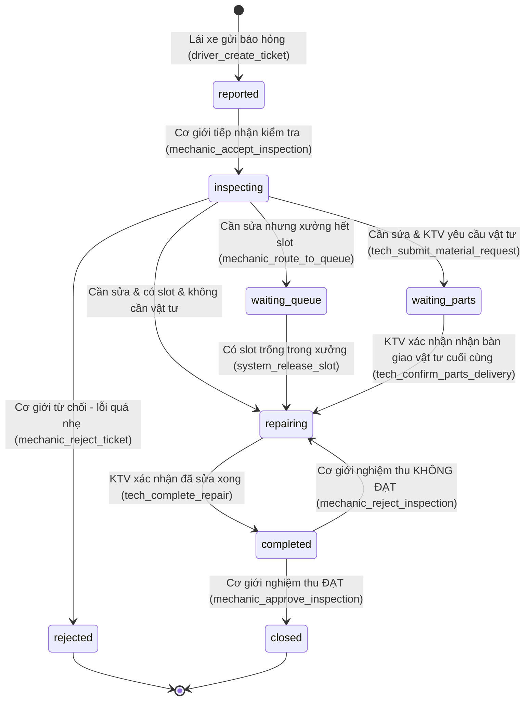
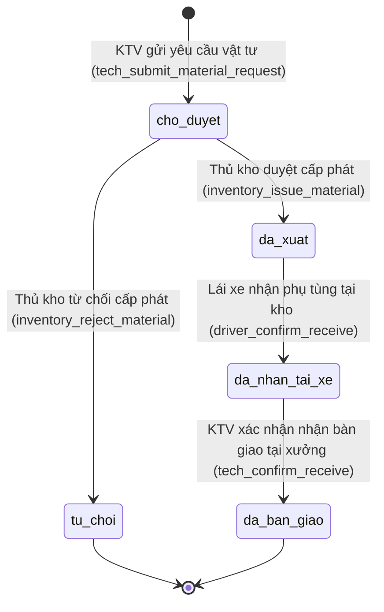

# 18 State Machine

## Purpose
Chương này đặc tả chi tiết máy trạng thái (State Machine) của hai thực thể cốt lõi và quan trọng nhất trong hệ thống FixTrack: **Phiếu sửa chữa (Repair Ticket)** và **Yêu cầu vật tư (Material Request)**. Tài liệu định nghĩa rõ ràng các trạng thái, sự kiện kích hoạt (Events), vai trò thực hiện (Actors), các điều kiện ràng buộc (Guards) và các hành vi tự động đi kèm (Side Effects/Actions).

Tài liệu này là cơ sở để:
- **Database Design** (Chapter 12, 13, 15) thiết kế các trường trạng thái và ràng buộc dữ liệu.
- **Backend Design** (Chapter 21, 22) lập trình logic xử lý API và kiểm soát luồng nghiệp vụ.
- **QA/QC Team** lập danh sách kịch bản kiểm thử trạng thái (State Transition Testing).

## Questions Answered
- Phiếu sửa chữa và Yêu cầu vật tư trải qua những trạng thái cụ thể nào?
- Những hành động nào của người dùng hoặc hệ thống kích hoạt việc đổi trạng thái?
- Vai trò nào có quyền thực hiện việc chuyển trạng thái tương ứng?
- Những điều kiện (Guards) nào phải thoả mãn trước khi chuyển trạng thái?
- Khi một trạng thái thay đổi, những hệ quả phụ nào (Side Effects) sẽ được hệ thống thực hiện tự động?
- Mối liên hệ đồng bộ trạng thái giữa Phiếu sửa chữa và Yêu cầu vật tư diễn ra như thế nào?

## Inputs
- [05 User Roles](../part_a_business_foundation/05_user_roles.md)
- [06 Workflow Analysis](../part_b_requirement_analysis/06_workflow_analysis.md)
- [07 Functional Requirements](../part_b_requirement_analysis/07_functional_requirements.md)
- [10 Use Cases](../part_b_requirement_analysis/10_use_cases.md)
- [16 UI/UX Design](./16_ui_ux_design.md)
- [17 Screen Specs](./17_screen_specs.md)

---

## Content

### Level 1 — Tổng quan vòng đời thực thể (Lifecycle Overview)

Hệ thống FixTrack vận hành dựa trên hai vòng đời thực thể song song nhưng có mối liên kết chặt chẽ:
1. **Repair Ticket (Phiếu sửa chữa)**: Quản lý toàn bộ tiến trình từ khi lái xe báo hỏng phương tiện cho đến khi sửa chữa hoàn tất và xe hoạt động trở lại.
2. **Material Request (Yêu cầu vật tư)**: Quản lý luồng yêu cầu, phê duyệt, cấp phát và bàn giao phụ tùng/vật tư phục vụ cho một phiếu sửa chữa cụ thể.

Mỗi thay đổi trạng thái đều được ghi lại trong bảng chuyên dụng **Nhật ký thay đổi trạng thái (Status Logs)** và kích hoạt **Nhật ký kiểm toán (Audit Logs)** tương ứng để đảm bảo tính minh bạch. Bảng `status_logs` sẽ được thiết kế riêng biệt trong DB Schema (Chapter 15) để tối ưu hoá hiệu suất truy vấn lịch sử trạng thái của từng phiếu.

---

### Level 2 — Máy trạng thái Phiếu sửa chữa (Repair Ticket State Machine)

#### 2.1 Sơ đồ chuyển đổi trạng thái (State Transition Diagram)



---

#### 2.2 Ma trận chuyển đổi trạng thái (State Transition Matrix)

FixTrack áp dụng quy chuẩn đặt tên Event thống nhất theo định dạng: `<actor>_<action>_<entity>`.

| Trạng thái nguồn | Sự kiện kích hoạt (Event) | Người thực hiện (Actor) | Điều kiện ràng buộc (Guards) | Trạng thái đích | Hành động phụ hệ thống (Side Effects / Actions) |
|:---|:---|:---|:---|:---|:---|
| **`[*]`** | `driver_create_ticket` | `lai_xe`, `admin` | Lái xe phải đang được gán xe hoạt động (`active_assignment`). | **`reported`** | - Tạo mã phiếu tự động `ma_phieu`<br>- Chuyển trạng thái xe sang `hong`<br>- Gửi thông báo đến Đội cơ giới |
| **`reported`** | `mechanic_accept_inspection` | `co_gioi`, `admin` | Phiếu đang ở trạng thái `reported`. | **`inspecting`** | - Ghi nhận timestamp `inspected_at`<br>- Ghi log người tiếp nhận |
| **`inspecting`** | `mechanic_reject_ticket` | `co_gioi`, `admin` | Bắt buộc phải nhập lý do từ chối (`reason`). | **`rejected`** | - Lưu lý do từ chối vào phiếu<br>- Chuyển trạng thái xe về `hoat_dong`<br>- Giải phóng xe khỏi phiếu |
| **`inspecting`** | `mechanic_route_to_queue` | `co_gioi`, `admin` | Xưởng sửa chữa hết slot trống (`slot_available == false`). | **`waiting_queue`** | - Thêm xe vào cuối hàng chờ sửa chữa (FIFO)<br>- Ghi log hàng chờ |
| **`inspecting`** | `tech_start_repair_direct` | `co_gioi`, `admin` | - Xưởng còn slot trống<br>- Không có yêu cầu vật tư nào được tạo. | **`repairing`** | - Ghi nhận timestamp `started_at`<br>- Chuyển trạng thái xe sang `dang_sua` |
| **`inspecting`** | `tech_request_parts` | `ky_thuat`, `admin` | KTV tạo yêu cầu vật tư đầu tiên thành công. | **`waiting_parts`** | - Tạo bản ghi `material_requests` ở trạng thái `cho_duyet`<br>- Gửi thông báo đến Kho vật tư |
| **`waiting_queue`**| `system_release_slot` | Hệ thống / `admin` | - Có slot trống trong xưởng<br>- Phiếu đứng đầu hàng chờ (hoặc được admin override có nhập lý do). | **`repairing`** | - Đưa xe ra khỏi hàng chờ xưởng<br>- Phân công KTV phụ trách phiếu<br>- Ghi nhận timestamp `started_at`<br>- Chuyển trạng thái xe sang `dang_sua` |
| **`waiting_parts`**| `tech_confirm_parts_delivery` | `ky_thuat` | Toàn bộ các đơn yêu cầu vật tư liên quan (ngoại trừ các đơn bị từ chối) phải ở trạng thái `da_ban_giao` (`ALL_REQUIRED_MATERIAL_REQUESTS_DELIVERED == true`). | **`repairing`** | - Ghi nhận timestamp `started_at`<br>- Chuyển trạng thái xe sang `dang_sua` |
| **`repairing`** | `tech_complete_repair` | `ky_thuat`, `admin` | KTV bấm xác nhận đã sửa xong toàn bộ hạng mục lỗi. | **`completed`** | - Ghi nhận timestamp `ended_at`<br>- Gửi thông báo yêu cầu nghiệm thu đến Cơ giới |
| **`completed`** | `mechanic_approve_inspection` | `co_gioi`, `admin` | Cơ giới chạy thử đạt yêu cầu. | **`closed`** | - Khép luồng phiếu<br>- Chuyển trạng thái xe về `hoat_dong`<br>- Giải phóng xe và tài xế khỏi ca gán hiện tại (nếu hết ca) |
| **`completed`** | `mechanic_reject_inspection` | `co_gioi`, `admin` | Cơ giới chạy thử không đạt, bắt buộc nhập lý do chưa đạt. | **`repairing`** | - Ghi nhận lý do lỗi nghiệm thu vào lịch sử status logs<br>- Gửi thông báo yêu cầu KTV khắc phục lại |

---

### Level 3 — Máy trạng thái Yêu cầu vật tư (Material Request State Machine)

#### 3.1 Sơ đồ chuyển đổi trạng thái (State Transition Diagram)



---

#### 3.2 Ma trận chuyển đổi trạng thái (State Transition Matrix)

| Trạng thái nguồn | Sự kiện kích hoạt (Event) | Người thực hiện (Actor) | Điều kiện ràng buộc (Guards) | Trạng thái đích | Hành động phụ hệ thống (Side Effects / Actions) |
|:---|:---|:---|:---|:---|:---|
| **`[*]`** | `tech_submit_material_request` | `ky_thuat` | Phiếu sửa chữa liên quan phải ở trạng thái `inspecting` hoặc `waiting_parts`. | **`cho_duyet`** | - Tạo bản ghi `material_requests`<br>- Hiển thị cảnh báo nếu số lượng > tồn kho khả dụng (không block) |
| **`cho_duyet`** | `inventory_issue_material` | `kho_vat_tu`, `admin` | Thủ kho bấm xác nhận đã xuất phụ tùng vật lý. | **`da_xuat`** | - Trừ số lượng tồn kho của vật tư tương ứng<br>- Gửi thông báo đến Lái xe yêu cầu nhận hàng |
| **`cho_duyet`** | `inventory_reject_material` | `kho_vat_tu`, `admin` | Thủ kho từ chối yêu cầu, bắt buộc nhập lý do từ chối. | **`tu_choi`** | - Gửi thông báo từ chối kèm lý do về cho KTV |
| **`da_xuat`** | `driver_confirm_receive` | `lai_xe`, `admin` | Lái xe xác nhận đã nhận đủ phụ tùng từ thủ kho. | **`da_nhan_tai_xe`** | - Ghi nhận timestamp lái xe nhận<br>- Gửi thông báo yêu cầu KTV sẵn sàng nhận bàn giao |
| **`da_nhan_tai_xe`**| `tech_confirm_receive` | `ky_thuat` | KTV xác nhận đã nhận bàn giao phụ tùng vật lý từ lái xe tại xưởng. | **`da_ban_giao`** | - Ghi nhận timestamp KTV nhận<br>- **Kích hoạt kiểm tra đồng bộ trạng thái phiếu sửa chữa** |

#### 3.3 Quy tắc cấp phát một phần và sửa chữa một phần (Partial Repair Policy)
Để đảm bảo vận hành linh hoạt trong thực tế (không làm xe tắc nghẽn lâu khi thiếu những phụ tùng phụ không ảnh hưởng an toàn):

- **BR-TBD-04 Partial Repair Policy**:
  1. Khi thủ kho thực hiện duyệt cấp phát một phần (Partial Approve) tạo ra 2 đơn `MR_A` (đầy đủ hàng, chuyển `da_xuat`) và `MR_B` (chờ hàng, lưu `cho_duyet`).
  2. KTV được phép lựa chọn tiến hành sửa chữa một phần (Partial Repair) bằng cách xác nhận bàn giao riêng cho đơn `MR_A`.
  3. Hệ thống vẫn cho phép chuyển trạng thái phiếu sang `repairing` nếu KTV bấm xác nhận bắt đầu sửa chữa với vật tư hiện có (không block bắt buộc phải chờ `MR_B`).
  4. Trách nhiệm theo dõi và nhập bổ sung `MR_B` khi hàng về thuộc về Thủ kho và KTV. Khi `MR_B` được cấp phát, luồng bàn giao lặp lại song song mà không ảnh hưởng tiến độ `repairing` hiện tại.

---

### Level 4 — Đồng bộ trạng thái liên thực thể (Cross-entity State Synchronization)

Hệ thống tự động đồng bộ trạng thái giữa **Repair Ticket** và **Material Request** theo nguyên tắc:

```mermaid
chronology
    title Luồng Đồng bộ Trạng thái Vật tư và Phiếu sửa chữa
    KTV : Tạo yêu cầu vật tư (MR)
    Hệ thống : Chuyển Ticket sang WAITING_PARTS
    Thủ kho : Xác nhận xuất kho (MR -> da_xuat)
    Lái xe : Xác nhận nhận hàng (MR -> da_nhan_tai_xe)
    KTV : Xác nhận nhận bàn giao (MR -> da_ban_giao)
    Hệ thống : Tự động kiểm tra: Nếu mọi MR đều da_ban_giao -> Chuyển Ticket sang REPAIRING & Ghi nhận started_at
```

1. **Khi KTV gửi yêu cầu vật tư đầu tiên**:
   - Trạng thái `material_requests` = `cho_duyet`.
   - Trạng thái `repair_tickets` tự động chuyển từ `inspecting` sang `waiting_parts`.

2. **Khi KTV xác nhận nhận bàn giao vật tư (tech_confirm_receive)**:
   - Hệ thống quét toàn bộ danh sách `material_requests` gắn liền với `repair_ticket` đó.
   - **Guard**: Nếu toàn bộ các đơn yêu cầu (trừ những đơn có trạng thái `tu_choi` hoặc đơn tồn đọng `MR_B` trong trường hợp sửa một phần được KTV bypass) đã chuyển sang `da_ban_giao`, hệ thống sẽ **tự động chuyển trạng thái của Repair Ticket liên quan sang `repairing`** và ghi nhận timestamp `started_at`.

---

### Level 5 — Cơ chế Giám sát, Timeout & Override (Monitoring, Timeout & Override Rules)

#### 5.1 Quy tắc cảnh báo chậm trễ trạng thái (State Timeout & Escalation Rules)
Để tránh các phiếu sửa chữa bị tắc nghẽn (stuck states) trong quy trình thực tế:

| Trạng thái hiện tại | Thời gian tối đa (Timeout) | Hành động hệ thống khi quá hạn | Đối tượng nhận cảnh báo |
|:---|:---|:---|:---|
| **`inspecting`** | 4 giờ | Gửi thông báo nhắc nhở kiểm tra xe | Đội cơ giới |
| **`waiting_queue`**| 24 giờ | Cảnh báo xe chờ trong hàng chờ quá lâu | Điều hành cơ giới & Quản lý |
| **`waiting_parts`**| 7 ngày | Cảnh báo thiếu vật tư/chậm trễ cấp phát | KTV phụ trách & Quản lý Kho |
| **`repairing`** | 48 giờ | Cảnh báo tiến độ sửa chữa kéo dài | KTV phụ trách & Kỹ thuật trưởng |

---

#### 5.2 Các bước chuyển đổi trạng thái bị cấm (Forbidden Transitions)
Để bảo vệ tính toàn vẹn dữ liệu, các hành động chuyển đổi sau bị chặn tuyệt đối ở mức API Backend (ngoại trừ quyền Override của Admin):
- `reported` $\rightarrow$ `repairing` (Chưa qua kiểm tra sơ bộ).
- `reported` $\rightarrow$ `completed` (Chưa sửa chữa).
- `rejected` $\rightarrow$ `reported` (Không thể tái mở phiếu đã bị từ chối, phải tạo phiếu mới).
- `closed` $\rightarrow$ `repairing` (Phiếu đã nghiệm thu đóng không thể tự ý sửa lại, phải tạo quy trình báo hỏng mới).
- `closed` $\rightarrow$ `inspecting` (Chặn chỉnh sửa ngược).

---

#### 5.3 Quyền Ghi đè trạng thái của Quản trị viên (Admin Override Rules)
Admin có quyền sử dụng chức năng Override để cưỡng bức chuyển đổi trạng thái trong các tình huống khẩn cấp (tranh chấp giữa các bộ phận, lỗi dữ liệu nhập sai, xử lý hàng chờ). Ràng buộc an toàn:
1. **Yêu cầu lý do**: Giao diện bắt buộc Admin nhập lý do ghi đè (tối thiểu 10 ký tự).
2. **Ghi nhật ký kiểm toán**: Hệ thống tự động ghi nhận hành động ghi đè vào bảng `audit_logs` với mức độ ưu tiên cao (Severity: HIGH).
3. **Mã hóa trạng thái xe**: Nếu ghi đè trạng thái phiếu, hệ thống tự động kiểm tra và đồng bộ trạng thái phương tiện (`vehicles.tinh_trang`) tương ứng để tránh mâu thuẫn dữ liệu.

---

## Outputs
- Đặc tả State Machine hoàn chỉnh: [18_state_machine.md](./18_state_machine.md)
- Tham chiếu sang: [17_screen_specs.md](./17_screen_specs.md) (luồng màn hình và nút bấm kích hoạt hành động)
- Tham chiếu sang: [21_api_design.md](../part_e_backend_design/21_api_design.md) (thiết kế các API transitions)
