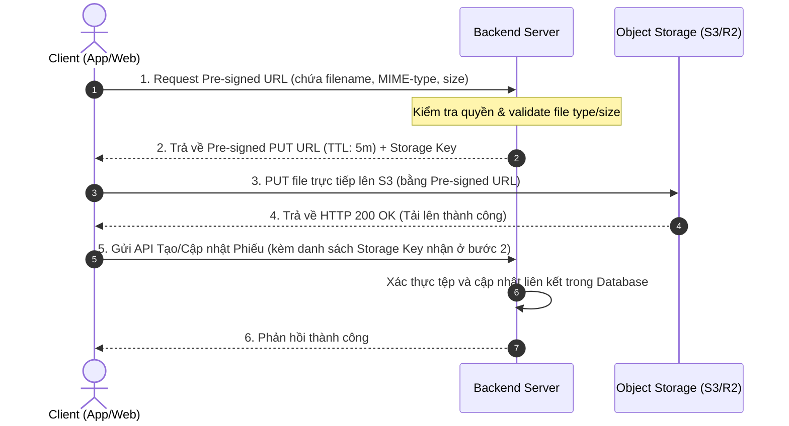
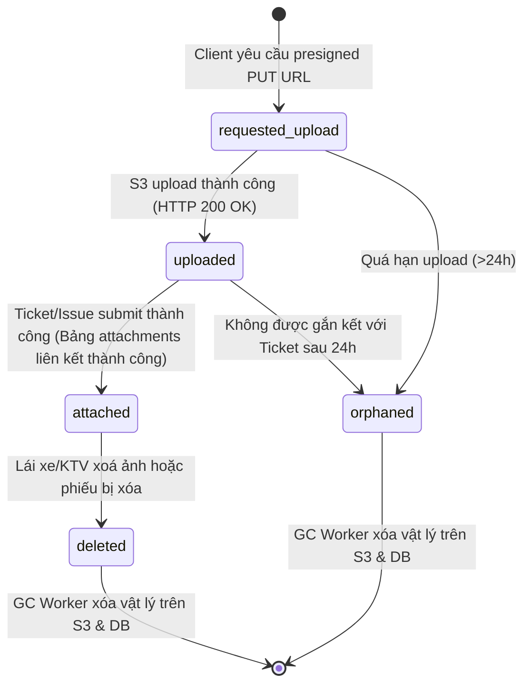

# 20 Attachment Design

## Purpose
Chương này đặc tả chi tiết kiến trúc và thiết kế hệ thống tệp tin đính kèm (Attachment Design) trong FixTrack. Tài liệu quy định các loại định dạng tệp tin cho phép, dung lượng tối đa, quy trình tải lên (Upload Flow) trực tiếp từ Client lên Object Storage thông qua Pre-signed URL, cơ chế bảo mật, vòng đời tệp tin và giải pháp tối ưu hóa băng thông (Client-side Compression & Image Variants).

Tài liệu này là cơ sở để:
- **Backend Design** (Chapter 21) tích hợp dịch vụ lưu trữ (Object Storage Service như MinIO, AWS S3, Cloudflare R2).
- **Frontend/Mobile Implementation** tích hợp tính năng nén ảnh trước khi tải lên, xử lý preview và thực hiện tải lên trực tiếp.
- **Database Design** (Chapter 15) thiết kế cấu trúc bảng lưu tệp đính kèm.

## Questions Answered
- Những loại tệp tin nào (ảnh, video) được phép tải lên hệ thống?
- Dung lượng và số lượng tệp tối đa cho một hạng mục báo hỏng là bao nhiêu?
- Quy trình upload diễn ra như thế nào để giảm tải cho Backend?
- Làm thế nào để bảo vệ tệp tin không bị rò rỉ ra ngoài (Security) và dọn dẹp các tệp rác (Garbage Collection)?
- Phía Client nén ảnh và video như thế nào để tiết kiệm băng thông 4G?

## Inputs
- [07 Functional Requirements](../part_b_requirement_analysis/07_functional_requirements.md) (`FR-TICKET-03`)
- [10 Use Cases](../part_b_requirement_analysis/10_use_cases.md) (`UC-01` Exception Flow)
- [16 UI/UX Design](./16_ui_ux_design.md) (Shared Components)
- [17 Screen Specs](./17_screen_specs.md) (`SCR-03` Tạo phiếu)

---

## Content

### Level 1 — Ràng buộc định dạng và dung lượng tệp tin (File Constraints)

Để tránh lãng phí dung lượng lưu trữ và hạn chế các cuộc tấn công mã độc, hệ thống áp dụng các ràng buộc cứng sau:

| Định dạng | Loại tệp tin | File Extensions | MIME Types | Magic Bytes (File Signatures) | Dung lượng tối đa | Giới hạn số lượng |
|---|---|---|---|---|---|---|
| **Hình ảnh** | JPG, JPEG, PNG, WEBP | `.jpg`, `.jpeg`, `.png`, `.webp` | `image/jpeg`, `image/png`, `image/webp` | JPEG: `FF D8 FF`<br>PNG: `89 50 4E 47`<br>WEBP: `52 49 46 46` | **10 MB** / tệp | Tối đa 3 tệp / hạng mục lỗi |
| **Video** | MP4, MOV | `.mp4`, `.mov` | `video/mp4`, `video/quicktime` | MP4: `00 00 00 ... 66 74 79 70`<br>MOV: `00 00 00 ... 6d 6f 6f 76` | **20 MB** / tệp | Tối đa 1 tệp / hạng mục lỗi |

> **Ràng buộc bảo mật (Server-side Magic Bytes)**: Backend bắt buộc phải kiểm tra chữ ký tệp tin thực tế (Magic Bytes) khi nhận callback chứ không chỉ kiểm tra phần mở rộng (extension) hoặc MIME-type từ Header. Mọi tệp tin không khớp chữ ký hợp lệ sẽ bị từ chối ngay lập tức để chặn mã độc giả dạng ảnh.

---

### Level 2 — Quy trình tải lên trực tiếp (Direct-to-S3 Upload Flow)

Để tránh hiện tượng thắt nút cổ chai (bottleneck) tại Backend Server khi nhiều người dùng cùng tải ảnh/video dung lượng lớn cùng lúc, FixTrack áp dụng luồng tải lên trực tiếp lên Object Storage (S3-compatible) thông qua **Pre-signed URL**:



#### Quy tắc thời hạn (TTL) của Pre-signed URL:
- **Pre-signed PUT URL (Tải lên)**: Chỉ có hiệu lực trong **5 phút**. Sau thời gian này, link tự động hết hạn để tránh bị lạm dụng.
- **Pre-signed GET URL (Xem tệp)**: Chỉ có hiệu lực trong **1 giờ**. Sinh ra động khi xem chi tiết phiếu (`SCR-04`).

---

### Level 3 — Vòng đời tệp đính kèm và Dọn dẹp rác (Attachment Lifecycle & GC)

#### 3.1 Trạng thái của Tệp đính kèm (Attachment State Machine)
Mỗi tệp tin trong hệ thống tuân theo máy trạng thái sau để tránh lưu trữ rác (Orphan Files) trong trường hợp ứng dụng bị crash khi đang tải lên:



#### 3.2 Quy trình dọn dẹp tệp tin mồ côi (Garbage Collection - GC Worker)
- **Quy tắc dọn dẹp (Orphan Cleanup Policy)**: Một Background Job chạy định kỳ mỗi 24 giờ sẽ quét các bản ghi tệp đính kèm ở trạng thái `requested_upload`, `uploaded` hoặc `orphaned` có `created_at` quá **24 giờ** mà chưa được liên kết với bất kỳ `ticket_issues` nào.
- **Hành động**: Worker gọi API xóa vật lý đối tượng trên S3 Bucket, đồng thời xóa bản ghi tương ứng trong bảng `attachments`.

---

### Level 4 — Cơ chế bảo mật và Phân vùng lưu trữ (Storage & Security)

#### 4.1 Quy tắc đặt đường dẫn tệp tin (S3 Key Structure)
Để dễ quản lý, tệp tin tải lên được phân vùng theo cấu trúc thư mục dạng **Object Key**:
```
attachments/tickets/{ticket_id}/issues/{issue_id}/{uuid_ngau_nhien}.{ext}
```
*Ví dụ*: `attachments/tickets/45/issues/102/a1b2c3d4-e5f6-7a8b-9c0d-1e2f3a4b5c6d.webp`

#### 4.2 Thiết kế các biến thể ảnh (Image Variants / Thumbnails)
Khi một hình ảnh nguyên bản (original) được tải lên thành công, một Worker nền sẽ tự động tạo ra các phiên bản ảnh nhỏ hơn để tối ưu hóa tốc độ tải trang phía client:
- **`original/`**: Ảnh gốc đã được nén bởi client (max 1920px).
- **`preview/`**: Ảnh resize trung bình (max 800px) dùng cho màn hình chi tiết phiếu `SCR-04`.
- **`thumbnail/`**: Ảnh thu nhỏ (max 200px) dùng cho danh sách hoặc xem nhanh.

#### 4.3 Quét Virus bất đồng bộ (Asynchronous Virus Scanning)
Với các tệp tin đính kèm có độ ưu tiên cao hoặc tải lên từ thiết bị ngoài, hệ thống tích hợp ClamAV chạy ngầm:
- Khi tệp chuyển sang trạng thái `uploaded`, ClamAV container tiến hành quét mã độc.
- Nếu phát hiện tệp tin nhiễm virus, trạng thái lập tức chuyển sang `deleted` (blocked), gửi cảnh báo cho quản trị viên và xóa tệp vật lý.

---

### Level 5 — Tối ưu hoá phía Client (Client-Side Optimization)

#### 5.1 Thuật toán nén ảnh Client-side (Image Compression)
Trước khi gửi yêu cầu Pre-signed URL, Client bắt buộc thực hiện:
1. **Resize**: Giới hạn kích thước tối đa của ảnh ở chiều dài lớn nhất (max-width/max-height) là **1920px**. Giữ nguyên tỷ lệ ảnh.
2. **Compress**: Nén ảnh về định dạng `.webp` (hoặc `.jpeg` làm fallback) với chất lượng nén (quality) là **75%**.
3. **Kết quả**: Ảnh gốc giảm từ ~4MB–8MB xuống dưới **500KB** trước khi tải lên.

#### 5.2 Ràng buộc và nén Video phía Client (Video Policy)
Để tránh video quay từ camera gốc quá nặng làm ngẽn mạng 4G:
- **Thời lượng**: Tối đa **15 giây**.
- **Codec**: H.264 (AAC audio) để tương thích hiển thị trên mọi trình duyệt Web/PWA.
- **Resolution**: Giới hạn tối đa **720p** (1280x720).
- **Bitrate**: Tối đa **2 Mbps**.
- **Framerate**: 24–30 FPS.

---

### Level 6 — Thiết kế Cơ sở dữ liệu (Database Schema)

Để thay thế cho việc lưu trữ mảng path thô sơ (`ticket_issues.duong_dan_anh[]`), FixTrack sử dụng một bảng quan hệ riêng biệt:

```sql
CREATE TABLE attachments (
    id UUID PRIMARY KEY DEFAULT gen_random_uuid(),
    ticket_id INT REFERENCES repair_requests(id) ON DELETE CASCADE,
    issue_id INT REFERENCES ticket_issues(id) ON DELETE CASCADE,
    storage_key VARCHAR(512) NOT NULL, -- Object Key trên S3
    file_name VARCHAR(255) NOT NULL, -- Tên file gốc người dùng tải lên
    mime_type VARCHAR(100) NOT NULL,
    size_bytes INT NOT NULL,
    checksum_sha256 VARCHAR(64), -- Dùng kiểm tra tính toàn vẹn dữ liệu
    status VARCHAR(20) NOT NULL DEFAULT 'requested_upload', -- requested_upload, uploaded, attached, orphaned, deleted
    uploaded_by INT REFERENCES users(id),
    created_at TIMESTAMP WITH TIME ZONE DEFAULT CURRENT_TIMESTAMP
);
```

---

## Outputs
- Đặc tả Hệ thống tệp đính kèm: [20_attachment_design.md](./20_attachment_design.md)
- Tham chiếu sang: [15_database_schema.md](../part_c_data_design/15_database_schema.md) (tích hợp bảng `attachments` thay thế cho cột array cũ)
- Tham chiếu sang: [21_api_design.md](../part_e_backend_design/21_api_design.md) (endpoint `/attachments/presigned-url` để lấy link upload)
