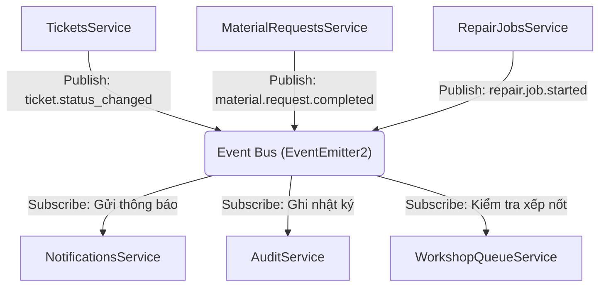

# 23 Service Contracts

**Trạng thái: Hoàn thành (Finalized - Version 1.0)**

---

## Purpose

Chương này đặc tả chi tiết các hợp đồng dịch vụ (Service Contracts) của hệ thống FixTrack ở tầng **Application Service (Use Cases)**. Tài liệu định nghĩa các giao diện lập trình TypeScript (Interfaces), các cấu trúc dữ liệu truyền nhận (DTOs), các trường hợp ngoại lệ nghiệp vụ (Business Exceptions) và ma trận sự kiện kết nối giữa các module.

Tài liệu này là ranh giới kỹ thuật quan trọng để:
*   **Backend Developers**: Triển khai các NestJS Services tuân thủ đúng phương thức, kiểu dữ liệu và ràng buộc nghiệp vụ.
*   **QA Team**: Hiểu rõ các kịch bản ngoại lệ để viết Unit Tests, Integration Tests và tạo mock dữ liệu chính xác cho từng trường hợp biên.
*   **System Integration**: Đảm bảo sự phối hợp đồng bộ, không xảy ra xung đột kiểu dữ liệu giữa các module khi gọi trực tiếp (đồng bộ) hoặc qua Event Bus (bất đồng bộ).

---

## Inputs

*   [05 User Roles](../part_a_business_foundation/05_user_roles.md)
*   [09 Business Rules](../part_b_requirement_analysis/09_business_rules.md)
*   [15 Database Schema](../part_c_data_design/15_database_schema.md)
*   [18 State Machine](../part_d_application_design/18_state_machine.md)
*   [21 API Design](./21_api_design.md)
*   [22 Backend Modules](./22_backend_modules.md)

---

# Level 1 — Design Philosophy & Conventions

## 1.1 Interface-Based Programming (Lập trình hướng giao diện)
Để đảm bảo tính cô lập (encapsulation) của từng module trong Modular Monolith, các module khác khi cần gọi đồng bộ sang nhau sẽ **chỉ được phép phụ thuộc vào Interface hoặc Tokens** được định nghĩa công khai trong `SharedKernel` hoặc phần public exports của module đó.

## 1.2 Business Exception Mapping (Bản đồ lỗi nghiệp vụ)
Tất cả các exception ném ra từ tầng Application Service phải kế thừa từ một lớp lỗi chung `BusinessException` chứa mã lỗi nghiệp vụ độc lập với giao thức truyền tải (REST, GraphQL hay WebSockets).
Mỗi mã lỗi nghiệp vụ tương ứng trực tiếp với mã HTTP Status và Error Code đã quy định tại [21 API Design](./21_api_design.md):

| Business Exception | Tương ứng HTTP Code | Error Code (API Design) | Mô tả |
| :--- | :--- | :--- | :--- |
| `EntityNotFoundException` | `404 Not Found` | `*_NOT_FOUND` | Không tìm thấy thực thể (User, Vehicle, Ticket...) |
| `ForbiddenActionException` | `403 Forbidden` | `FORBIDDEN` | Sai vai trò hoặc không đủ thẩm quyền xử lý dữ liệu |
| `InvalidStateTransitionException` | `400 Bad Request` | `INVALID_STATUS` | Chuyển trạng thái vi phạm Guard của State Machine |
| `InsufficientStockException` | `400 Bad Request` | `MATERIAL_INSUFFICIENT` | Số lượng tồn kho khả dụng không đủ |
| `SlotUnavailableException` | `400 Bad Request` | `REPAIR_SLOT_NOT_AVAILABLE`| Hết cầu sửa chữa trống trong xưởng |
| `HandoverIncompleteException` | `400 Bad Request` | `REP_PARTS_NOT_DELIVERED` | Chưa hoàn thành bàn giao vật tư, cấm sửa |

## 1.3 Transaction Boundaries (Ranh giới giao dịch CSDL)
*   Mọi phương thức Service có thực hiện thay đổi dữ liệu trên nhiều bảng (ví dụ: tạo ticket và đổi trạng thái xe, duyệt xuất kho và trừ tồn kho) bắt buộc phải được bọc trong một **Database Transaction**.
*   Sử dụng cơ chế `QueryRunner` của TypeORM để quản lý thủ công (Manual Transaction Control) hoặc sử dụng decorator `@Transactional()` để đảm bảo tính toàn vẹn dữ liệu (ACID).

---

# Level 2 — Common DTOs & Types

Dưới đây là các cấu trúc dữ liệu dùng chung trên toàn bộ hệ thống service:

```typescript
// Định nghĩa Actor đang đăng nhập từ token JWT
export interface CurrentUser {
  user_id: string;
  username: string;
  role: 'DRIVER' | 'MECHANIC' | 'TECH' | 'INVENTORY' | 'MANAGER';
  scopes: string[]; // Danh sách quyền chi tiết phục vụ ABAC
}

// Cấu trúc phân trang chuẩn hóa
export interface Paginated<T> {
  data: T[];
  meta: {
    page: number;
    limit: number;
    total_records: number;
    total_pages: number;
    timestamp: string;
  };
}

// Bộ lọc phân trang cơ bản
export interface BaseFilter {
  page?: number;
  limit?: number;
  search?: string;
  sort_by?: string;
  sort_order?: 'ASC' | 'DESC';
}
```

---

# Level 3 — Service Interfaces

## 3.1 AuthService (Xác thực & Phân quyền)
Chịu trách nhiệm xử lý đăng nhập, đăng xuất, cấp phát và thu hồi mã thông báo JWT.

```typescript
export interface TokenPayload {
  access_token: string;
  refresh_token: string;
  expires_in: number; // đơn vị giây
}

export interface IAuthService {
  /**
   * Đăng nhập hệ thống bằng mã nhân viên và mật khẩu
   * @throws EntityNotFoundException nếu sai mã nhân viên hoặc mật khẩu
   */
  login(dto: LoginDto): Promise<TokenPayload>;

  /**
   * Đăng xuất hệ thống, thu hồi refresh token trong Redis
   */
  logout(refreshToken: string): Promise<void>;

  /**
   * Cấp lại access token mới từ refresh token hợp lệ
   * @throws ForbiddenActionException nếu refresh token không hợp lệ hoặc đã bị thu hồi
   */
  refreshToken(refreshToken: string): Promise<TokenPayload>;

  /**
   * Lấy thông tin tài khoản hiện tại từ userId
   * @throws EntityNotFoundException
   */
  getMe(userId: string): Promise<CurrentUser>;
}
```

## 3.2 UsersService (Quản lý Người dùng & Phân công)
Chịu trách nhiệm quản lý thông tin nhân sự và phân công xe cho tài xế.

```typescript
export interface IUsersService {
  createUser(dto: CreateUserDto): Promise<UserEntity>;
  getUserById(id: string): Promise<UserEntity>;
  listUsers(filter: UserFilterDto): Promise<Paginated<UserEntity>>;
  updateUser(id: string, dto: UpdateUserDto): Promise<UserEntity>;

  /**
   * Phân công phương tiện cho tài xế vận hành
   * @emits user.vehicle.assigned
   * @throws EntityNotFoundException nếu tài xế hoặc phương tiện không tồn tại
   * @throws InvalidStateTransitionException nếu phương tiện hoặc tài xế đã bị gán trong ca khác
   */
  assignVehicle(driverId: string, vehicleId: string, actorId: string): Promise<VehicleAssignmentEntity>;

  /**
   * Kết thúc phân công phương tiện, giải phóng xe và tài xế
   * @throws EntityNotFoundException
   */
  unassignVehicle(assignmentId: string, actorId: string): Promise<void>;
}
```

## 3.3 VehiclesService (Quản lý Phương tiện)
Quản lý vòng đời hoạt động và trạng thái kỹ thuật của đội xe.

```typescript
export interface IVehiclesService {
  createVehicle(dto: CreateVehicleDto): Promise<VehicleEntity>;
  getVehicleById(id: string): Promise<VehicleEntity>;
  listVehicles(filter: VehicleFilterDto): Promise<Paginated<VehicleEntity>>;
  updateVehicle(id: string, dto: UpdateVehicleDto): Promise<VehicleEntity>;

  /**
   * Cập nhật trạng thái vật lý của phương tiện (ACTIVE, BROKEN, REPAIRING)
   * @throws EntityNotFoundException
   */
  updateVehicleStatus(id: string, status: 'ACTIVE' | 'BROKEN' | 'REPAIRING', actorId: string): Promise<VehicleEntity>;
}
```

## 3.4 TicketsService (Quản lý Phiếu Sửa Chữa)
Được xem là core service trung tâm điều phối máy trạng thái của Phiếu sửa chữa (`RepairTicket`).

```typescript
export interface ITicketsService {
  /**
   * Lái xe tạo phiếu báo hỏng xe
   * @guards BR-01: Tài xế phải đang được gán vận hành xe này tại thời điểm hiện tại
   * @emits ticket.created
   * @throws ForbiddenActionException nếu tài xế không được gán xe
   */
  createTicket(dto: CreateTicketDto, user: CurrentUser): Promise<RepairTicketEntity>;

  /**
   * Lấy chi tiết phiếu kèm kiểm tra quyền dữ liệu ABAC
   * @throws EntityNotFoundException
   * @throws ForbiddenActionException nếu tài khoản không đủ quyền xem theo scope
   */
  getTicketById(id: string, user: CurrentUser): Promise<RepairTicketEntity>;

  /**
   * Lọc và tìm kiếm danh sách phiếu theo phân quyền dữ liệu ABAC
   */
  listTickets(filter: TicketFilterDto, user: CurrentUser): Promise<Paginated<RepairTicketEntity>>;

  /**
   * Cập nhật thông tin phiếu sửa chữa kèm bảo vệ ghi đè đồng thời (Optimistic Lock)
   * @throws InvalidStateTransitionException nếu version gửi lên bị lệch
   */
  updateTicket(id: string, dto: UpdateTicketDto, actorId: string): Promise<RepairTicketEntity>;

  /**
   * Đội cơ giới tiếp nhận phiếu để kiểm tra sơ bộ
   * Trạng thái phiếu: reported -> inspecting
   * @emits ticket.status_changed
   * @throws InvalidStateTransitionException nếu trạng thái hiện tại khác reported
   */
  acceptInspection(id: string, actorId: string): Promise<RepairTicketEntity>;

  /**
   * Đội cơ giới từ chối phiếu (Lỗi quá nhẹ, không cần sửa)
   * Trạng thái phiếu: inspecting -> rejected
   * @emits ticket.status_changed
   * @throws InvalidStateTransitionException nếu thiếu lý do từ chối (reason)
   */
  rejectTicket(id: string, reason: string, actorId: string): Promise<RepairTicketEntity>;

  /**
   * Đội cơ giới chuyển xe vào hàng chờ sửa chữa do xưởng quá tải
   * Trạng thái phiếu: inspecting -> waiting_queue
   * @guards Cần đảm bảo xưởng hết slot trống (slot_available == false)
   * @emits ticket.status_changed
   * @throws SlotUnavailableException nếu xưởng vẫn còn cầu trống (phải sửa trực tiếp)
   */
  routeToQueue(id: string, actorId: string): Promise<RepairTicketEntity>;

  /**
   * Đội cơ giới chạy thử nghiệm thu ĐẠT và đóng phiếu
   * Trạng thái phiếu: completed -> closed
   * @emits ticket.status_changed
   * @throws InvalidStateTransitionException
   */
  approveInspection(id: string, actorId: string): Promise<RepairTicketEntity>;

  /**
   * Đội cơ giới nghiệm thu KHÔNG ĐẠT, yêu cầu sửa lại
   * Trạng thái phiếu: completed -> repairing
   * @emits ticket.status_changed
   * @throws InvalidStateTransitionException nếu thiếu lý do nghiệm thu không đạt
   */
  rejectInspection(id: string, reason: string, actorId: string): Promise<RepairTicketEntity>;
}
```

## 3.5 WorkshopQueueService (Quản lý Hàng Chờ Xưởng)
Quản lý logic thứ tự xe chờ vào cầu sửa chữa theo thuật toán FIFO có cấu trúc.

```typescript
export interface IWorkshopQueueService {
  /**
   * Lấy danh sách xe đang đứng trong hàng chờ sửa chữa
   */
  getQueue(): Promise<QueueEntryEntity[]>;

  /**
   * Đẩy một xe vào hàng chờ ở vị trí cuối cùng
   * @emits queue.updated
   */
  addVehicleToQueue(ticketId: string, vehicleId: string): Promise<QueueEntryEntity>;

  /**
   * Thay đổi thứ tự ưu tiên hoặc đẩy một xe lên đầu hàng chờ
   * @emits queue.updated
   * @throws ForbiddenActionException nếu không phải Quản lý/Admin thực hiện
   */
  promoteEntry(id: string, actorId: string): Promise<QueueEntryEntity>;

  /**
   * Giải phóng xe khỏi hàng chờ khi có cầu sửa chữa trống
   * Kích hoạt chuyển trạng thái ticket từ waiting_queue sang repairing
   * @emits queue.updated
   */
  releaseVehicleFromQueue(id: string, actorId: string): Promise<void>;
}
```

## 3.6 MaterialRequestsService (Quản lý Yêu Cầu Vật Tư)
Quản lý chi tiết máy trạng thái của Yêu cầu vật tư (`MaterialRequest`) và đồng bộ trạng thái liên quan.

```typescript
export interface IMaterialRequestsService {
  /**
   * Kỹ thuật viên tạo yêu cầu cấp vật tư phục vụ sửa chữa
   * @guards Phiếu sửa chữa liên quan phải ở trạng thái inspecting hoặc waiting_parts
   * @emits material.request.created
   * @throws InvalidStateTransitionException nếu ticket sai trạng thái
   */
  createRequest(dto: CreateMaterialRequestDto, techId: string): Promise<MaterialRequestEntity>;

  /**
   * Lấy danh sách yêu cầu vật tư phân trang theo phân quyền
   */
  listRequests(filter: MaterialRequestFilterDto, user: CurrentUser): Promise<Paginated<MaterialRequestEntity>>;

  /**
   * Lấy thông tin chi tiết một yêu cầu vật tư
   */
  getRequestById(id: string, user: CurrentUser): Promise<MaterialRequestEntity>;

  /**
   * Thủ kho phê duyệt xuất kho vật tư (hỗ trợ duyệt một phần)
   * Trạng thái MR: cho_duyet -> da_xuat
   * @guards Số lượng tồn kho khả dụng phải đủ đáp ứng các mặt hàng phê duyệt
   * @emits material.request.approved
   * @throws InsufficientStockException nếu hết hàng khả dụng trong kho
   */
  approveRequest(id: string, dto: ApproveMaterialRequestDto, actorId: string): Promise<MaterialRequestEntity>;

  /**
   * Thủ kho từ chối yêu cầu cấp phát vật tư
   * Trạng thái MR: cho_duyet -> tu_choi
   * @emits material.request.rejected
   * @throws InvalidStateTransitionException nếu không nhập lý do từ chối
   */
  rejectRequest(id: string, reason: string, actorId: string): Promise<MaterialRequestEntity>;

  /**
   * Lái xe xác nhận đã nhận phụ tùng vật lý từ thủ kho
   * Trạng thái MR: da_xuat -> da_nhan_tai_xe
   * @emits material.request.delivered
   * @throws ForbiddenActionException nếu không phải tài xế được gán của ticket
   */
  confirmDelivery(id: string, driverId: string): Promise<MaterialRequestEntity>;

  /**
   * Kỹ thuật viên xác nhận đã nhận bàn giao phụ tùng từ lái xe tại xưởng
   * Trạng thái MR: da_nhan_tai_xe -> da_ban_giao
   * @emits material.request.completed
   * @throws ForbiddenActionException nếu không phải KTV phụ trách sửa chữa xe
   */
  confirmHandover(id: string, techId: string): Promise<MaterialRequestEntity>;

  /**
   * Kiểm tra và đồng bộ trạng thái của Ticket liên quan dựa trên tất cả các MR đi kèm.
   * Nếu tất cả MR chuyển sang da_ban_giao -> Tự động chuyển trạng thái Ticket sang repairing.
   */
  syncTicketMaterialStatus(ticketId: string, actorId: string): Promise<void>;
}
```

## 3.7 RepairJobsService (Điều hành Sửa Chữa)
Quản lý các công việc và tiến độ sửa chữa thực tế tại cầu sửa chữa của KTV.

```typescript
export interface IRepairJobsService {
  /**
   * Kỹ thuật viên bắt đầu sửa chữa xe tại cầu
   * Trạng thái Ticket: waiting_parts hoặc waiting_queue hoặc inspecting -> repairing
   * @guards Kiểm tra nếu xe có yêu cầu vật tư, mọi MR bắt buộc phải hoàn thành bàn giao (da_ban_giao)
   *         Trừ phi có chính sách bypass Partial Repair từ KTV.
   * @emits repair.job.started
   * @throws HandoverIncompleteException nếu vật tư chưa bàn giao đủ
   */
  startJob(ticketId: string, techId: string): Promise<RepairJobEntity>;

  /**
   * Kỹ thuật viên báo cáo hoàn tất sửa chữa tất cả hạng mục lỗi
   * Trạng thái Ticket: repairing -> completed
   * @emits repair.job.completed
   * @throws InvalidStateTransitionException
   */
  completeJob(id: string, techId: string): Promise<RepairJobEntity>;

  /**
   * Lấy lịch sử công việc sửa chữa phân trang
   */
  listJobs(filter: RepairJobFilterDto, user: CurrentUser): Promise<Paginated<RepairJobEntity>>;
}
```

## 3.8 AttachmentsService (Quản lý File & S3 Presigned URL)
Chịu trách nhiệm sinh mã URL và dọn dẹp các tệp đính kèm.

```typescript
export interface PresignedUrlResponse {
  attachment_id: string;
  upload_url: string;      // S3 upload link tạm thời
  access_url: string;      // S3 read link
  expires_in: number;
}

export interface IAttachmentsService {
  /**
   * Sinh URL upload file lên S3 tạm thời cho Client
   */
  generatePresignedUrl(fileName: string, mimeType: string, fileSize: number, actorId: string): Promise<PresignedUrlResponse>;

  /**
   * Xác nhận Client đã tải file lên S3 thành công để chuyển trạng thái file sang hoạt động
   */
  confirmUpload(attachmentId: string, actorId: string): Promise<AttachmentEntity>;

  /**
   * Lấy link truy cập file tạm thời phục vụ hiển thị hình ảnh
   */
  getAccessUrl(attachmentId: string, actorId: string): Promise<string>;
}
```

## 3.9 NotificationsService (Hệ thống Thông báo)
Quản lý luồng gửi tin tức và đẩy thông báo Push FCM/Web.

```typescript
export interface INotificationsService {
  /**
   * Tạo và gửi thông báo tới người dùng cụ thể
   */
  sendNotification(userId: string, title: string, body: string, type: string, referenceId?: string): Promise<NotificationEntity>;

  /**
   * Đăng ký mã token của thiết bị di động để nhận Push thông qua Firebase
   */
  registerDeviceToken(userId: string, token: string): Promise<void>;

  /**
   * Lấy hộp thư thông báo cá nhân phân trang
   */
  listNotifications(userId: string, filter: BaseFilter): Promise<Paginated<NotificationEntity>>;

  /**
   * Đánh dấu thông báo đã đọc
   * @throws EntityNotFoundException
   */
  markAsRead(id: string, userId: string): Promise<NotificationEntity>;
}
```

---

# Level 4 — Event Publisher & Subscriber Registry

Hệ thống FixTrack giao tiếp bất đồng bộ thông qua **Event Bus** để giải vây phụ thuộc vòng (Anti-Circular Dependency) giữa các Feature Modules. Dưới đây là danh mục đăng ký các bên Phát hành (Publishers) và Đăng ký nhận (Subscribers) của từng Sự kiện Nghiệp vụ:



### Bảng chi tiết Đăng ký Sự kiện (Event Registry Matrix)

| Tên Sự kiện (Event Name) | Bên Phát hành (Publisher) | Bên Đăng ký (Subscriber) | Side Effects (Hành động phụ kích hoạt) |
| :--- | :--- | :--- | :--- |
| **`user.vehicle.assigned`** | `UsersService.assignVehicle` | `VehiclesService` | Chuyển trạng thái xe sang `ACTIVE` |
| | | `NotificationsService` | Gửi Push cho tài xế: "Bạn đã được bàn giao xe {biên_số}" |
| **`ticket.created`** | `TicketsService.createTicket` | `VehiclesService` | Chuyển trạng thái xe sang `BROKEN` |
| | | `NotificationsService` | Gửi cảnh báo cho Đội cơ giới để tiếp nhận kiểm tra |
| **`ticket.status_changed`** | `TicketsService` | `AuditService` | Ghi log lịch sử thay đổi trạng thái vào `audit_logs` |
| | | `NotificationsService` | Gửi Push cập nhật trạng thái sửa chữa cho tài xế |
| **`material.request.created`** | `MaterialRequestsService.createRequest`| `TicketsService` | **Tự động chuyển trạng thái Ticket liên quan sang `waiting_parts`** |
| | | `NotificationsService` | Gửi cảnh báo chuông web cho Thủ kho có yêu cầu mới |
| **`material.request.approved`** | `MaterialRequestsService.approveRequest`| `NotificationsService` | Gửi Push báo tài xế: "Vật tư xe {biển_số} đã xuất kho, hãy qua nhận" |
| **`material.request.delivered`** | `MaterialRequestsService.confirmDelivery`| `NotificationsService` | Gửi Push báo KTV: "Tài xế đã nhận vật tư, đang chuyển về xưởng" |
| **`material.request.completed`** | `MaterialRequestsService.confirmHandover`| `MaterialRequestsService` | **Kích hoạt gọi phương thức `syncTicketMaterialStatus` để đồng bộ trạng thái Ticket** |
| **`repair.job.started`** | `RepairJobsService.startJob` | `VehiclesService` | Chuyển trạng thái xe sang `REPAIRING` |
| | | `NotificationsService` | Gửi Push báo tài xế: "Xe đã bắt đầu được tiến hành sửa chữa" |
| **`repair.job.completed`** | `RepairJobsService.completeJob` | `NotificationsService` | Gửi thông báo đến Đội cơ giới yêu cầu chạy thử nghiệm thu |
| **`queue.updated`** | `WorkshopQueueService` | `NotificationsService` | Gửi cập nhật vị trí hàng chờ theo thời gian thực tới tài xế |
