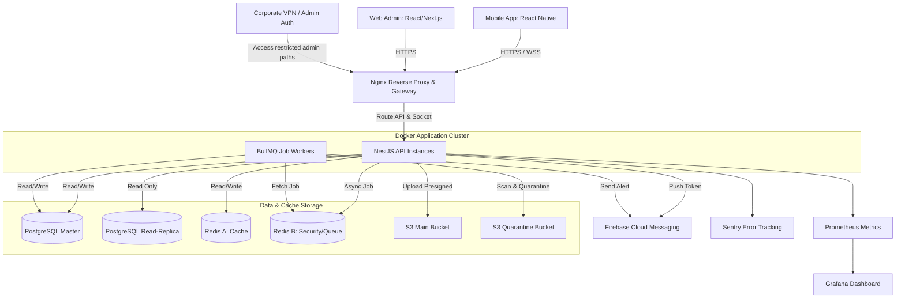
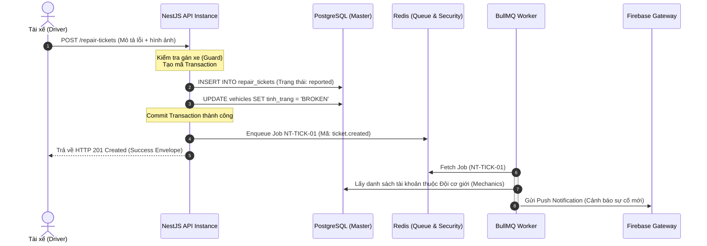
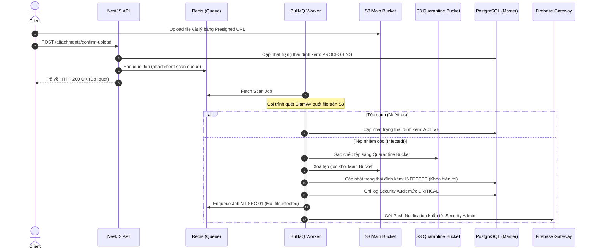

# 26 System Architecture

**Trạng thái: Hoàn thành (Finalized - Version 1.0)**

---

## Purpose

Chương này đặc tả chi tiết kiến trúc hệ thống (System Architecture) tổng thể của hệ thống FixTrack ở cấp độ vận hành Production. Tài liệu định nghĩa sơ đồ kết nối mạng (Topology), các phân lớp hạ tầng kỹ thuật, môi trường triển khai, luồng dữ liệu tuần tự và các mục tiêu phi chức năng về tính sẵn sàng cao, bảo mật và vận hành giám sát.

---

## Inputs

*   [05 User Roles](../part_a_business_foundation/05_user_roles.md)
*   [15 Database Schema](../part_c_data_design/15_database_schema.md)
*   [18 State Machine](../part_d_application_design/18_state_machine.md)
*   [19 Notification Flow](../part_d_application_design/19_notification_flow.md)
*   [20 Attachment Design](../part_d_application_design/20_attachment_design.md)
*   [21 API Design](../part_e_backend_design/21_api_design.md)
*   [22 Backend Modules](../part_e_backend_design/22_backend_modules.md)
*   [24 Background Jobs](../part_e_backend_design/24_background_jobs.md)
*   [25 Cache Strategy](../part_e_backend_design/25_cache_strategy.md)

---

# Level 1 — High-Level Architecture Diagram

Sơ đồ dưới đây mô tả cấu trúc vật lý và logic của toàn bộ hệ thống FixTrack khi vận hành thực tế:



---

# Level 2 — Deployment Environments

Hệ thống được vận hành đồng bộ trên 3 môi trường nhằm phục vụ đầy đủ vòng đời phát triển:

| Môi trường (Env) | Mục đích sử dụng | Công nghệ Runtime | Chiến lược cơ sở dữ liệu (Database Strategy) | Cấu hình Security |
| :--- | :--- | :--- | :--- | :--- |
| **Local (Development)** | Lập trình và kiểm thử đơn vị của Developer | Node.js local + Docker cho PostgreSQL/Redis | DB chạy cục bộ, tự động đồng bộ Schema | Cho phép kết nối trực tiếp không qua VPN |
| **Staging (UAT / QA)** | Kiểm thử tích hợp (Integration Tests) và nghiệm thu người dùng | Docker Compose chạy trên 1 Server | CSDL PostgreSQL độc lập, chạy tự động Migration | Basic Auth bảo vệ toàn bộ các endpoint ngoài |
| **Production (Live)** | Hệ thống vận hành thực tế của doanh nghiệp | **Docker containers** quản lý độc lập (Production-ready) | PostgreSQL Master-Replica + Redis riêng biệt | Tách subnet, hạn chế VPN nội bộ, chặn Internet ngoài |

---

# Level 3 — Layer Specifications

## 3.1 Client Layer (Lớp Ứng dụng Client)
*   **Mobile Application**: Xây dựng bằng React Native (TypeScript). Phục vụ Lái xe (Driver), Đội cơ giới (Mechanic) và Kỹ thuật viên (Tech) thao tác tại xưởng hoặc ngoài hiện trường. Tương tác qua REST API và kết nối WebSocket Socket.IO để nhận thông báo real-time.
*   **Web Admin Portal**: Xây dựng bằng React/Next.js. Phục vụ Quản lý (Manager), Điều hành xưởng và Nhân viên kho (Inventory Staff) thao tác giám sát, duyệt vật tư và kết xuất báo cáo.

## 3.2 Network & Gateway Layer (Lớp Mạng & Định tuyến)
*   **Nginx Reverse Proxy**:
    *   Thực hiện chấm dứt mã hóa SSL/TLS (TLS 1.3).
    *   Định tuyến (Routing): Đường dẫn `/api/v1/*` chuyển tới cụm NestJS API; đường dẫn `/socket.io/*` chuyển tới WebSocket Gateway; các đường dẫn tĩnh phục vụ Web Admin.
    *   Giới hạn tần suất (Rate Limiting): Cấu hình ở Nginx kết hợp với Redis để chặn tấn công từ chối dịch vụ (DDoS) và brute-force.

## 3.3 Security Architecture Layer (Kiến trúc Bảo mật)
*   **Network Isolation (Cô lập mạng)**: Toàn bộ cơ sở dữ liệu PostgreSQL, các cụm Redis và S3 Storage được đặt trong **Private Subnet** (mạng nội bộ không thể truy cập trực tiếp từ Internet).
*   **VPN Restriction**: Công cụ quản trị tác vụ hàng chờ (Bull Board) và các API quản trị nội bộ **bắt buộc chỉ cho phép truy cập từ Corporate VPN** (mạng nội bộ doanh nghiệp) kết hợp với phân quyền Admin RBAC nghiêm ngặt.
*   **Secrets Management**: Mật khẩu DB, khóa API của Firebase, khóa JWT được lưu trữ an toàn dưới dạng các biến môi trường (Environment Variables) hoặc hệ thống quản lý khóa tập trung (HashiCorp Vault / AWS Secrets Manager).

## 3.4 Application & Workers Layer (Lớp Ứng dụng & Xử lý nền)
*   **NestJS API Instance**: Các tiến trình xử lý API HTTP và Socket Gateway. Chạy ở chế độ không trạng thái (Stateless) để sẵn sàng mở rộng ngang khi tải tăng.
*   **BullMQ Workers**: Các tiến trình Node.js chạy độc lập chuyên xử lý tác vụ nền (gửi push, dọn dẹp file, quét timeout). Việc tách biệt tiến trình giúp tránh hiện tượng nghẽn Event Loop của luồng API chính.

## 3.5 Database & Caching Layer (Lớp Cơ sở dữ liệu & Bộ nhớ đệm)
*   **PostgreSQL**:
    *   *Master DB*: Xử lý toàn bộ các giao dịch ghi (Write transactions) để đảm bảo tính toàn vẹn dữ liệu ACID.
    *   *Read-Replica DB*: Phục vụ các API truy vấn báo cáo nặng của Quản lý và lấy danh mục tĩnh để giảm tải cho Master.
*   **Redis Caching (Cụm Redis A)**:
    *   *Policy*: Cấu hình `allkeys-lru` để tự động giải phóng RAM khi đầy.
    *   *Nhiệm vụ*: Cache danh mục vật tư, danh sách kho, và snapshot hàng chờ.
*   **Redis Security & Queue (Cụm Redis B)**:
    *   *Policy*: Cấu hình **`noeviction`** để bảo vệ dữ liệu nghiệp vụ, không tự động xóa khi đầy.
    *   *Nhiệm vụ*: Lưu trữ hàng chờ BullMQ, danh sách đen token (`blacklist`), và phiên làm việc (`session`).

## 3.6 Object Storage Layer (Lớp Lưu trữ tệp tin)
*   **S3 Main Bucket**: Lưu trữ hình ảnh/video báo lỗi xe do tài xế tải lên.
*   **S3 Quarantine Bucket**: Vùng cô lập vật lý dành cho các file phát hiện nhiễm mã độc trong quy trình quét virus.

## 3.7 Observability Layer (Hệ thống Giám sát & Đo lường)
*   **Metrics**: Thu thập thông tin CPU, RAM, Redis memory, và API Latency bằng **Prometheus**.
*   **Visualization**: Hiển thị bảng biểu giám sát thời gian thực qua **Grafana**.
*   **Error Tracking**: Tự động bắt và báo cáo lỗi phát sinh ở cả Client và Backend về hệ thống **Sentry** kèm theo `trace_id` để debug tức thời.
*   **Centralized Logging**: Thu thập toàn bộ log hệ thống tập trung qua **Loki** hoặc cụm ELK Stack.

---

# Level 4 — End-to-End Request Flows

## 4.1 Luồng Tạo phiếu sửa chữa (Create Ticket Flow)
Mô tả tiến trình từ khi tài xế nhấn gửi báo hỏng, ghi nhận DB đồng bộ và đẩy tác vụ gửi push không đồng bộ:



## 4.2 Luồng Quét virus và Cách ly tệp đính kèm (File Scan & Quarantine Flow)
Mô tả tiến trình kiểm tra tệp đính kèm sau khi client hoàn tất upload:



---

# Level 5 — High Availability & Scalability

Để đảm bảo hệ thống có thể phục vụ số lượng người dùng lớn và không có điểm lỗi duy nhất (Single Point of Failure):

## 5.1 Horizontal Scaling (Mở rộng ngang API)
*   **Stateless Server**: Các instances NestJS API hoàn toàn không lưu trạng thái (Stateless), mọi dữ liệu phiên làm việc được lưu trên Redis và PostgreSQL.
*   **Auto-scaling**: Nền tảng điều phối container (ví dụ: Kubernetes HPA hoặc Docker Swarm) có thể tự động nhân bản (scale-out) thêm API instance mới khi tải CPU của các container hiện tại vượt quá 70% để chia sẻ lưu lượng.

## 5.2 Lộ trình Mở rộng Cơ sở dữ liệu (PostgreSQL HA Roadmap)
Để giải quyết bài toán tải đọc/ghi tăng dần theo quy mô doanh nghiệp:

```mermaid
chronology
    title Lộ trình nâng cấp tính sẵn sàng cao CSDL
    Phase 1 (Single Node) : Triển khai 1 Database PostgreSQL Master duy nhất cho cả Đọc và Ghi
    Phase 2 (Master-Replica) : Cấu hình 1 Master (xử lý Ghi) và 1 Replica (xử lý Đọc), đồng bộ bất đồng bộ
    Phase 3 (Auto-Failover) : Tích hợp công cụ Patroni và Consul để tự động phát hiện lỗi và thăng chức Replica lên Master khi Master chết
```

---

# Level 6 — Architecture NFR Targets

Hạ tầng và kiến trúc hệ thống FixTrack được thiết lập để đạt được các chỉ tiêu chất lượng phi chức năng dưới đây:

| Chỉ số kỹ thuật (Metric) | Giá trị mục tiêu (Target) | Cơ chế đảm bảo (Implementation Mechanism) |
| :--- | :--- | :--- |
| **API Latency (Độ trễ API)** | p95 < 300ms | Cache-aside cho danh mục, chỉ số đệm Redis < 5ms. |
| **Availability (Tính sẵn sàng)**| **99.9%** (Downtime < 8.76 giờ/năm) | Chạy đa instances API, tự động phát hiện lỗi của Gateway. |
| **RPO (Recovery Point Objective)**| **< 15 phút** | Thực hiện backup tự động CSDL PostgreSQL định kỳ 15 phút một lần lưu trữ ngoài vùng vật lý (S3). |
| **RTO (Recovery Time Objective)** | **< 1 giờ** | Có sẵn kịch bản khôi phục (Runbook), tự động dựng lại container bằng mã nguồn Docker Compose. |
| **Max Concurrent Users** | 1,000 active users (~300 simultaneous API requests) | Xử lý hàng chờ BullMQ song song, phân luồng đọc ghi CSDL. |
