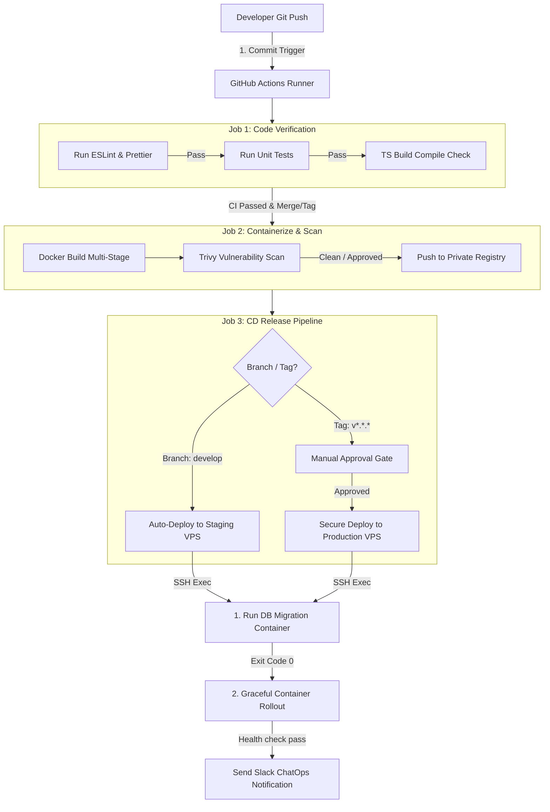

# 32 CI/CD

**Trạng thái: Hoàn thành (Finalized - Version 1.0)**

---

## Purpose

Chương này đặc tả chi tiết quy trình Tích hợp liên tục và Triển khai liên tục (CI/CD Pipeline Specification) của hệ thống FixTrack. Tài liệu định nghĩa sơ đồ tuần tự các bước kiểm thử tự động, đóng gói Docker, quét mã độc bảo mật, cơ chế phê duyệt thủ công (Manual Gate Approval), mẫu file cấu hình chạy chính thức của GitHub Actions, và các giải pháp tối ưu hóa tốc độ xây dựng mã nguồn (Build Caching).

---

## Inputs

*   [28 Security Architecture](../part_f_solution_architecture/28_security_architecture.md)
*   [30 Infrastructure](./30_infrastructure.md)
*   [31 Deployment](./31_deployment.md)

---

# Level 1 — CI/CD General Architecture (Kiến trúc Tổng quan)

Quy trình tích hợp và triển khai tự động của FixTrack được thiết kế dựa trên công cụ **GitHub Actions** với luồng xử lý khép kín từ mã nguồn Git đến máy chủ đích:



## 1.1 Quy tắc Quản lý Nhánh & Kích hoạt Pipeline (Gitflow & Pipeline Triggers)

Để phân định rõ ràng các phiên bản chạy kiểm thử và vận hành chính thức, dự án áp dụng quy tắc nhánh nghiêm ngặt:

*   **Nhánh `feature/*` và `fix/*`**: Lập trình viên phát triển tính năng mới. Khi tạo Pull Request (PR) về nhánh `develop`, hệ thống tự động kích hoạt **CI Pipeline** để kiểm tra tính toàn vẹn của mã nguồn.
*   **Nhánh `develop`**: Nhánh tích hợp chính. Mỗi khi code được merge thành công vào `develop`, hệ thống tự động kích hoạt **CD Staging Pipeline** để deploy lên Staging VPS.
*   **Thẻ Release `v*.*.*` (Git Tags)**: Khi Tech Lead tạo thẻ phiên bản ổn định từ nhánh `main`, hệ thống kích hoạt **CD Production Pipeline** yêu cầu phê duyệt thủ công (Manual Approval Gate).
*   > [!IMPORTANT]
    > **Lưu ý về cơ chế Trigger của GitHub Actions:**
    > Trong cấu hình `on.push`, GitHub Actions xử lý sự kiện đẩy nhánh (`branches`) và đẩy tag (`tags`) hoàn toàn biệt lập. Khi push một thẻ tag `v*.*.*`, hệ thống sẽ kích hoạt một tiến trình chạy độc lập dành riêng cho tag (Release Pipeline) chứ không chạy gộp chung với nhánh.

## 1.2 Định dạng Chiến lược Triển khai (Deployment Strategy Definition)
Hệ thống FixTrack xác định rõ ràng hai chiến lược triển khai cho các môi trường:
*   **Phase 1 (MVP) — Recreate Deployment Strategy**: Áp dụng cho cả Staging và Production. Thực thi tắt phiên bản cũ, khởi chạy phiên bản mới dưới sự kiểm soát của `deploy.sh` (chấp nhận thời gian dừng dịch vụ cực ngắn khoảng 3-5 giây để tối giản hóa hạ tầng).
*   **Phase 2 (HA Scale) — Rolling Update / Blue-Green Deployment Strategy**: Triển khai cuốn chiếu không downtime thông qua Load Balancer (Caddy/Traefik).

---

# Level 2 — Continuous Integration (CI Pipeline)

Mỗi khi mã nguồn được đẩy lên GitHub hoặc có PR mới, runner sẽ khởi chạy các bước kiểm tra chất lượng mã nguồn độc lập nhằm phát hiện lỗi sớm nhất:

1.  **Linting & Quality Check (Kiểm tra cú pháp)**:
    *   Thực thi lệnh kiểm tra chất lượng mã nguồn: `npm run lint` để phát hiện code thừa hoặc không tuân thủ quy tắc lập trình.
    *   Thực thi lệnh format: `npm run format -- --check` để xác thực định dạng file nhất quán toàn dự án.
2.  **Automated Testing (Kiểm thử tự động 3 tầng)**:
    *   **Unit Tests (Kiểm thử đơn vị)**: Khởi chạy lệnh `npm run test`.
        *   *Quy tắc tỷ lệ phủ (Coverage Policy)*: Phân lớp cụ thể:
            *   *Core Business Modules* (ví dụ: `TicketModule`, `MaterialModule`, `RepairModule`): Bắt buộc đạt tỷ lệ phủ tối thiểu **90%**.
            *   *Shared & Utility Modules* (ví dụ: `CacheModule`, `HelperModule`): Đạt tỷ lệ phủ tối thiểu **80%**.
    *   **Integration Tests (Kiểm thử tích hợp)**: Khởi chạy `npm run test:integration` để xác thực việc liên kết logic giữa các service và DB mock.
    *   **E2E Smoke Tests (Kiểm thử hộp đen đầu-cuối)**: Khởi chạy `npm run test:e2e` đối với các luồng nghiệp vụ cốt lõi (tạo ticket -> duyệt vật tư -> đóng ticket) để đảm bảo không gãy luồng xử lý chính.
3.  **Database Migration validation (Kiểm thử di cư dữ liệu)**:
    *   Thực thi lệnh kiểm tra tính hợp lệ của schema: `npm run migration:check` (hoặc đối soát dry-run giữa file schema ORM hiện tại với danh sách migrations trong Git) nhằm sớm phát hiện hiện tượng lệch schema (Schema Drift) trước khi đóng gói code.
4.  **Compilation Check (Biên dịch thử)**:
    *   Thực thi lệnh `npm run build` để xác minh trình biên dịch TypeScript không gặp bất kỳ lỗi kiểu dữ liệu (Static Type Checking) nào trước khi tiến hành đóng gói Docker.

---

# Level 3 — Continuous Delivery & Deployment (CD Pipeline)

Quy trình đóng gói tệp tin ảnh và triển khai từ xa được thực hiện tự động qua các kết nối bảo mật:

1.  **Đóng gói Ảnh Chứa (Containerization)**:
    *   Sử dụng công cụ **Docker Buildx** hỗ trợ tối ưu hóa và xuất tệp ảnh nén theo mã nguồn Dockerfile multi-stage (đã lược bỏ devDependencies ở Chapter 31).
2.  **Quét Lỗ hổng Bảo mật (Trivy Scan Gate)**:
    *   Sau khi đóng gói, image được quét bảo mật tĩnh.
    *   *Tiêu chí chặn*: Nếu phát hiện lỗi bảo mật mức độ `HIGH` hoặc `CRITICAL` mà nhà cung cấp đã có bản vá (patched vulnerability), image sẽ bị chặn lại, không được push lên registry và gửi cảnh báo lỗi về Slack.
3.  **Deploy qua kết nối SSH bảo mật (SSH-Deploy)**:
    *   GitHub Actions sử dụng khóa Private Key SSH lưu trữ trong bí mật an toàn (GitHub Secrets) để SSH vào VPS Host.
    *   Thực hiện chạy tệp tin `deploy.sh` đã cài đặt trên host để hoàn tất cập nhật.

---

# Level 4 — GitHub Actions Workflow Spec (Mẫu file YAML hoàn chỉnh)

Dưới đây là tệp cấu hình chạy chính thức [ci-cd.yml](file:///c:/Users/Legion/Desktop/IT/FixTrack/.github/workflows/ci-cd.yml) hoàn chỉnh của hệ thống FixTrack:

```yaml
name: FixTrack CI/CD Pipeline

on:
  push:
    branches:
      - develop
      - main
    tags:
      - 'v*.*.*'
  pull_request:
    branches:
      - develop
      - main

permissions:
  contents: read

jobs:
  # ============================================================================
  # 1. CI JOB: LINT, TEST & COMPILE
  # ============================================================================
  ci-verification:
    runs-on: ubuntu-latest
    steps:
      - name: Checkout Code
        uses: actions/checkout@v4

      - name: Setup Node.js
        uses: actions/setup-node@v4
        with:
          node-version: 20

      # Tối ưu hóa: Caching thư mục node_modules dựa trên package-lock.json
      - name: Cache Node Modules
        uses: actions/cache@v4
        id: node-cache
        with:
          path: ~/.npm
          key: ${{ runner.os }}-node-${{ hashFiles('**/package-lock.json') }}
          restore-keys: |
            ${{ runner.os }}-node-

      - name: Install Dependencies
        run: npm ci

      - name: Run Linting & Format Check
        run: |
          npm run lint
          npm run format -- --check

      - name: Run Unit Tests & Coverage
        run: npm run test -- --coverage

      - name: Run Integration Tests
        run: npm run test:integration

      - name: Run E2E Smoke Tests
        run: npm run test:e2e

      - name: Validate Database Migrations (No Schema Drift)
        run: npm run migration:check

      - name: Build TypeScript Verification
        run: npm run build

      # Lưu giữ báo cáo kiểm thử với vòng đời 30 ngày (Retention Policy)
      - name: Upload Test Coverage Report
        if: always()
        uses: actions/upload-artifact@v4
        with:
          name: coverage-report
          path: coverage/
          retention-days: 30

  # ============================================================================
  # 2. BUILD & PUSH IMAGE TO REGISTRY (CHỈ CHẠY KHI MERGE DEVELOP HOẶC TAG RELEASE)
  # ============================================================================
  build-and-push:
    needs: ci-verification
    runs-on: ubuntu-latest
    if: github.event_name == 'push' || startsWith(github.ref, 'refs/tags/v')
    steps:
      - name: Checkout Code
        uses: actions/checkout@v4

      - name: Set up QEMU
        uses: docker/setup-qemu-action@v3

      - name: Set up Docker Buildx
        uses: docker/setup-buildx-action@v3

      - name: Login to Private Registry
        uses: docker/login-action@v3
        with:
          registry: ${{ secrets.REGISTRY_URL }}
          username: ${{ secrets.REGISTRY_USERNAME }}
          password: ${{ secrets.REGISTRY_PASSWORD }}

      # Tối ưu hóa: Build và PUSH trực tiếp lên Registry (Chỉ build đúng 1 lần)
      - name: Build and Push Docker Image
        uses: docker/build-push-action@v5
        with:
          context: .
          push: true
          tags: |
            ${{ secrets.REGISTRY_URL }}/fixtrack-app:${{ github.sha }}
            ${{ github.ref_type == 'tag' && format('{0}/fixtrack-app:{1}', secrets.REGISTRY_URL, github.ref_name) || format('{0}/fixtrack-app:develop', secrets.REGISTRY_URL) }}
          cache-from: type=gha
          cache-to: type=gha,mode=max

      # Bảo mật: Quét lỗ hổng tĩnh trên Image vừa Push lên Registry
      - name: Run Trivy Vulnerability Scanner
        uses: aquasecurity/trivy-action@master
        with:
          image-ref: ${{ secrets.REGISTRY_URL }}/fixtrack-app:${{ github.sha }}
          format: 'table'
          exit-code: '1' # Thất bại pipeline nếu phát hiện lỗi bảo mật nặng
          ignore-unfixed: true
          severity: 'HIGH,CRITICAL'

  # ============================================================================
  # 3. CD JOB: DEPLOY TO STAGING (UAT)
  # ============================================================================
  deploy-staging:
    needs: build-and-push
    runs-on: ubuntu-latest
    if: github.ref == 'refs/heads/develop'
    steps:
      - name: Execute Remote SSH Deploy Staging
        uses: appleboy/ssh-action@v1.0.3
        with:
          host: ${{ secrets.STAGING_VPS_HOST }}
          username: ${{ secrets.STAGING_VPS_USER }}
          key: ${{ secrets.SSH_PRIVATE_KEY }}
          port: ${{ secrets.STAGING_VPS_SSH_PORT }}
          script: |
            cd /var/lib/fixtrack
            ./deploy.sh develop

  # ============================================================================
  # 4. CD JOB: DEPLOY TO PRODUCTION (YÊU CẦU MANUAL APPROVAL GATE)
  # ============================================================================
  deploy-production:
    needs: build-and-push
    runs-on: ubuntu-latest
    if: startsWith(github.ref, 'refs/tags/v')
    environment:
      name: production # Định nghĩa môi trường yêu cầu phê duyệt thủ công trên GitHub UI
    steps:
      - name: Execute Remote SSH Deploy Production
        uses: appleboy/ssh-action@v1.0.3
        with:
          host: ${{ secrets.PROD_VPS_HOST }}
          username: ${{ secrets.PROD_VPS_USER }}
          key: ${{ secrets.SSH_PRIVATE_KEY }}
          port: ${{ secrets.PROD_VPS_SSH_PORT }}
          script: |
            cd /var/lib/fixtrack
            ./deploy.sh ${{ github.ref_name }}
```

---

# Level 5 — Build Optimization & Security Gates (Tối ưu hóa & Chốt chặn)

## 5.1 Chiến lược Tối ưu hóa Tốc độ Xây dựng (Build Cache Strategy)

Để rút ngắn tổng thời gian thực thi của một chu trình CI/CD xuống dưới **5 phút**, hệ thống áp dụng cơ chế bộ nhớ đệm 2 lớp:

1.  **NPM Cache**:
    *   Tận dụng action `actions/cache` lưu trữ nội dung thư mục `~/.npm`. Khóa cache (Cache Key) được tính toán theo mã băm SHA256 của tệp `package-lock.json`. 
    *   Nếu tệp danh mục thư viện không thay đổi, bước cài đặt thư viện (`npm ci`) sẽ tận dụng bộ nhớ đệm cũ và chỉ mất dưới 30 giây để hoàn tất.
2.  **Docker Layer Cache**:
    *   Sử dụng cơ chế cache backend **GitHub Actions cache (gha)** được tích hợp sẵn trong action `docker/build-push-action`.
    *   Các layer không đổi (như cài đặt môi trường node-alpine, cài đặt múi giờ) sẽ được tải nhanh từ cache và tái sử dụng trực tiếp, giảm thiểu tối đa thời gian tải mạng.

## 5.2 Định nghĩa Chốt chặn Chất lượng & Bảo mật (Quality Gates)

Pipeline sẽ bị dừng và hủy bỏ trạng thái cập nhật lập tức nếu vi phạm bất kỳ tiêu chuẩn nào dưới đây:

*   **Linting/Formatting Gate**: Bất kỳ lỗi cú pháp hoặc định dạng sai quy chuẩn nào chưa sửa.
*   **Testing Gate**: Bất kỳ ca kiểm thử nào bị trượt (Unit, Integration, E2E) hoặc tỷ lệ phủ mã nguồn dưới mức quy định (90% cho Core, 80% cho Shared).
*   **Database Migration Gate**: Phát hiện lệch cấu trúc schema giữa ORM và file Migration thực tế.
*   **Security Vulnerability Gate (Trivy Gate)**: Phát hiện lỗ hổng phần mềm hoặc tệp hệ thống thuộc mức độ nghiêm trọng `HIGH` hoặc `CRITICAL` mà hãng sản xuất đã phát hành bản vá bảo mật (patched version).
*   **Health Check Gate**: Sau khi container khởi chạy trên server, nếu các script kiểm tra sức khỏe của API hoặc Worker trả về mã lỗi (`unhealthy`) liên tiếp quá 3 lần.

## 5.3 Quản lý Nhật ký & Tệp tin Tạm thời (Retention Policy)

Nhằm tối ưu hóa tài nguyên lưu trữ trên GitHub Cloud và máy chủ đích, hệ thống áp đặt chính sách lưu trữ:
*   **Pipeline Build Logs & Artifacts (Báo cáo Coverage, Test logs)**: Tự động xóa sạch sau **30 ngày** lưu trữ.
*   **Release Build Metadata (Metadata của bản phát hành chính thức)**: Lưu trữ trong **90 ngày** phục vụ công tác rà soát lỗi lịch sử.

## 5.4 Quy trình Thông báo Sự cố & ChatOps (Slack Notifications)

FixTrack không chỉ cấu hình cảnh báo khi thất bại, mà thiết lập ChatOps đa trạng thái gửi trực tiếp về Slack:

```
[ GHA Pipeline Run ]
         ├── (Deploy Thành công) ────► [ Slack Alert: SUCCESS (Green) ]
         ├── (Bảo mật có cảnh báo) ──► [ Slack Alert: WARNING (Yellow) ]
         └── (Build/Deploy Thất bại) ─► [ Slack Alert: CRITICAL (Red & Rollback Triggered) ]
```

*   **SUCCESS (Màu xanh lá)**: Gửi tin nhắn khi quá trình build, test, migration, và deploy hoàn tất thành công.
*   **WARNING (Màu vàng)**: Gửi tin nhắn khi deploy thành công nhưng có cảnh báo nhỏ (ví dụ: phát hiện lỗ hổng bảo mật cấp thấp chưa có bản vá).
*   **CRITICAL (Màu đỏ)**: Gửi tin nhắn khẩn cấp khi có job bị trượt, hoặc healthcheck thất bại dẫn tới kích hoạt script khôi phục nhanh `rollback.sh` trên máy chủ.
