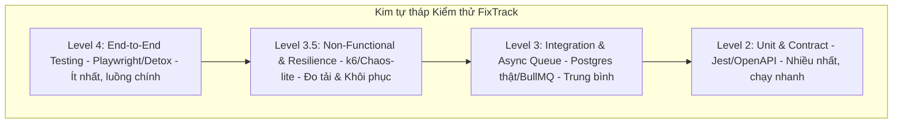

# 34 Testing Strategy

**Trạng thái: Hoàn thành (Finalized - Version 1.0)**

---

## Purpose

Chương này đặc tả chi tiết chiến lược kiểm thử và đảm bảo chất lượng phần mềm (Testing Strategy Specification) của hệ thống FixTrack. Tài liệu định nghĩa cấu trúc kim tự tháp kiểm thử 4 tầng, ma trận kiểm thử phân bổ theo mô hình, chiến lược quản lý dữ liệu kiểm thử (Test Data Strategy), đặc tả các loại hình kiểm thử chức năng (Unit, Contract, Integration, Async Queue, WebSocket, E2E) và phi chức năng (Performance Workloads, Failure Injection), cùng các tiêu chí khóa chốt chặn (CI Gating Criteria) để bảo vệ chất lượng bản phát hành.

---

## Inputs

*   [07 Functional Requirements](../part_b_requirement_analysis/07_functional_requirements.md)
*   [21 API Design](../part_e_backend_design/21_api_design.md)
*   [22 Backend Modules](../part_e_backend_design/22_backend_modules.md)
*   [24 Background Jobs](../part_e_backend_design/24_background_jobs.md)
*   [32 CI/CD](../part_g_devops/32_ci_cd.md)

---

# Level 1 — Testing Pyramid (Kim tự tháp Kiểm thử)

Quy trình quản lý chất lượng của FixTrack áp dụng mô hình kim tự tháp kiểm thử 4 tầng để tối ưu hóa tài nguyên chạy test và độ phủ lỗi:



## 1.1 Ma trận Loại hình Kiểm thử theo Module (Test Matrix)

| Module nghiệp vụ | Unit Test | Contract Test | Integration Test | Async/WS Test | E2E Test | Performance | Security |
| :--- | :---: | :---: | :---: | :---: | :---: | :---: | :---: |
| **Authentication & IAM** | ✓ | — | ✓ | — | ✓ | — | ✓ (Pen-test / Auth Abuse) |
| **Ticket Management** | ✓ | ✓ | ✓ | ✓ (WS Notify) | ✓ | ✓ | ✓ (IDOR Gate) |
| **Inventory & Material** | ✓ | ✓ | ✓ (Transactions) | — | ✓ | — | ✓ (IDOR Gate) |
| **Background Queue (BullMQ)**| ✓ | — | ✓ | ✓ (DLQ/Retry) | — | ✓ (Soak test) | — |
| **Notification Gateway** | ✓ | — | — | ✓ (Socket.IO) | — | — | — |
| **File Upload (S3)** | ✓ | — | ✓ | ✓ (ClamAV scan) | — | — | ✓ (Malware Gate) |

---

# Level 1.5 — Test Data Strategy (Chiến lược Dữ liệu Kiểm thử)

Để đảm bảo các ca kiểm thử hoạt động ổn định, không phụ thuộc vào trạng thái dữ liệu cũ (No Flaky Tests) và có thể lặp lại vô hạn, hệ thống thiết lập chiến lược quản lý dữ liệu kiểm thử:

1.  **Dữ liệu cố định (Deterministic Fixtures)**:
    *   Các danh mục dùng chung (Roles, System Enums, Lookup tables) được đồng bộ cứng từ tệp tin seed hệ thống trước khi chạy test suite.
2.  **Khởi tạo linh hoạt (Factory Builders)**:
    *   Sử dụng các hàm sinh dữ liệu giả độc lập thay vì ghi đè trực tiếp SQL. Ví dụ:
        *   `createFakeDriver()`: Khởi tạo tài xế với tài khoản mock.
        *   `createFakeTicket(driverId)`: Tạo phiếu báo hỏng gắn với tài xế cụ thể.
3.  **Cô lập và Khôi phục CSDL (Database Isolation & Cleanup)**:
    *   *Môi trường chạy Integration*: Sử dụng container Docker PostgreSQL chạy biệt lập.
    *   *Chu kỳ reset*: Trước mỗi test suite, cơ sở dữ liệu được xóa trống và nạp lại cấu trúc bảng bằng database migrations. Sau mỗi ca kiểm thử đơn lẻ, dữ liệu giao dịch được tự động quét sạch bằng các hàm dọn dẹp bảng (Clean-up Helpers).

---

# Level 2 — Unit & Contract Testing Specifications (Kiểm thử Đơn vị & Hợp đồng)

## 2.1 Đặc tả Kiểm thử Đơn vị (Unit Testing)

*   **Đối tượng**: Các cấu trúc nghiệp vụ của NestJS: Controllers, Services, Custom Guards, Custom Pipes, Interceptors.
*   **Quy tắc Mocking (Cách ly kiểm thử)**:
    *   Sử dụng thư viện `jest.mock()` để giả lập đầu ra của lớp truy vấn cơ sở dữ liệu (Postgres Repository).
    *   Mocking 100% kết nối của các dịch vụ bên thứ ba (AWS S3 SDK, FCM SDK, Mailer Service) để tránh gửi tín hiệu giả ra môi trường thực tế khi chạy CI.
*   **Chính sách Độ phủ mã nguồn (Coverage Policy)**:
    *   *Core Business Modules* (ví dụ: `TicketModule`, `MaterialModule`, `RepairModule`): Tỷ lệ phủ mã nguồn bắt buộc đạt tối thiểu **90%**.
    *   *Shared & Utility Modules* (ví dụ: `CacheModule`, `HelperModule`): Đạt tối thiểu **80%**.
    *   > [!IMPORTANT]
        > **Nguyên tắc Scenario-based Coverage:**
        > Chỉ số độ phủ dòng lệnh (Code Coverage %) chỉ được coi là tiêu chuẩn sàn (floor value). Để pass kiểm định chất lượng, các module bắt buộc phải có ca kiểm thử bao phủ toàn bộ các kịch bản rẽ nhánh nghiệp vụ (Scenario Coverage) chứ không chỉ chạy qua dòng lệnh.

## 2.2 Kiểm thử Hợp đồng API (API Contract Testing)

Nhằm đảm bảo giao tiếp không bị đứt gãy giữa Frontend (React Native / Web Dashboard) và Backend (NestJS API) khi có cập nhật mã nguồn (No Breaking Changes):

*   Sử dụng thư viện kiểm chứng định dạng JSON Schema dựa trên tài liệu **OpenAPI Specification** (Chapter 21).
*   Mọi API response trong kiểm thử bắt buộc phải chạy qua lớp xác thực cấu trúc (Schema Assertion). Nếu cấu trúc JSON trả về bị thiếu trường dữ liệu, hoặc sai kiểu dữ liệu (ví dụ: `ticketId` chuyển từ `string` sang `number`), bài kiểm thử sẽ lập tức báo lỗi cấu trúc hợp đồng API.

---

# Level 3 — Integration & Async Queue Testing (Kiểm thử Tích hợp & Hàng chờ)

## 3.1 Kiểm thử Tích hợp CSDL (DB Transaction Testing)

*   Sử dụng PostgreSQL container thật để chạy kiểm thử tích hợp (Integration Tests) thay vì sử dụng mock.
*   **Xác thực Tính toàn vẹn của Giao dịch (ACID Verification)**:
    *   *Ca kiểm thử điển hình*: Quy trình Duyệt cấp phát vật tư sửa chữa.
    *   *Luồng kiểm tra*: Gọi API cấp phát vật tư -> Kiểm tra số lượng tồn kho của vật tư bị trừ đúng số lượng -> Kiểm tra trạng thái ticket cập nhật thành công.
    *   *Kiểm thử Rollback*: Cố ý giả lập lỗi ghi log sau khi đã trừ kho vật tư -> Xác thực rằng lệnh trừ kho vật tư đã tự động khôi phục lại (Rollback), đảm bảo không xảy ra hiện tượng lệch số liệu kho do crash runtime.

## 3.2 Kiểm thử Hàng chờ chạy nền (Async Queue Testing)

Kiểm thử các kịch bản xử lý bất đồng bộ trong BullMQ (Chapter 24) để đảm bảo độ tin cậy của dữ liệu:

*   **Kiểm thử Cơ chế Thử lại (Retry Mechanism)**:
    *   Giả lập lỗi mạng khi gọi FCM server gửi thông báo.
    *   Xác thực Worker tự động thử lại 3 lần theo thuật toán Exponential Backoff đã cấu hình.
*   **Kiểm thử Hàng chờ Chết (Dead Letter Queue - DLQ)**:
    *   Sau 3 lần retry thất bại liên tiếp, xác thực job tự động chuyển vào hàng chờ lỗi (DLQ), lưu lại siêu dữ liệu lỗi và gửi cảnh báo khẩn cấp về Slack.
*   **Kiểm thử Tính nhất quán (Idempotency Check)**:
    *   Mỗi job được gán một định danh duy nhất (`jobId`).
    *   Giả lập đẩy trùng lặp 2 job có cùng `jobId` vào hàng chờ. Xác thực Worker chỉ thực thi xử lý nghiệp vụ đúng 1 lần duy nhất, tránh việc lặp lại hành động (ví dụ: trừ kho 2 lần cho cùng một yêu cầu).

## 3.3 Kiểm thử Realtime WebSocket (Socket.IO Testing)

*   **Xác thực Kết nối (Socket Auth)**: Khởi chạy Client kết nối giả lập, truyền JWT Token hợp lệ và không hợp lệ để xác thực cơ chế lọc bảo mật (Socket Guard).
*   **Tham gia phòng (Room Join)**: Kiểm tra Client được điều hướng đúng vào phòng chat/nhận sự kiện theo định danh phiếu báo hỏng (`ticket-123`) hoặc vai trò (`role-manager`).
*   **Thứ tự Sự kiện (Event Ordering)**: Gửi chuỗi sự kiện sửa chữa liên tiếp (`job.started`, `job.completed`) và xác thực các Client trong room nhận đúng chuỗi sự kiện theo đúng trình tự thời gian.

---

# Level 4 — End-to-End (E2E) Testing Specifications (Kiểm thử Toàn trình)

Kiểm thử toàn trình (E2E) mô phỏng chính xác các hành vi của người dùng trên giao diện để kiểm tra tính đúng đắn của toàn bộ hệ thống.

## 4.1 Công cụ và Môi trường

*   **Web Dashboard UI (Quản lý)**: Sử dụng **Playwright** chạy trên các trình duyệt headless (Chromium, Firefox).
*   **Mobile Application (Tài xế / Thợ sửa)**: Sử dụng **Detox** giả lập thiết bị iOS/Android chạy các luồng thao tác nút bấm thực tế.

## 4.2 Kịch bản Luồng Nghiệp vụ Cốt lõi (Golden Path Test Scenario)

```
[ Playwright / Detox Runner ]
          │
          ▼ (Luồng thao tác thực tế giả lập)
1. Tài xế đăng nhập Mobile App -> Tạo phiếu báo hỏng xe -> Đính kèm ảnh chụp sự cố.
          │
          ▼
2. Điều phối viên đăng nhập Web Dashboard -> Duyệt phiếu -> Phân công Thợ máy.
          │
          ▼
3. Thợ máy nhận thông báo trên Mobile -> Tạo yêu cầu phụ tùng thay thế.
          │
          ▼
4. Quản lý xưởng đăng nhập Web -> Ký duyệt xuất kho vật tư phụ tùng.
          │
          ▼
5. Thợ máy cập nhật "Đã sửa xong" -> Tài xế xác nhận chất lượng -> Đóng phiếu.
```

---

# Level 5 — Performance & Resilience Testing (Hiệu năng & Kháng lỗi)

## 5.1 Cấu hình Giả lập Tải hiệu năng (`k6` Load Testing)

Sử dụng công cụ **k6** để viết script mô phỏng tải HTTP trên Production theo các kịch bản phân loại:

### 1. Load Test (Tải thông thường)
*   **Mục tiêu**: Xác thực hệ thống chạy ổn định dưới tải kỳ vọng.
*   **Cấu hình**: Tăng dần từ 0 lên 50 người dùng đồng thời (Virtual Users - VUs) trong 2 phút, duy trì ổn định ở mức 50 VUs trong 10 phút với tốc độ 20 req/sec.
*   **Chỉ số đạt yêu cầu**: p95 Latency < 500ms, tỷ lệ lỗi HTTP 5xx = 0%.

### 2. Stress Test (Thử thách quá tải)
*   **Mục tiêu**: Tìm điểm giới hạn chịu tải (Bottleneck) của CPU/RAM hệ thống.
*   **Cấu hình**: Đẩy tải lên mức 200 VUs trong 5 phút với tốc độ 80 req/sec.
*   **Chỉ số đạt yêu cầu**: Hệ thống không bị crash (OOM), PostgreSQL không cạn kết nối, các API trả về mã lỗi 429 (Rate Limit) đúng quy chuẩn chứ không crash 500.

### 3. Spike Test (Tải tăng vọt đột biến)
*   **Mục tiêu**: Đánh giá khả năng thích ứng của hệ thống khi có lưu lượng tăng đột ngột.
*   **Cấu hình**: Tải đột ngột tăng từ 10 VUs lên 120 VUs chỉ trong vòng 10 giây, duy trì trong 1 phút rồi giảm nhanh.
*   **Chỉ số đạt yêu cầu**: Hệ thống tự động phục hồi về trạng thái phản hồi nhanh (< 500ms) sau khi kết thúc tải spike.

### 4. Soak Test (Kiểm thử độ bền)
*   **Mục tiêu**: Phát hiện rò rỉ bộ nhớ (Memory Leak) và rò rỉ kết nối (Connection Leak).
*   **Cấu hình**: Chạy tải liên tục ở mức ổn định 30 VUs trong suốt 12 giờ liên tiếp.
*   **Chỉ số đạt yêu cầu**: Dung lượng RAM sử dụng của container NestJS và số lượng kết nối DB duy trì ở mức ổn định dạng đường thẳng nằm ngang, không có xu hướng tăng đều hình bậc thang.

## 5.2 Tiêm Lỗi Hạ tầng (Failure Injection / Chaos-lite)

Xác định mức độ chống chịu lỗi của phần mềm khi hạ tầng gặp sự cố tạm thời:
*   **Redis Down**: Tắt cụm Redis Cache tạm thời trong lúc chạy test. Xác thực ứng dụng tự động bỏ qua cache và truy vấn trực tiếp xuống DB (Cache Fallback) mà không bị crash HTTP response.
*   **Postgres Reconnect**: Tắt dịch vụ Postgres trong 5 giây rồi bật lại. Xác thực NestJS API tự phục hồi kết nối (Auto-reconnect) thành công và tiếp tục xử lý các truy vấn sau đó.
*   **S3 / FCM Timeout**: Giả lập API bên thứ ba bị nghẽn mạng phản hồi (chậm 10 giây). Xác thực ứng dụng ngắt kết nối đúng timeout đã cấu hình (Chapter 29) và trả về lỗi hợp lý thay vì treo vô hạn luồng xử lý.

---

# Level 6 — Security Testing & CI/CD Gating (Bảo mật & Chốt chặn CI)

## 6.1 Quét Lỗ hổng Tĩnh & Động (SAST & DAST)
*   **SAST (Quét mã tĩnh)**: Tích hợp công cụ SonarQube quét mã nguồn mỗi khi tạo PR. Cấm merge nếu phát hiện các lỗi logic nguy hiểm như dùng hàm băm yếu, SQL Injection tiềm ẩn.
*   **DAST (Quét động ứng dụng)**: Định kỳ kích hoạt các bài quét tự động bằng công cụ **OWASP ZAP** nhắm vào các cổng Staging API để dò tìm các lỗ hổng thời gian chạy nguy hiểm như lỗi chiếm quyền phiên (Session Hijacking), lỗi kiểm soát quyền truy cập đối tượng (BOLA/IDOR) và các cấu hình mạng sai sót.
*   **Vulnerability Scan (Quét thư viện/hệ điều hành)**: Quét thư viện bên thứ ba (`npm audit`) và quét hệ điều hành container (`trivy image`) trong pipeline build.

## 6.2 Quy tắc Khóa chốt chặn trên CI/CD (CI Gating Criteria)

Mọi Pull Request (PR) muốn merge vào nhánh chính `develop` hoặc `main` bắt buộc phải vượt qua tất cả các bài test tự động được cấu hình cứng trong pipeline (Chapter 32). Lệnh merge sẽ bị **khóa cứng (Blocked)** trên GitHub nếu phát hiện:

1.  Bất kỳ ca kiểm thử đơn vị (Unit Test) hay tích hợp (Integration Test) nào bị thất bại (Failed).
2.  Tổng độ phủ dòng lệnh (Code Coverage) dưới mức cam kết sàn (90% Core / 80% Shared).
3.  Quét bảo mật Trivy phát hiện bất kỳ lỗ hổng mức độ `HIGH` hoặc `CRITICAL` nào chưa được vá.
4.  Lỗi kiểm tra cú pháp (Lint/Format errors).
