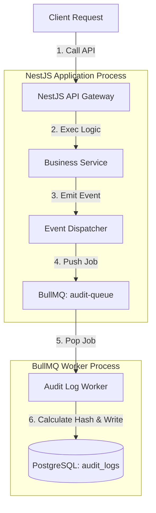

# 35 Audit Logging

**Trạng thái: Hoàn thành (Finalized - Version 1.0)**

---

## Purpose

Chương này đặc tả chi tiết cơ chế Nhật ký kiểm toán (Audit Logging Specification) của hệ thống FixTrack. Tài liệu định nghĩa kiến trúc ghi vết bất đồng bộ qua hàng chờ, danh mục sự kiện kiểm toán nghiệp vụ, đặc tả cấu trúc dữ liệu bảng nhật ký kiểm toán, chính sách an ninh chống giả mạo (hash chain) và quy tắc truy cập (immutable policy), chính sách lưu trữ (retention policy) cùng các ca kiểm thử mẫu trên tầng NestJS.

> [!NOTE]
> **Reality Alignment:**
> Chương này đặc tả kiến trúc mục tiêu của FixTrack sử dụng khung NestJS (NestJS reference architecture). Các ca kiểm thử tự động thực tế được viết bằng Python/pytest để chạy trực tiếp trên mã nguồn backend FastAPI hiện tại.

---

## Inputs

*   [05 User Roles](../part_a_business_foundation/05_user_roles.md)
*   [08 Non-Functional Requirements](../part_b_requirement_analysis/08_non_functional_requirements.md)
*   [22 Backend Modules](../part_e_backend_design/22_backend_modules.md)
*   [24 Background Jobs](../part_e_backend_design/24_background_jobs.md)
*   [28 Security Architecture](../part_f_solution_architecture/28_security_architecture.md)

---

# Level 1 — Audit Trail Architecture (Kiến trúc Ghi vết Kiểm toán)

Hệ thống FixTrack ghi nhật ký kiểm toán bất đồng bộ (Asynchronous Audit Logging) để tránh làm tăng độ trễ (latency) của các API HTTP nghiệp vụ thông thường.



### Luồng Xử lý Chi tiết:
1. **Client** gửi yêu cầu thay đổi trạng thái (ví dụ: duyệt cấp phát vật tư).
2. **Business Service** xử lý nghiệp vụ thành công, thực thi thay đổi trong database và ghi nhận kết quả.
3. Sau khi transaction nghiệp vụ hoàn tất, Service phát ra sự kiện thông qua **Event Dispatcher** (`EventEmitter2`).
4. Event Listener tương ứng nhận sự kiện và đẩy một Job ghi log vào hàng chờ **BullMQ** (`audit-queue`). Luồng API phản hồi ngay lập tức cho Client.
5. **Audit Log Worker** chạy nền lấy Job ra khỏi hàng chờ.
6. Worker truy vấn hash của bản ghi log liền trước từ database, thực hiện tính toán hàm băm liên kết (hash chain) SHA256 và lưu bản ghi kiểm toán mới vào bảng `audit_logs`.

---

# Level 2 — Audit Event Registry (Danh mục Sự kiện Kiểm toán)

### Quy tắc đặt tên (Naming Convention)
Tên sự kiện kiểm toán bắt buộc sử dụng **cú pháp dấu chấm phân đoạn kết hợp snake_case** (`dot notation with snake_case segments`).

| Event Name | Domain Target | Hành động kích hoạt | Dữ liệu lưu trữ |
| :--- | :--- | :--- | :--- |
| `vehicle.assigned` | `vehicle_assignment` | Phân công xe cho tài xế | Id phân công, ID xe, ID tài xế |
| `vehicle.unassigned` | `vehicle_assignment` | Thu hồi xe từ tài xế | ID phân công, ID xe, ID tài xế |
| `ticket.status_changed` | `repair_request` | Đổi trạng thái phiếu sửa chữa | ID phiếu, trạng thái cũ, trạng thái mới |
| `material.request_approved` | `material_request` | Duyệt xuất kho phụ tùng | ID phiếu yêu cầu, trạng thái cũ, số lượng xuất |

---

# Level 3 — Database Schema & Data Dictionary

Bảng nhật ký kiểm toán được lưu trữ tại schema CSDL chính và được thiết kế tối ưu cho việc truy vấn truy vết sự cố.

### 3.1 Cấu trúc Bảng `audit_logs`

| Field | Type | Nullable | Mô tả |
| :--- | :--- | :---: | :--- |
| `id` | `INT / BIGINT` | No | Khóa chính (Tự động tăng) |
| `trace_id` | `VARCHAR(64)` | No | ID truy vết duy nhất từ HTTP context (X-Request-ID) |
| `actor_user_id` | `INT` | No | ID của tài khoản thực hiện hành động |
| `actor_role` | `VARCHAR(30)` | No | Vai trò của tài khoản tại thời điểm thực hiện (ví dụ: `MANAGER`) |
| `action` | `VARCHAR(50)` | No | Tên sự kiện (ví dụ: `ticket.status_changed`) |
| `target_type` | `VARCHAR(50)` | No | Loại đối tượng chịu tác động (ví dụ: `repair_request`) |
| `target_id` | `INT` | Yes | ID khóa chính của đối tượng chịu tác động |
| `old_value` | `TEXT` | Yes | Dạng chuỗi JSON của trạng thái cũ |
| `new_value` | `TEXT` | Yes | Dạng chuỗi JSON của trạng thái mới |
| `ip_address` | `VARCHAR(45)` | Yes | Địa chỉ IP của client (hỗ trợ IPv4 và IPv6) |
| `user_agent` | `TEXT` | Yes | Chuỗi User Agent của trình duyệt/thiết bị |
| `status` | `VARCHAR(20)` | No | Trạng thái ghi log (`SUCCESS` hoặc `FAILED`) |
| `hash_chain` | `CHAR(64)` | No | Hàm băm liên kết SHA256 chống giả mạo |
| `created_at` | `TIMESTAMP` | No | Thời điểm ghi nhật ký (Server default `now()`) |

---

# Level 4 — API Spec & Security Access Control

## 4.1 Quyền truy cập API (Access Control)
*   Endpoint truy vấn: `GET /api/v1/audit-logs`
*   Quy tắc phân quyền: **Chỉ cho phép vai trò `MANAGER` hoặc `SECURITY_AUDITOR`**. Toàn bộ các vai trò khác (`DRIVER`, `TECH`, `INVENTORY`, `MECHANIC`) khi gọi endpoint này sẽ nhận mã lỗi `403 Forbidden`.

## 4.2 Chính sách Bất biến (Immutable Audit Policy)
*   Nhật ký kiểm toán là dữ liệu append-only (chỉ thêm, không sửa xóa).
*   **Nghiêm cấm** mọi thao tác `UPDATE` và `DELETE` đối với bảng `audit_logs`.
*   *Phòng vệ Database*: Thiết lập database triggers hoặc chính sách PostgreSQL RLS (Row Level Security) để chặn đứng mọi câu lệnh `UPDATE` hoặc `DELETE` tác động lên bảng này, kể cả đối với user db thông thường.

## 4.3 Cơ chế chống giả mạo bằng chuỗi liên kết Hash (Hash Chaining)
Mỗi dòng log được băm liên kết trực tiếp với dòng log ngay trước đó để đảm bảo tính toàn vẹn. Nếu kẻ tấn công xâm nhập vào CSDL và thay đổi giá trị một dòng log, chuỗi hash liên kết sẽ bị gãy.

*   Công thức tính Hash cho bản ghi thứ $n$:
    $$\text{hash}_n = \text{SHA256}(\text{payload}_n + \text{hash}_{n-1})$$
    Trong đó:
    *   $\text{payload}_n$: Chuỗi ghép các thuộc tính cốt lõi của bản ghi: `actor_user_id` + `action` + `target_type` + `target_id` + `old_value` + `new_value` + `trace_id` + `created_at`.
    *   $\text{hash}_{n-1}$: Giá trị `hash_chain` của bản ghi thứ $n-1$. Bản ghi đầu tiên (genesis) sử dụng chuỗi mặc định `"genesis"`.

---

# Level 5 — Retention & Archiving Policy (Chính sách Lưu trữ)

Hệ thống phân định 2 vùng lưu trữ rõ rệt để tối ưu hiệu năng cơ sở dữ liệu nóng:

| Môi trường lưu trữ | Chu kỳ giữ lại | Định dạng & Vị trí | Mục tiêu |
| :--- | :--- | :--- | :--- |
| **Hot Storage** | **180 ngày** | PostgreSQL table `audit_logs` | Phục vụ truy vấn nhanh, xuất báo cáo kiểm toán thời gian thực của Manager. |
| **Cold Storage** | **3 năm** | Tệp tin CSV nén (.tar.gz) lưu trên S3 | Đáp ứng các yêu cầu tuân thủ an ninh thông tin pháp lý, lưu trữ dài hạn giá rẻ. |

---

# Level 6 — Test Cases & Verification Plan (NestJS Spec)

Các ca kiểm thử tầng NestJS (Jest/Supertest) được thiết kế để xác thực hoạt động của hệ thống:

```typescript
// audit.e2e-spec.ts
import { Test, TestingModule } from '@nestjs/testing';
import { INestApplication } from '@nestjs/common';
import * as request from 'supertest';
import { AppModule } from '../src/app.module';

describe('Audit Logging System (E2E)', () => {
  let app: INestApplication;

  beforeAll(async () => {
    const moduleFixture: TestingModule = await Test.createTestingModule({
      imports: [AppModule],
    }).compile();

    app = moduleFixture.createNestApplication();
    await app.init();
  });

  it('1. Bị chặn truy cập khi gọi API audit log với quyền DRIVER (RBAC)', () => {
    return request(app.getHttpServer())
      .get('/api/v1/audit-logs')
      .set('Authorization', `Bearer ${driverToken}`)
      .expect(403);
  });

  it('2. Cho phép MANAGER truy vấn thành công danh sách log (RBAC)', () => {
    return request(app.getHttpServer())
      .get('/api/v1/audit-logs')
      .set('Authorization', `Bearer ${managerToken}`)
      .expect(200)
      .expect((res) => {
        expect(Array.isArray(res.body)).toBe(true);
      });
  });

  it('3. Ghi vết bất đồng bộ thành công qua BullMQ Queue', async () => {
    // Kích hoạt hành động nghiệp vụ
    await request(app.getHttpServer())
      .post('/api/v1/repair-requests/1/assign')
      .set('Authorization', `Bearer ${managerToken}`)
      .send({ mechanicId: 2 })
      .expect(200);

    // Chờ Worker xử lý job bất đồng bộ trong queue
    await new Promise((resolve) => setTimeout(resolve, 500));

    // Kiểm tra log xuất hiện trong DB
    const res = await request(app.getHttpServer())
      .get('/api/v1/audit-logs?doi_tuong=repair_request')
      .set('Authorization', `Bearer ${managerToken}`)
      .expect(200);

    expect(res.body[0].hanh_dong).toBe('ticket.status_changed');
  });
});
```
